# Architecture Documentation

## Overview

This document describes the technical architecture of the Azure Security Assessment Templates framework, including component interactions, data flows, and deployment patterns.

## System Architecture

### High-Level Architecture

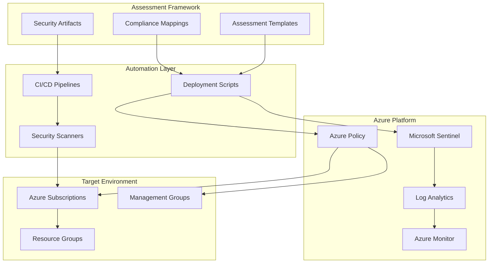

### Component Architecture

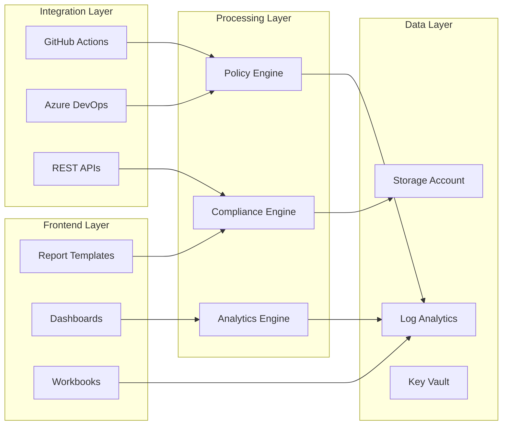

## Deployment Architecture

### Single Subscription Deployment

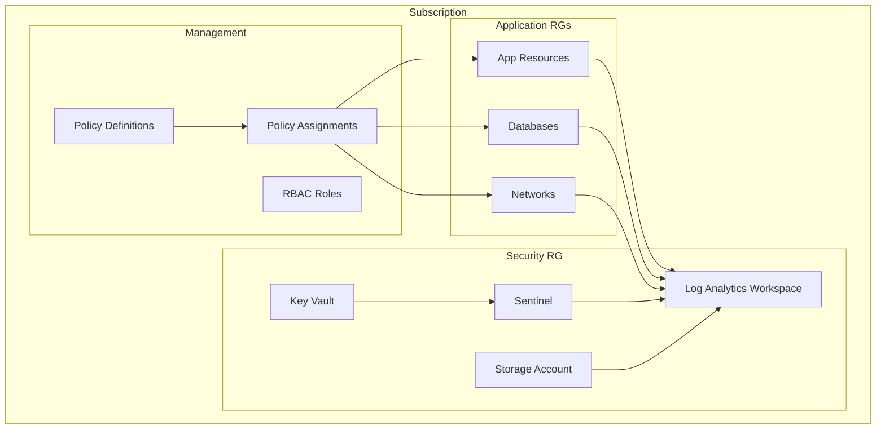

### Multi-Subscription Enterprise Deployment

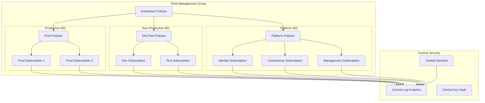

## Security Architecture

### Defense in Depth

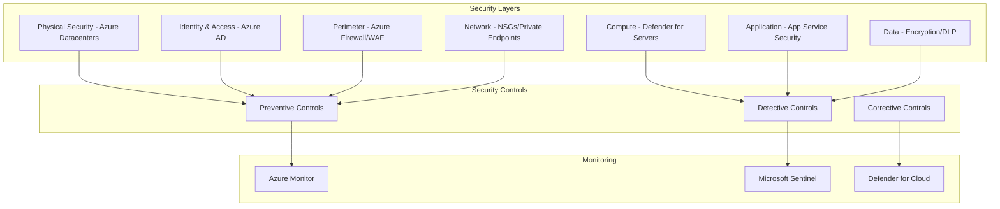

### Zero Trust Architecture

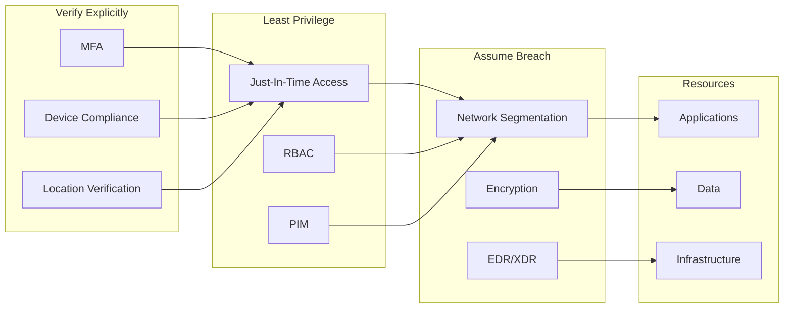

## Data Flow Architecture

### Assessment Data Flow

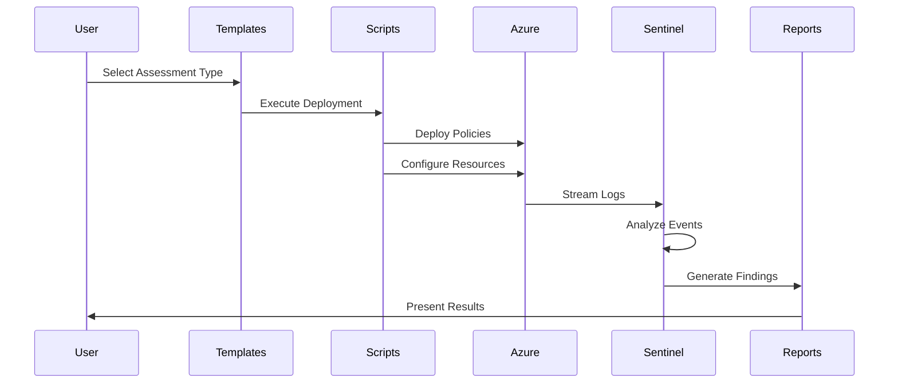

### Policy Evaluation Flow

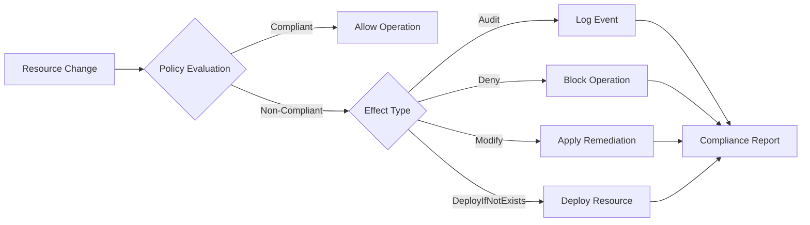

### Incident Response Flow

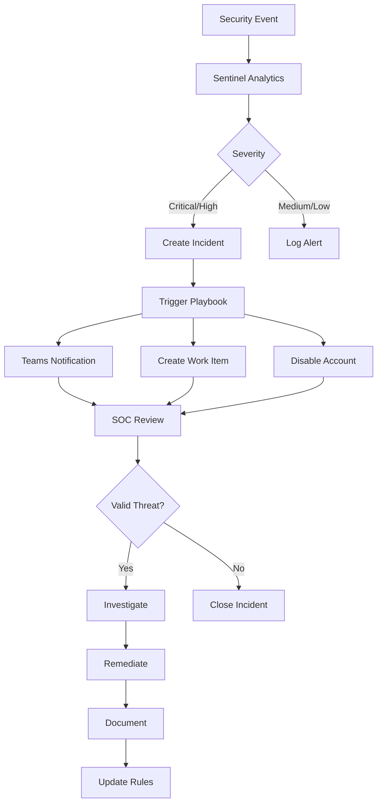

## CI/CD Pipeline Architecture

### GitHub Actions Workflow

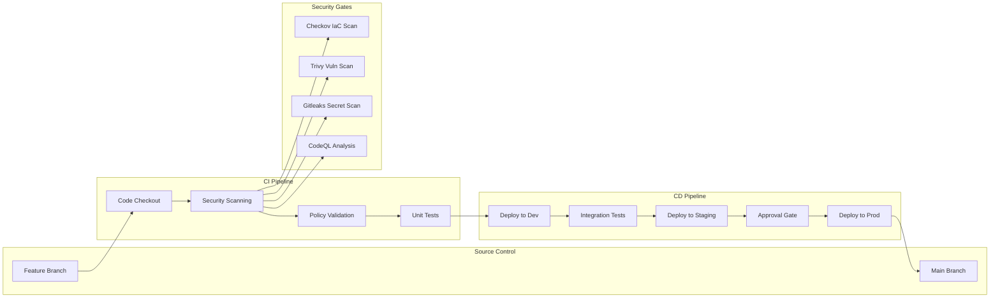

## Network Architecture

### Hub-Spoke Topology

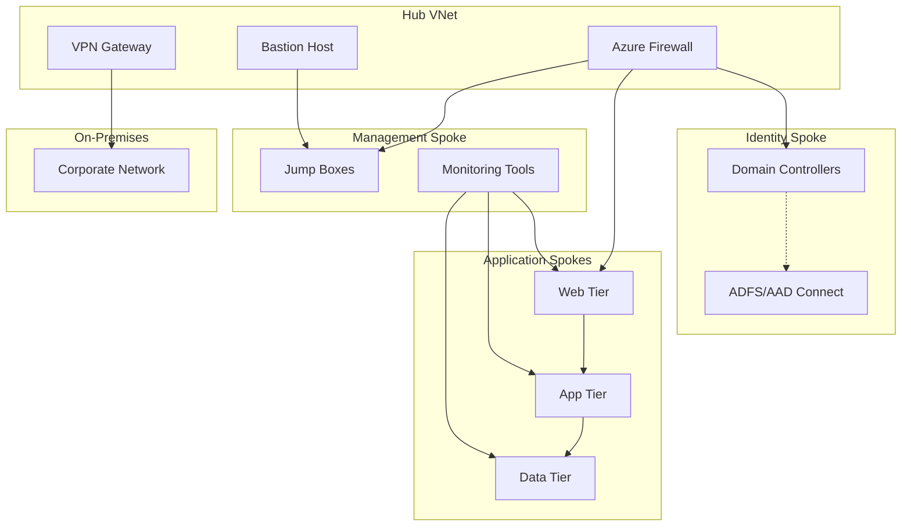

### Private Endpoint Architecture

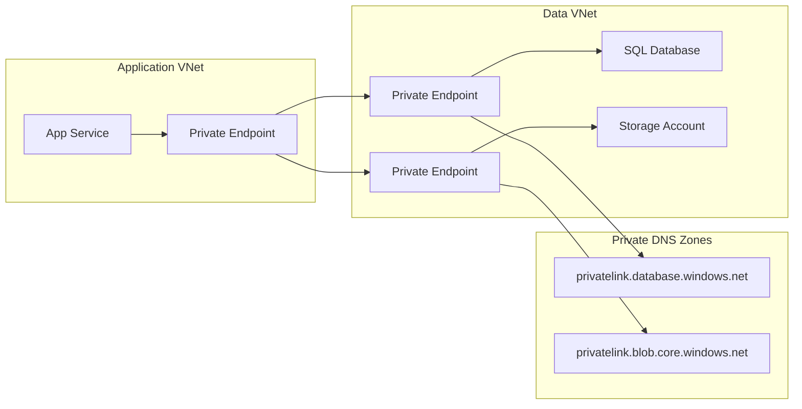

## Integration Architecture

### External System Integration

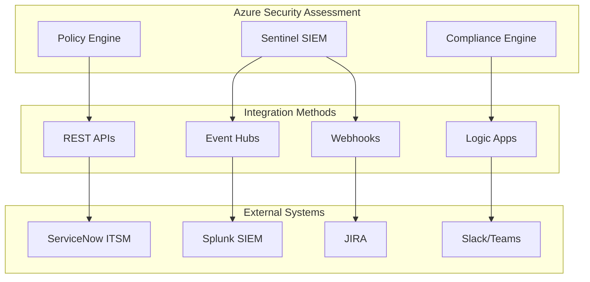

## Scalability Patterns

### Multi-Region Deployment

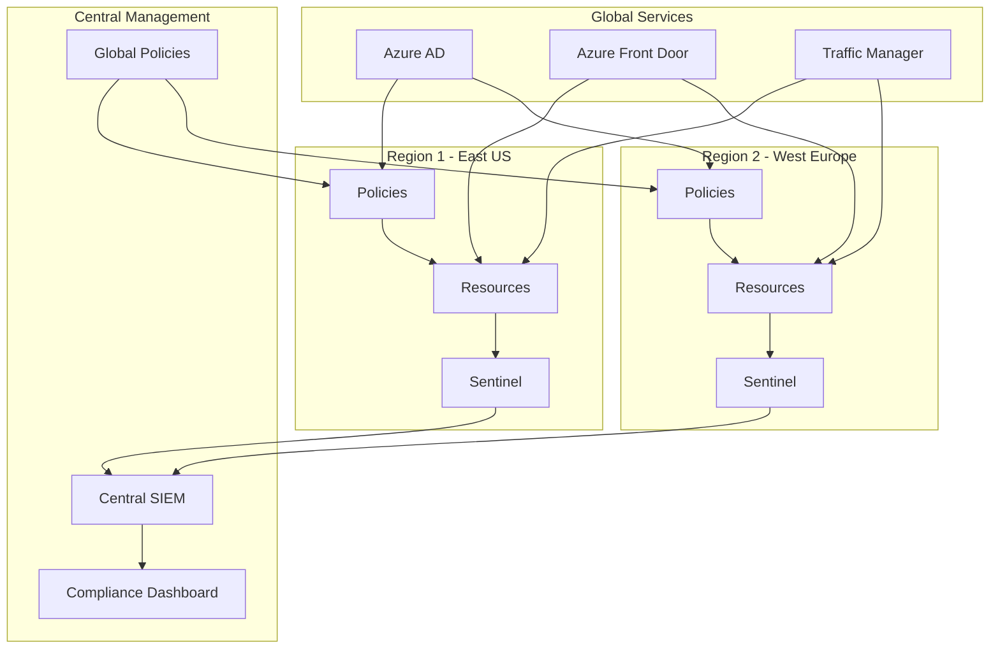

## Technology Stack

### Core Technologies

| Component | Technology | Purpose |
|-----------|------------|---------|
| **Policy Engine** | Azure Policy | Compliance enforcement |
| **SIEM** | Microsoft Sentinel | Security monitoring |
| **Data Platform** | Log Analytics | Data aggregation |
| **Automation** | Logic Apps | Workflow orchestration |
| **IaC** | ARM/Bicep/Terraform | Infrastructure deployment |
| **CI/CD** | GitHub Actions/Azure DevOps | Pipeline automation |
| **Monitoring** | Azure Monitor | Performance tracking |
| **Secrets** | Azure Key Vault | Credential management |
| **Identity** | Azure AD | Authentication/Authorization |
| **Networking** | Azure Virtual Network | Network isolation |

### Security Tools Integration

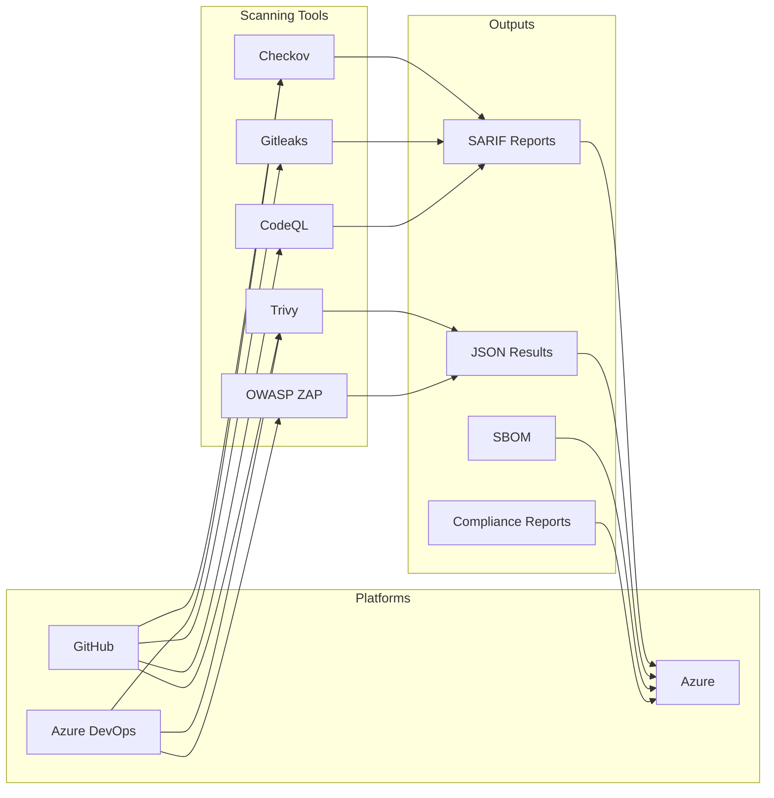

## Disaster Recovery Architecture

### Backup and Recovery Strategy

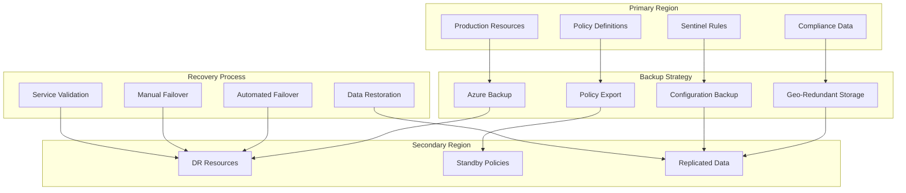

## Performance Considerations

### Optimization Points

1. **Policy Evaluation**: Batch policy assignments for better performance
2. **Log Ingestion**: Use data collection rules to filter unnecessary data
3. **Query Optimization**: Optimize KQL queries in Sentinel rules
4. **Storage Tiering**: Use appropriate storage tiers for compliance data
5. **Caching**: Implement caching for frequently accessed reports

### Scaling Thresholds

| Component | Metric | Threshold | Action |
|-----------|--------|-----------|---------|
| Log Analytics | Daily Ingestion | > 500 GB | Consider commitment tier |
| Sentinel | Rules per Workspace | > 500 | Distribute across workspaces |
| Policy | Assignments per Scope | > 200 | Use management groups |
| Storage | Monthly Growth | > 10% | Review retention policies |
| Key Vault | Requests per Second | > 2000 | Implement caching |

## Security Considerations

### Data Protection

- **Encryption at Rest**: All data encrypted using Azure-managed keys
- **Encryption in Transit**: TLS 1.2+ for all communications
- **Key Management**: Centralized in Azure Key Vault
- **Data Classification**: Automated tagging and classification
- **Access Control**: RBAC with least privilege principle

### Compliance Controls

- **Audit Logging**: All actions logged to immutable storage
- **Change Tracking**: Version control for all templates and policies
- **Evidence Collection**: Automated evidence gathering for audits
- **Retention Policies**: Configurable based on compliance requirements
- **Data Residency**: Regional deployment options for data sovereignty

---

**Last Updated:** 2024-01-15  
**Version:** 2.0.0