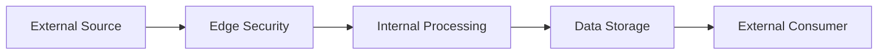

# Context and Scope Definition for Security Assessment

This document establishes the organizational context, boundaries, and scope for security assessments in accordance with ISO 27001:2022 (Clauses 4.1, 4.2) and SOC 2 Type II service organization requirements. It provides a comprehensive framework for understanding the internal and external environment, stakeholder expectations, and system boundaries.

## 1. Executive Summary and Assessment Scope

### 1.1 Assessment Objectives
- **Primary Purpose**: [Define primary assessment objectives - compliance validation, risk assessment, security posture evaluation]
- **Assessment Type**: [ ] ISO 27001:2022 Readiness  [ ] SOC 2 Type II  [ ] Security Architecture Review  [ ] Risk Assessment  [ ] Other: ___________
- **Assessment Period**: [Start Date] to [End Date]
- **Next Review Date**: [Schedule for reassessment]

### 1.2 Assessment Standards and Frameworks
- **Primary Framework**: [ISO 27001:2022 / SOC 2 Type II / NIST CSF / Other]
- **Secondary Frameworks**: [CIS Controls, MCSB, PCI DSS, GDPR, HIPAA, etc.]
- **Industry Standards**: [Industry-specific requirements]

### 1.3 Scope Statement
**One-sentence scope description**: 
[Concise statement of what is being assessed]

## 2. Organizational Context Analysis (ISO 27001:2022 Clause 4.1)

### 2.1 Business Context and Strategic Environment

#### 2.1.1 Organizational Mission and Vision
- **Mission Statement**: [Organization's mission]
- **Vision Statement**: [Organization's vision]
- **Strategic Objectives**: [Key business objectives relevant to information security]
- **Business Model**: [How the organization creates, delivers, and captures value]

#### 2.1.2 Industry and Market Context
- **Industry Sector**: [Primary industry classification]
- **Market Position**: [Competitive position and market share]
- **Geographic Footprint**: [Countries/regions of operation]
- **Regulatory Environment**: [Key regulatory drivers affecting the organization]

#### 2.1.3 Critical Business Services and Operations
| Service/Process | Business Criticality | Data Sensitivity | Regulatory Requirements | Stakeholder Impact |
|-----------------|---------------------|------------------|------------------------|-------------------|
| [Service 1] | [High/Medium/Low] | [Confidential/Internal/Public] | [GDPR/HIPAA/PCI/Other] | [Customer/Partner/Internal] |
| [Service 2] | | | | |
| [Add rows as needed] | | | | |

#### 2.1.4 Value Chain Analysis
- **Core Processes**: [Primary value-creating activities]
- **Support Processes**: [Infrastructure, HR, technology, procurement]
- **External Dependencies**: [Critical third-party services and suppliers]
- **Information Flow**: [How information flows through the value chain]

### 2.2 External Context Factors

#### 2.2.1 Regulatory and Legal Environment
| Regulation/Law | Applicability | Jurisdiction | Compliance Status | Impact Level |
|----------------|---------------|--------------|------------------|--------------|
| GDPR | [Yes/No/Partial] | EU | [Compliant/Gap/Not Assessed] | [High/Medium/Low] |
| HIPAA | [Yes/No/Partial] | US | [Compliant/Gap/Not Assessed] | [High/Medium/Low] |
| PCI DSS | [Yes/No/Partial] | Global | [Compliant/Gap/Not Assessed] | [High/Medium/Low] |
| SOX | [Yes/No/Partial] | US | [Compliant/Gap/Not Assessed] | [High/Medium/Low] |
| [Add additional regulations] | | | | |

#### 2.2.2 Technology and Cyber Threat Landscape
- **Threat Environment**: [Current threat landscape relevant to the organization]
- **Emerging Technologies**: [New technologies being adopted or considered]
- **Industry Cyber Trends**: [Sector-specific cyber security trends]
- **Geopolitical Factors**: [Nation-state threats, trade restrictions, etc.]

#### 2.2.3 Economic and Social Factors
- **Economic Environment**: [Economic factors affecting operations]
- **Social Expectations**: [Stakeholder expectations regarding privacy and security]
- **Environmental Factors**: [ESG considerations affecting security decisions]

### 2.3 Internal Context Factors

#### 2.3.1 Organizational Structure and Governance
- **Governance Model**: [Corporate governance structure]
- **Organizational Chart**: [Reference to current org chart or key reporting relationships]
- **Decision-Making Authority**: [How security decisions are made and by whom]
- **Risk Appetite Statement**: [Organization's risk tolerance and appetite]

#### 2.3.2 Cultural and Behavioral Factors
- **Security Culture Maturity**: [Current state of security awareness and culture]
- **Change Management Capability**: [Organization's ability to manage change]
- **Innovation vs. Security Balance**: [How the organization balances innovation with security]

#### 2.3.3 Resource Constraints and Capabilities
- **Financial Resources**: [Budget constraints and funding availability]
- **Human Resources**: [Staffing levels, skills, and competencies]
- **Technology Resources**: [Technology infrastructure and capabilities]
- **Time Constraints**: [Project timelines and delivery pressures]

## 3. Stakeholder Analysis (ISO 27001:2022 Clause 4.2)

### 3.1 Internal Stakeholders

#### 3.1.1 Leadership and Governance
| Stakeholder Role | Name/Department | Security Expectations | Influence Level | Interest Level |
|------------------|-----------------|----------------------|----------------|----------------|
| Chief Executive Officer | [Name] | [Specific expectations] | High | High |
| Chief Information Officer | [Name] | [Specific expectations] | High | High |
| Chief Security Officer | [Name] | [Specific expectations] | High | High |
| Chief Risk Officer | [Name] | [Specific expectations] | High | High |
| Board of Directors | [Names/Committee] | [Specific expectations] | High | Medium |
| Audit Committee | [Names] | [Specific expectations] | High | High |

#### 3.1.2 Operational Stakeholders
| Stakeholder Role | Name/Department | Security Expectations | Influence Level | Interest Level |
|------------------|-----------------|----------------------|----------------|----------------|
| IT Operations | [Name/Team] | [Specific expectations] | Medium | High |
| DevOps/Engineering | [Name/Team] | [Specific expectations] | Medium | High |
| Business Units | [Name/Department] | [Specific expectations] | Medium | Medium |
| Human Resources | [Name/Team] | [Specific expectations] | Low | Medium |
| Legal/Compliance | [Name/Team] | [Specific expectations] | Medium | High |
| Finance | [Name/Team] | [Specific expectations] | Low | Low |

### 3.2 External Stakeholders

#### 3.2.1 Business Partners and Customers
| Stakeholder Type | Organization/Name | Security Requirements | Contractual Obligations | Communication Method |
|------------------|-------------------|----------------------|------------------------|---------------------|
| Key Customers | [Customer Names] | [Security requirements] | [SLAs, contracts] | [Communication channels] |
| Strategic Partners | [Partner Names] | [Security requirements] | [Partnership agreements] | [Communication channels] |
| Suppliers/Vendors | [Vendor Names] | [Security requirements] | [Vendor agreements] | [Communication channels] |

#### 3.2.2 Regulatory and Oversight Bodies
| Regulator/Authority | Jurisdiction | Reporting Requirements | Assessment Schedule | Contact Information |
|---------------------|--------------|----------------------|-------------------|-------------------|
| [Regulatory Body] | [Geographic scope] | [Required reports] | [Frequency] | [Contact details] |
| External Auditors | [Global/Regional] | [Audit requirements] | [Annual/Periodic] | [Contact details] |
| Certification Bodies | [Scope] | [Certification maintenance] | [Annual/Triennial] | [Contact details] |

### 3.3 Stakeholder Communication and Engagement Plan
- **Communication Schedule**: [Regular reporting and communication schedule]
- **Escalation Procedures**: [How security issues are escalated to appropriate stakeholders]
- **Feedback Mechanisms**: [How stakeholder feedback is collected and incorporated]

## 4. Azure Environment Scope Definition

### 4.1 Azure Tenant and Subscription Architecture

#### 4.1.1 Tenant Structure
- **Primary Tenant ID**: [Azure AD Tenant ID]
- **Tenant Name**: [Display name]
- **Domain Names**: [Verified domains]
- **Multi-Tenant Architecture**: [ ] Yes  [ ] No
  - If Yes, describe: [Multi-tenant setup details]

#### 4.1.2 Management Group Hierarchy
```
Root Management Group
├── [Level 1 MG Name]
│   ├── [Level 2 MG Name]
│   │   └── [Subscription Names]
│   └── [Level 2 MG Name]
│       └── [Subscription Names]
└── [Level 1 MG Name]
    └── [Subscription Names]
```

#### 4.1.3 Subscription Inventory
| Subscription Name | Subscription ID | Management Group | Environment Type | Business Owner | Technical Owner |
|-------------------|----------------|------------------|------------------|----------------|----------------|
| [Prod-Primary] | [GUID] | [MG Name] | Production | [Name] | [Name] |
| [Dev-Primary] | [GUID] | [MG Name] | Development | [Name] | [Name] |
| [Test-Primary] | [GUID] | [MG Name] | Test | [Name] | [Name] |

### 4.2 Geographic and Regional Scope

#### 4.2.1 Azure Region Deployment
| Azure Region | Region Code | Data Residency Requirements | Regulatory Constraints | Disaster Recovery Role |
|--------------|-------------|----------------------------|----------------------|----------------------|
| [East US 2] | eastus2 | [US Data Residency] | [None/GDPR/Other] | Primary |
| [West Europe] | westeurope | [EU Data Residency] | [GDPR] | Secondary |
| [Add additional regions] | | | | |

#### 4.2.2 Cross-Border Data Transfer Considerations
- **Data Localization Requirements**: [Specific requirements for data residency]
- **Cross-Border Transfer Mechanisms**: [Standard Contractual Clauses, Adequacy Decisions, etc.]
- **Regional Compliance Variations**: [Different compliance requirements by region]

### 4.3 Network Architecture and Connectivity

#### 4.3.1 Network Topology
- **Hub-Spoke Architecture**: [ ] Yes  [ ] No
- **Virtual WAN**: [ ] Yes  [ ] No
- **Hybrid Connectivity**: 
  - [ ] ExpressRoute
  - [ ] Site-to-Site VPN
  - [ ] Point-to-Site VPN
  - [ ] Azure Bastion

#### 4.3.2 Network Boundaries and Segmentation
| Network Segment | CIDR Range | Purpose | Security Controls | Internet Access |
|-----------------|------------|---------|-------------------|----------------|
| [Hub-Network] | [10.0.0.0/16] | [Hub services] | [NSGs, Firewall] | [Yes/No/Restricted] |
| [Prod-Spoke] | [10.1.0.0/16] | [Production workloads] | [NSGs, Firewall] | [Yes/No/Restricted] |
| [Dev-Spoke] | [10.2.0.0/16] | [Development workloads] | [NSGs, Firewall] | [Yes/No/Restricted] |

#### 4.3.3 Internet Connectivity and Exposure
- **Public IP Addresses**: [Inventory of public IPs and their purposes]
- **Load Balancers**: [External-facing load balancers]
- **Application Gateways**: [Web application firewalls and gateways]
- **CDN Services**: [Content delivery networks in use]

### 4.4 Identity and Access Management Scope

#### 4.4.1 Identity Providers and Federation
- **Primary Identity Provider**: [Azure AD / External IDP]
- **Federated Identity Providers**: [ADFS, SAML, OAuth providers]
- **B2B Collaboration**: [ ] Enabled  [ ] Disabled
- **B2C Services**: [ ] Enabled  [ ] Disabled

#### 4.4.2 Privileged Access Management
- **Privileged Identity Management (PIM)**: [ ] Enabled  [ ] Disabled
- **Conditional Access Policies**: [Number of policies and scope]
- **Multi-Factor Authentication**: [Scope and methods]
- **Emergency Access Accounts**: [Break-glass account procedures]

## 5. System Boundaries and Architecture

### 5.1 Technical System Boundaries

#### 5.1.1 Compute Resources
| Service Type | Resource Names | Environment | Data Classification | Business Criticality |
|--------------|----------------|-------------|-------------------|---------------------|
| Virtual Machines | [VM Names/RGs] | [Prod/Dev/Test] | [Confidential/Internal/Public] | [High/Medium/Low] |
| App Services | [App Names] | [Prod/Dev/Test] | [Confidential/Internal/Public] | [High/Medium/Low] |
| Container Instances | [Container Names] | [Prod/Dev/Test] | [Confidential/Internal/Public] | [High/Medium/Low] |
| Kubernetes Services | [AKS Cluster Names] | [Prod/Dev/Test] | [Confidential/Internal/Public] | [High/Medium/Low] |
| Function Apps | [Function Names] | [Prod/Dev/Test] | [Confidential/Internal/Public] | [High/Medium/Low] |

#### 5.1.2 Data and Storage Resources
| Service Type | Resource Names | Data Types | Encryption Status | Backup/DR |
|--------------|----------------|------------|------------------|-----------|
| Storage Accounts | [Storage Names] | [Data types stored] | [At rest/in transit] | [Enabled/Disabled] |
| SQL Databases | [DB Names] | [Data types stored] | [TDE/Always Encrypted] | [Enabled/Disabled] |
| Cosmos DB | [DB Names] | [Data types stored] | [At rest/in transit] | [Enabled/Disabled] |
| Key Vault | [Vault Names] | [Keys, secrets, certificates] | [HSM/Software] | [Enabled/Disabled] |
| Data Lake | [Lake Names] | [Data types stored] | [At rest/in transit] | [Enabled/Disabled] |

#### 5.1.3 Platform and Infrastructure Services
| Service Category | Specific Services | Configuration Scope | Security Controls |
|------------------|-------------------|-------------------|------------------|
| Networking | [VNets, Subnets, NSGs, etc.] | [Configuration details] | [Security measures] |
| Security Services | [Security Center, Sentinel, etc.] | [Configuration details] | [Security measures] |
| Monitoring | [Log Analytics, Application Insights] | [Configuration details] | [Security measures] |
| DevOps | [DevOps Services, Repositories] | [Configuration details] | [Security measures] |

### 5.2 Application Architecture and Dependencies

#### 5.2.1 Application Inventory
| Application Name | Application Type | Technology Stack | Data Processed | External Dependencies |
|------------------|------------------|------------------|----------------|---------------------|
| [App Name 1] | [Web/API/Desktop/Mobile] | [.NET/Java/Python/etc.] | [PII/PHI/Financial/etc.] | [External APIs/Services] |
| [App Name 2] | [Web/API/Desktop/Mobile] | [.NET/Java/Python/etc.] | [PII/PHI/Financial/etc.] | [External APIs/Services] |

#### 5.2.2 Data Flow Mapping
```
[Data Source] → [Processing System] → [Storage System] → [Output/Consumer]
[External API] → [App Gateway] → [App Service] → [SQL Database] → [Reporting System]
```

#### 5.2.3 Integration Points and APIs
| Integration Type | Source System | Target System | Data Exchanged | Security Controls |
|------------------|---------------|---------------|----------------|------------------|
| [API/File/DB] | [System Name] | [System Name] | [Data types] | [Authentication/Encryption] |

### 5.3 Infrastructure Dependencies

#### 5.3.1 Critical Dependencies Mapping
| Dependency Type | Provider/Service | Criticality Level | Failure Impact | Mitigation Strategy |
|-----------------|------------------|-------------------|----------------|-------------------|
| Cloud Provider | Microsoft Azure | Critical | [Impact description] | [Mitigation measures] |
| Identity Provider | [Azure AD/External] | Critical | [Impact description] | [Mitigation measures] |
| DNS Services | [Provider] | High | [Impact description] | [Mitigation measures] |
| Certificate Authority | [Provider] | High | [Impact description] | [Mitigation measures] |

#### 5.3.2 Third-Party Service Providers
| Service Provider | Services Provided | Data Shared | Security Controls | Contract Terms |
|------------------|-------------------|-------------|------------------|----------------|
| [Provider Name] | [Service description] | [Data types] | [Security requirements] | [Key terms] |

## 6. Data Classification and Information Assets

### 6.1 Data Classification Framework

#### 6.1.1 Classification Levels
| Classification Level | Definition | Handling Requirements | Retention Period | Disposal Method |
|---------------------|------------|----------------------|------------------|-----------------|
| Confidential | [Definition] | [Specific handling] | [Time period] | [Disposal method] |
| Internal | [Definition] | [Specific handling] | [Time period] | [Disposal method] |
| Public | [Definition] | [Specific handling] | [Time period] | [Disposal method] |
| Restricted | [Definition] | [Specific handling] | [Time period] | [Disposal method] |

#### 6.1.2 Information Asset Inventory
| Asset Name | Asset Type | Classification | Owner | Location | Protection Measures |
|------------|------------|----------------|-------|----------|-------------------|
| [Customer Database] | [Database] | [Confidential] | [Data Owner] | [Azure Region] | [Encryption, Access Controls] |
| [HR Records] | [File Share] | [Confidential] | [Data Owner] | [Azure Region] | [Encryption, Access Controls] |

### 6.2 Personal Data and Privacy Considerations

#### 6.2.1 Personal Data Inventory (GDPR/Privacy)
| Data Category | Data Elements | Lawful Basis | Data Subjects | Processing Purpose | Retention Period |
|---------------|---------------|--------------|---------------|-------------------|------------------|
| [Customer Data] | [Name, Email, etc.] | [Contract/Consent] | [Customers] | [Service delivery] | [Time period] |
| [Employee Data] | [HR information] | [Employment] | [Employees] | [HR management] | [Time period] |

#### 6.2.2 Cross-Border Data Transfer Assessment
- **Transfer Mechanisms**: [Standard Contractual Clauses, BCRs, Adequacy Decisions]
- **Transfer Impact Assessment**: [Summary of transfer risk assessment]
- **Data Subject Rights**: [How data subject rights are handled across borders]

## 7. Risk Management Context

### 7.1 Risk Assessment Framework

#### 7.1.1 Risk Methodology
- **Risk Assessment Standard**: [ISO 27005, NIST, FAIR, etc.]
- **Risk Scale**: [5x5 matrix, quantitative, qualitative]
- **Risk Appetite**: [Organization's risk tolerance levels]
- **Risk Criteria**: [Acceptable vs. unacceptable risk levels]

#### 7.1.2 Threat Landscape Analysis
| Threat Category | Likelihood | Impact | Current Controls | Residual Risk |
|-----------------|------------|--------|------------------|---------------|
| Cyber Attacks | [High/Medium/Low] | [High/Medium/Low] | [Control summary] | [Risk level] |
| Insider Threats | [High/Medium/Low] | [High/Medium/Low] | [Control summary] | [Risk level] |
| Natural Disasters | [High/Medium/Low] | [High/Medium/Low] | [Control summary] | [Risk level] |
| Regulatory Changes | [High/Medium/Low] | [High/Medium/Low] | [Control summary] | [Risk level] |

### 7.2 Business Impact Analysis

#### 7.2.1 Critical Business Functions
| Business Function | Maximum Tolerable Downtime | Recovery Time Objective | Recovery Point Objective | Impact of Disruption |
|-------------------|----------------------------|-------------------------|-------------------------|---------------------|
| [Function 1] | [Time period] | [Time period] | [Time period] | [Impact description] |
| [Function 2] | [Time period] | [Time period] | [Time period] | [Impact description] |

#### 7.2.2 Financial Impact Assessment
- **Revenue Impact**: [Potential revenue loss from security incidents]
- **Compliance Costs**: [Costs of regulatory violations]
- **Reputation Impact**: [Quantified or qualitative reputation damage]
- **Recovery Costs**: [Estimated costs for incident response and recovery]

## 8. Regulatory and Compliance Context

### 8.1 Compliance Requirements Matrix

#### 8.1.1 Primary Compliance Frameworks
| Framework | Applicability | Assessment Frequency | Next Assessment | Certification Status |
|-----------|---------------|---------------------|-----------------|-------------------|
| ISO 27001:2022 | [Full/Partial] | [Annual/Triennial] | [Date] | [Certified/Gap/Not Assessed] |
| SOC 2 Type II | [Full/Partial] | [Annual] | [Date] | [Certified/Gap/Not Assessed] |
| GDPR | [Full/Partial] | [Ongoing] | [Date] | [Compliant/Gap/Not Assessed] |
| HIPAA | [Full/Partial] | [Annual] | [Date] | [Compliant/Gap/Not Assessed] |
| PCI DSS | [Full/Partial] | [Annual] | [Date] | [Compliant/Gap/Not Assessed] |

#### 8.1.2 Industry-Specific Requirements
- **Financial Services**: [SOX, PCI DSS, Basel III, etc.]
- **Healthcare**: [HIPAA, HITECH, FDA regulations]
- **Government**: [FedRAMP, FISMA, etc.]
- **Other Industry Requirements**: [Sector-specific regulations]

### 8.2 Regulatory Reporting and Documentation

#### 8.2.1 Required Documentation
| Document Type | Regulation | Update Frequency | Next Review | Owner |
|---------------|------------|------------------|-------------|-------|
| Privacy Policy | GDPR | [Annual] | [Date] | [Role] |
| Incident Response Plan | [Multiple] | [Annual] | [Date] | [Role] |
| Risk Assessment | ISO 27001 | [Annual] | [Date] | [Role] |

#### 8.2.2 Regulatory Reporting Requirements
- **Breach Notification**: [Timeline and procedures for different regulations]
- **Compliance Reporting**: [Regular reporting requirements and schedules]
- **Audit Requirements**: [External audit schedules and requirements]

## 9. Assessment Boundaries and Limitations

### 9.1 Technical Boundaries

#### 9.1.1 In-Scope Systems and Services
**Cloud Services:**
- Azure Subscription(s): [List specific subscription IDs]
- Resource Groups: [Specific resource groups or ALL]
- Geographic Regions: [Specific Azure regions]
- Service Types: [Compute, Storage, Networking, Security, etc.]

**On-Premises Systems (if applicable):**
- Physical Location(s): [Specific locations]
- Network Segments: [Specific network ranges]
- System Types: [Servers, workstations, network devices, etc.]

**Software and Applications:**
- Custom Applications: [List specific applications]
- Third-Party Software: [Licensed and SaaS applications]
- Development Tools: [CI/CD pipelines, repositories]

#### 9.1.2 Assessment Methodology Scope
- **Control Testing**: [Manual testing, automated scanning, configuration review]
- **Penetration Testing**: [ ] Included  [ ] Excluded  [ ] Limited Scope
- **Code Review**: [ ] Included  [ ] Excluded  [ ] Limited Scope
- **Architecture Review**: [ ] Included  [ ] Excluded  [ ] Limited Scope

### 9.2 Organizational Boundaries

#### 9.2.1 Business Unit Scope
| Business Unit | Included | Excluded | Justification |
|---------------|----------|----------|---------------|
| [Unit 1] | [Yes/No] | [Yes/No] | [Reason for inclusion/exclusion] |
| [Unit 2] | [Yes/No] | [Yes/No] | [Reason for inclusion/exclusion] |

#### 9.2.2 Geographic Scope
- **Included Locations**: [Specific offices, data centers, regions]
- **Excluded Locations**: [Locations not covered and justification]
- **Remote Work Considerations**: [How remote work is addressed]

### 9.3 Time and Resource Boundaries

#### 9.3.1 Assessment Timeline
- **Planning Phase**: [Start Date] to [End Date]
- **Discovery Phase**: [Start Date] to [End Date]
- **Testing Phase**: [Start Date] to [End Date]
- **Reporting Phase**: [Start Date] to [End Date]
- **Final Report Delivery**: [Date]

#### 9.3.2 Resource Limitations
- **Assessment Team Size**: [Number of assessors]
- **Client Resource Availability**: [Time commitment from organization]
- **System Access Windows**: [Maintenance windows, business hour restrictions]
- **Budget Constraints**: [Any budget limitations affecting scope]

## 10. Exclusions and Justifications

### 10.1 Technical Exclusions

#### 10.1.1 Systems and Services Excluded
| Excluded Item | Category | Justification | Risk Acceptance | Alternative Controls |
|---------------|----------|---------------|-----------------|-------------------|
| [Legacy System X] | [System] | [End-of-life, replacement planned] | [Risk Owner] | [Compensating controls] |
| [Dev Environment Y] | [Environment] | [No production data] | [Risk Owner] | [Compensating controls] |

#### 10.1.2 Testing Limitations
- **Production System Testing**: [Limitations on production system testing]
- **Destructive Testing**: [Exclusion of tests that could cause system damage]
- **Social Engineering**: [Exclusion of social engineering tests]

### 10.2 Organizational Exclusions

#### 10.2.1 Business Process Exclusions
| Excluded Process | Justification | Risk Owner | Next Review Date |
|------------------|---------------|------------|------------------|
| [Process Name] | [Reason for exclusion] | [Risk Owner] | [Date] |

#### 10.2.2 Third-Party Exclusions
- **Vendor Systems**: [Third-party systems not directly controlled]
- **Partner Networks**: [Partner-controlled infrastructure]
- **Cloud Provider Infrastructure**: [Shared responsibility model limitations]

### 10.3 Risk Acceptance Documentation

#### 10.3.1 Accepted Risks
| Risk Description | Business Justification | Risk Owner | Acceptance Date | Review Date |
|------------------|----------------------|------------|----------------|-------------|
| [Risk 1] | [Business reason] | [Name/Role] | [Date] | [Date] |
| [Risk 2] | [Business reason] | [Name/Role] | [Date] | [Date] |

## 11. Interface and Integration Analysis

### 11.1 System Interfaces

#### 11.1.1 Internal System Interfaces
| Source System | Target System | Interface Type | Data Exchanged | Security Controls |
|---------------|---------------|----------------|----------------|------------------|
| [System A] | [System B] | [API/File/DB] | [Data description] | [Controls in place] |

#### 11.1.2 External System Interfaces
| External System | Internal System | Interface Type | Data Exchanged | Security Controls |
|-----------------|-----------------|----------------|----------------|------------------|
| [Partner System] | [Internal System] | [API/VPN/etc.] | [Data description] | [Controls in place] |

### 11.2 Third-Party Integrations

#### 11.2.1 SaaS Application Integrations
| SaaS Provider | Application | Integration Method | Data Shared | Security Assessment Status |
|---------------|-------------|-------------------|-------------|---------------------------|
| [Provider] | [Application] | [API/SSO/etc.] | [Data types] | [Assessed/Pending/Not Required] |

#### 11.2.2 Cloud Service Integrations
| Cloud Service | Provider | Integration Type | Security Controls | Monitoring |
|---------------|----------|------------------|------------------|------------|
| [Service] | [Provider] | [Type] | [Controls] | [Monitoring approach] |

### 11.3 Data Flow Security

#### 11.3.1 Critical Data Flows


#### 11.3.2 Data Flow Security Controls
| Data Flow | Encryption in Transit | Encryption at Rest | Access Controls | Monitoring |
|-----------|----------------------|-------------------|-----------------|------------|
| [Flow 1] | [TLS 1.2+] | [AES 256] | [RBAC] | [Enabled] |

## 12. Change Management and Scope Updates

### 12.1 Scope Change Control Process

#### 12.1.1 Change Request Process
1. **Change Identification**: [How scope changes are identified]
2. **Impact Assessment**: [Process for assessing change impact]
3. **Approval Process**: [Who approves scope changes]
4. **Documentation**: [How changes are documented]
5. **Communication**: [How changes are communicated to stakeholders]

#### 12.1.2 Change Approval Matrix
| Change Type | Approval Required | Timeline | Documentation |
|-------------|------------------|----------|---------------|
| Minor Scope Adjustment | [Role] | [Timeframe] | [Documents required] |
| Major Scope Change | [Multiple Roles] | [Timeframe] | [Documents required] |
| Emergency Change | [Role] | [Timeframe] | [Documents required] |

### 12.2 Continuous Monitoring and Updates

#### 12.2.1 Regular Review Schedule
- **Monthly Reviews**: [Scope validation and minor updates]
- **Quarterly Reviews**: [Major scope assessment]
- **Annual Reviews**: [Complete scope reassessment]
- **Event-Triggered Reviews**: [Merger, acquisition, major system changes]

#### 12.2.2 Triggers for Scope Reassessment
- **Organizational Changes**: [Mergers, acquisitions, divestitures]
- **Technology Changes**: [Major system implementations, cloud migrations]
- **Regulatory Changes**: [New compliance requirements]
- **Threat Landscape Changes**: [Significant new threats or vulnerabilities]

## 13. Validation and Approval

### 13.1 Stakeholder Review and Approval

#### 13.1.1 Review Process
| Review Stage | Participants | Review Focus | Timeline | Deliverable |
|--------------|-------------|---------------|----------|-------------|
| Technical Review | [IT/Security Teams] | [Technical accuracy] | [Days] | [Comments] |
| Business Review | [Business Owners] | [Business alignment] | [Days] | [Approval] |
| Executive Review | [Leadership] | [Strategic alignment] | [Days] | [Final Approval] |

#### 13.1.2 Approval Matrix
| Document Section | Reviewer | Approver | Date | Version |
|------------------|----------|----------|------|---------|
| Overall Scope | [Name/Role] | [Name/Role] | [Date] | [Version] |
| Technical Boundaries | [Name/Role] | [Name/Role] | [Date] | [Version] |
| Compliance Requirements | [Name/Role] | [Name/Role] | [Date] | [Version] |

### 13.2 Documentation Control

#### 13.2.1 Version Control
- **Current Version**: [Version Number]
- **Approved By**: [Name and Role]
- **Approval Date**: [Date]
- **Next Review Date**: [Date]
- **Distribution List**: [Who receives updates]

#### 13.2.2 Change History
| Version | Date | Changes Made | Changed By | Approved By |
|---------|------|--------------|------------|-------------|
| 1.0 | [Date] | Initial version | [Name] | [Name] |
| 1.1 | [Date] | [Change description] | [Name] | [Name] |

### 13.3 Communication and Distribution

#### 13.3.1 Stakeholder Communication Plan
- **Internal Communication**: [How scope is communicated internally]
- **External Communication**: [Communication to external parties]
- **Update Notifications**: [How updates are communicated]

#### 13.3.2 Document Access and Security
- **Access Controls**: [Who can access this document]
- **Classification**: [Document classification level]
- **Storage Location**: [Where the document is stored]
- **Retention Period**: [How long the document is kept]

---

## Document Control Information

**Document Title**: Context and Scope Definition for Security Assessment  
**Document Owner**: [Information Security Team]  
**Document Custodian**: [Name and Role]  
**Classification**: [Internal/Confidential]  
**Version**: 1.0  
**Last Updated**: [Date]  
**Next Review**: [Date]  
**Approved By**: [Name and Role, Date]

---

*This document is designed to be customized for each organization and assessment. All bracketed placeholders should be completed with organization-specific information. Regular reviews and updates ensure the context and scope remain current and accurate.*

