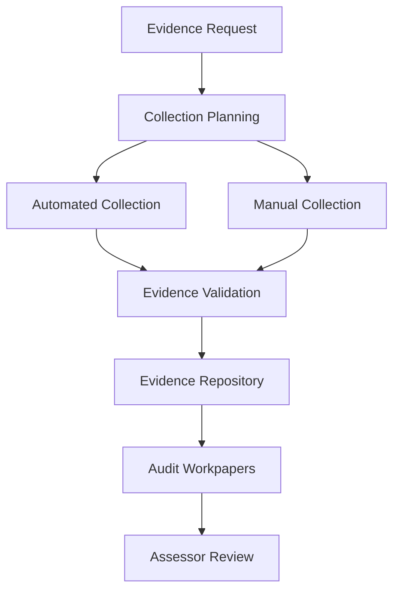

# Comprehensive Compliance Framework Guide

This directory provides a complete compliance management framework for security assessments and audits, supporting multiple frameworks including ISO/IEC 27001:2022, SOC 2 Type II, and various regulatory requirements. The framework is specifically designed for Azure cloud environments and provides automated compliance monitoring, evidence collection, and gap analysis capabilities.

## Table of Contents

1. [Supported Compliance Frameworks](#supported-compliance-frameworks)
2. [Framework Architecture and Structure](#framework-architecture-and-structure)
3. [Multi-Framework Mapping Methodologies](#multi-framework-mapping-methodologies)
4. [Evidence Collection and Management](#evidence-collection-and-management)
5. [Azure-Specific Implementation Guidance](#azure-specific-implementation-guidance)
6. [Assessment Procedures and Testing](#assessment-procedures-and-testing)
7. [Gap Analysis and Remediation Planning](#gap-analysis-and-remediation-planning)
8. [Automated Compliance Monitoring](#automated-compliance-monitoring)
9. [Audit Preparation and Coordination](#audit-preparation-and-coordination)
10. [Compliance Reporting and Certification](#compliance-reporting-and-certification)
11. [Continuous Compliance Monitoring](#continuous-compliance-monitoring)
12. [Third-Party Assessor Management](#third-party-assessor-management)
13. [Quick Start Guide](#quick-start-guide)

## Supported Compliance Frameworks

### Primary Frameworks

#### ISO/IEC 27001:2022
- **Scope**: Information Security Management System (ISMS) certification
- **Controls**: 93 Annex A controls across 4 themes (Organizational, People, Physical, Technological)
- **Templates**: 
  - `ISO27001/SoA-Template.md` - Statement of Applicability template
  - `ISO27001/ISMS-Scope-Template.md` - ISMS boundary definition
  - `ISO27001/Annex-A-Controls.xlsx` - Complete control matrix with Azure mappings
  - `ISO27001/Risk-Treatment-Plan.xlsx` - Risk management documentation
  - `ISO27001/Internal-Audit-Checklist.md` - ISMS audit procedures

#### SOC 2 Type II
- **Scope**: Service Organization Control reporting for service providers
- **Criteria**: Trust Services Criteria (Security, Availability, Confidentiality, Processing Integrity, Privacy)
- **Templates**:
  - `SOC2/TSC-Control-Mapping.xlsx` - Complete TSC control matrix
  - `SOC2/Evidence-Request-List.md` - Structured evidence collection framework
  - `SOC2/Test-Procedures.md` - Control testing procedures
  - `SOC2/Bridge-Letter-Template.md` - Management representation letter
  - `SOC2/Remediation-Tracking.xlsx` - Finding remediation management

### Regulatory Compliance Frameworks

#### HIPAA (Healthcare)
- **Scope**: Protected Health Information (PHI) security and privacy
- **Templates**:
  - `Regulatory/HIPAA/Risk-Assessment-Template.xlsx`
  - `Regulatory/HIPAA/BAA-Requirements.md` - Business Associate Agreement requirements
  - `Regulatory/HIPAA/Azure-Compliance-Mapping.xlsx`

#### PCI DSS (Payment Card Industry)
- **Scope**: Payment card data protection
- **Templates**:
  - `Regulatory/PCI-DSS/SAQ-Mapping.xlsx` - Self-Assessment Questionnaire mapping
  - `Regulatory/PCI-DSS/Network-Segmentation-Validation.md`
  - `Regulatory/PCI-DSS/Azure-Implementation-Guide.md`

#### GDPR (General Data Protection Regulation)
- **Scope**: Personal data protection and privacy
- **Templates**:
  - `Regulatory/GDPR/DPIA-Template.md` - Data Protection Impact Assessment
  - `Regulatory/GDPR/Article-32-Controls.xlsx` - Technical and organizational measures
  - `Regulatory/GDPR/Azure-DPA-Mapping.xlsx`

#### Additional Frameworks
- **NIST Cybersecurity Framework**: `NIST-CSF/Framework-Mapping.xlsx`
- **CIS Controls v8**: `CIS-Controls/Implementation-Guide.xlsx`
- **FedRAMP**: `FedRAMP/Control-Implementation-Summary.xlsx`
- **CCPA**: `Regulatory/CCPA/Privacy-Program-Template.md`

## Framework Architecture and Structure

### Core Components

```
Compliance/
├── Framework-Crosswalks/          # Multi-framework mapping matrices
│   ├── ISO27001-SOC2-Crosswalk.xlsx
│   ├── NIST-CSF-Mapping.xlsx
│   └── Regulatory-Alignment-Matrix.xlsx
├── ISO27001/                      # ISO 27001 specific templates
├── SOC2/                         # SOC 2 specific templates
├── Regulatory/                   # Industry-specific compliance
├── Evidence-Management/          # Evidence collection framework
├── Assessment-Tools/            # Testing and validation tools
├── Azure-Implementation/        # Cloud-specific guidance
├── Automation/                 # Compliance monitoring scripts
└── Reporting/                 # Compliance dashboards and reports
```

### Template Categories

1. **Control Matrices**: Comprehensive mapping of controls to Azure services and implementations
2. **Evidence Templates**: Standardized evidence collection and documentation formats
3. **Assessment Procedures**: Step-by-step testing and validation procedures
4. **Gap Analysis Tools**: Structured approaches to identify compliance gaps
5. **Remediation Planning**: Action plan templates and tracking mechanisms
6. **Reporting Templates**: Executive summaries, detailed findings, and certification reports

## Multi-Framework Mapping Methodologies

### Crosswalk Development Process

#### 1. Control Identification and Categorization
```
Process Flow:
Framework A Control → Common Control Objective → Framework B Control
     ↓                         ↓                        ↓
Analysis of intent → Identify shared requirements → Map equivalent controls
```

#### 2. Mapping Methodologies

**Direct Mapping**: One-to-one control relationships
- Example: ISO 27001 A.9.1.1 (Access Control Policy) ↔ SOC 2 CC6.1 (Access Controls)

**Partial Mapping**: One-to-many or many-to-one relationships
- Example: ISO 27001 A.12.6.1 (Management of Technical Vulnerabilities) maps to multiple SOC 2 controls

**Gap Identification**: Controls unique to specific frameworks
- Document additional requirements and implementation needs

#### 3. Azure Service Mapping
Each control maps to specific Azure services and configurations:

```yaml
Control_Mapping:
  ISO_27001_A_9_4_2:  # Secure log-on procedures
    Azure_Services:
      - Azure Active Directory
      - Conditional Access
      - Multi-Factor Authentication
    Implementation:
      - Policy: "require-mfa-policy.json"
      - Configuration: "conditional-access-config.yml"
    Evidence_Points:
      - Sign-in logs
      - Policy assignments
      - Risk detections
```

### Framework Crosswalk Templates

#### ISO 27001 ↔ SOC 2 Crosswalk
Location: `Framework-Crosswalks/ISO27001-SOC2-Crosswalk.xlsx`

| ISO 27001 Control | SOC 2 Criterion | Mapping Type | Azure Implementation | Evidence Source |
|-------------------|-----------------|--------------|---------------------|-----------------|
| A.5.1.1 | CC1.1 | Direct | Policy documents | Document repository |
| A.9.1.1 | CC6.1, CC6.2 | Partial | Azure AD policies | Access review reports |

## Evidence Collection and Management

### Evidence Framework Architecture

#### 1. Evidence Categories
- **Policies and Procedures**: Documented controls and processes
- **System Configurations**: Technical implementation evidence  
- **Monitoring Data**: Logs, alerts, and security events
- **Personnel Evidence**: Training records, background checks
- **Third-Party Attestations**: Vendor certifications and assessments

#### 2. Evidence Collection Templates

**Automated Evidence Collection**
```bash
# Azure Policy compliance evidence
./Scripts/collect-policy-evidence.sh --scope subscription --output evidence/

# Log Analytics query results
./Scripts/export-monitoring-evidence.sh --workspace $WORKSPACE_ID --timespan 90days

# Configuration baselines
./Scripts/capture-baseline-evidence.sh --resource-group security-rg
```

**Manual Evidence Collection**
- `Evidence-Management/Evidence-Request-Template.xlsx` - Standardized evidence requests
- `Evidence-Management/Evidence-Validation-Checklist.md` - Quality assurance procedures
- `Evidence-Management/Evidence-Repository-Structure.md` - Organization guidelines

#### 3. Evidence Management Process



### Evidence Validation Framework

#### Quality Assurance Criteria
- **Completeness**: All requested evidence provided
- **Accuracy**: Evidence reflects actual implementation
- **Timeliness**: Evidence from relevant period
- **Authenticity**: Evidence from authoritative sources
- **Relevance**: Evidence directly supports control objectives

#### Validation Templates
- `Evidence-Management/Validation-Checklist.xlsx` - Quality control matrix
- `Evidence-Management/Exception-Documentation.md` - Gap documentation
- `Evidence-Management/Remediation-Evidence.xlsx` - Follow-up evidence tracking

## Azure-Specific Implementation Guidance

### Azure Service Control Mapping

#### Identity and Access Management
```yaml
Azure_AD_Controls:
  ISO_27001_A_9_2_1:  # User registration and de-registration
    Implementation:
      - Service: Azure AD User Management
      - Policies: 
        - Automated provisioning via Azure AD Connect
        - JIT access with Privileged Identity Management
    Evidence:
      - User lifecycle reports
      - Access reviews
      - Provisioning logs

  SOC_2_CC6_1:  # Logical access controls
    Implementation:
      - Service: Conditional Access
      - Configuration: Risk-based authentication
    Evidence:
      - Sign-in risk reports
      - Blocked sign-ins
      - Policy compliance
```

#### Data Protection and Encryption
```yaml
Data_Protection_Controls:
  ISO_27001_A_10_1_1:  # Cryptographic policy
    Azure_Implementation:
      - Azure Key Vault for key management
      - Customer-managed keys (CMK) for sensitive data
      - Always Encrypted for SQL databases
    Configuration_Files:
      - "Azure-Implementation/key-vault-config.json"
      - "Azure-Implementation/cmk-deployment.bicep"
```

### Azure Policy Integration

#### Compliance Policy Definitions
Location: `Azure-Implementation/Policy-Definitions/`

**Example: ISO 27001 A.12.6.1 - Vulnerability Management**
```json
{
  "name": "audit-vulnerability-assessment",
  "displayName": "Audit SQL vulnerability assessment deployment",
  "description": "This policy audits whether SQL vulnerability assessment is configured",
  "mode": "All",
  "policyRule": {
    "if": {
      "field": "type",
      "equals": "Microsoft.Sql/servers"
    },
    "then": {
      "effect": "AuditIfNotExists",
      "details": {
        "type": "Microsoft.Sql/servers/vulnerabilityAssessments",
        "name": "default"
      }
    }
  }
}
```

#### Policy Assignment Templates
```bash
# Deploy compliance policies at management group level
az policy assignment create \
  --name "ISO27001-Compliance" \
  --scope "/providers/Microsoft.Management/managementGroups/mg-prod" \
  --policy-set-definition "ISO27001-Initiative" \
  --params @iso27001-params.json
```

### Azure Security Center Integration

#### Compliance Dashboards
- **Regulatory Compliance Dashboard**: Track compliance posture across frameworks
- **Secure Score**: Automated security recommendations aligned to controls
- **Policy Compliance**: Real-time policy violation monitoring

#### Configuration Templates
```yaml
Security_Center_Config:
  Standard_Tier: true
  Auto_Provisioning: enabled
  Compliance_Standards:
    - ISO_27001
    - SOC_2_TSC
    - NIST_800_53
    - PCI_DSS_3_2_1
  Email_Notifications:
    - security-team@company.com
    - compliance@company.com
```

## Assessment Procedures and Testing

### Control Testing Methodology

#### 1. Testing Approach Selection
- **Inquiry**: Interviews with personnel
- **Observation**: Direct observation of processes
- **Inspection**: Document and record examination
- **Reperformance**: Independent execution of control procedures

#### 2. Sample Selection Methodology

**Risk-Based Sampling**
```
High Risk Controls: 100% testing
Medium Risk Controls: Statistical sampling (60-80%)
Low Risk Controls: Judgmental sampling (25-40%)
```

**Sample Size Calculator**
Location: `Assessment-Tools/Sample-Size-Calculator.xlsx`
- Population size
- Risk level
- Confidence level
- Expected deviation rate

#### 3. Control Testing Templates

**Walkthrough Procedures**
Location: `Assessment-Tools/Walkthrough-Templates/`
- Process flow documentation
- Key control identification  
- Dependency mapping
- Risk point analysis

**Substantive Testing**
Location: `Assessment-Tools/Testing-Procedures/`
- Detail testing templates by control family
- Exception documentation forms
- Remediation tracking worksheets

### Azure-Specific Testing Procedures

#### Identity and Access Controls Testing
```powershell
# Test 1: MFA enforcement validation
$users = Get-AzureADUser -All $true
$mfaUsers = Get-AzureADUser -All $true | Get-AzureADUserRegisteredDevice

# Test 2: Privileged access review
Get-AzureADDirectoryRole | ForEach-Object {
    Get-AzureADDirectoryRoleMember -ObjectId $_.ObjectId
}

# Test 3: Conditional access policy effectiveness
Get-AzureADMSNamedPolicy -PolicyType conditionalAccess
```

#### Data Protection Testing
```bash
# Test encryption at rest
az storage account show --name $STORAGE_ACCOUNT --query encryption

# Test TLS configuration
az webapp config show --name $WEBAPP_NAME --resource-group $RG --query httpsOnly

# Test Key Vault access policies
az keyvault show --name $KV_NAME --query properties.accessPolicies
```

### Testing Documentation Templates

#### Test Results Documentation
- `Assessment-Tools/Test-Results-Template.xlsx`
- `Assessment-Tools/Exception-Summary.xlsx`
- `Assessment-Tools/Management-Letter-Points.md`

## Gap Analysis and Remediation Planning

### Gap Analysis Methodology

#### 1. Current State Assessment
```yaml
Assessment_Categories:
  Policy_and_Governance:
    - Policy existence and approval
    - Policy communication and training
    - Policy review and update procedures
  
  Technical_Implementation:
    - Azure service configuration
    - Security control deployment
    - Monitoring and logging coverage
  
  Operational_Procedures:
    - Process documentation
    - Role definitions and responsibilities
    - Incident response capabilities
```

#### 2. Gap Identification Framework

**Control Effectiveness Rating**
- **Effective (E)**: Control operating as designed
- **Needs Improvement (NI)**: Control functioning but has deficiencies
- **Ineffective (I)**: Control not operating effectively
- **Not Implemented (N)**: Control does not exist

#### 3. Risk Assessment Integration
Location: `Gap-Analysis/Risk-Assessment-Template.xlsx`

| Control | Gap Description | Risk Level | Business Impact | Remediation Effort | Priority |
|---------|----------------|------------|-----------------|-------------------|----------|
| A.9.1.1 | No formal access policy | High | Data breach risk | Medium | 1 |

### Remediation Planning Framework

#### 1. Remediation Prioritization Matrix

**Priority Calculation**
```
Priority Score = (Risk Level × Business Impact) / Implementation Effort
```

#### 2. Remediation Plan Template
Location: `Gap-Analysis/Remediation-Plan-Template.xlsx`

**Plan Components**
- **Finding Description**: Detailed gap analysis
- **Remediation Actions**: Specific steps to address gaps
- **Responsible Party**: Owner and accountable parties
- **Timeline**: Target completion dates
- **Resource Requirements**: Budget and personnel needs
- **Success Criteria**: Measurable completion indicators

#### 3. Azure-Specific Remediation Guidance

**Common Remediation Patterns**
```yaml
Access_Control_Gaps:
  Policy_Deployment:
    - Deploy conditional access policies
    - Configure PIM for privileged access
    - Implement access reviews
  
  Monitoring_Gaps:
    - Enable Azure AD audit logs
    - Configure Azure Monitor alerts
    - Deploy Sentinel analytics rules
  
  Data_Protection_Gaps:
    - Enable storage account encryption
    - Implement Key Vault for secrets
    - Configure TDE for SQL databases
```

### Remediation Tracking and Monitoring

#### Progress Tracking Dashboard
Location: `Gap-Analysis/Remediation-Dashboard.pbix`

**Key Metrics**
- Remediation completion rate
- Overdue items by risk level
- Resource utilization
- Control effectiveness improvement

## Automated Compliance Monitoring

### Continuous Compliance Framework

#### 1. Automated Assessment Architecture

```yaml
Monitoring_Components:
  Azure_Policy:
    - Real-time compliance evaluation
    - Automatic remediation where applicable
    - Compliance scoring and reporting
    
  Azure_Security_Center:
    - Security posture monitoring
    - Regulatory compliance dashboard
    - Security recommendations
    
  Azure_Sentinel:
    - Security event monitoring
    - Incident detection and response
    - Compliance violation alerting
    
  Log_Analytics:
    - Centralized logging
    - Custom compliance queries
    - Historical compliance reporting
```

#### 2. Compliance Monitoring Queries
Location: `Automation/Compliance-Queries/`

**Example: Access Review Compliance**
```kusto
AuditLogs
| where TimeGenerated > ago(90d)
| where OperationName contains "Review"
| where Category == "RoleManagement"
| summarize ReviewCount = count() by UserPrincipalName, bin(TimeGenerated, 7d)
| where ReviewCount == 0
```

**Example: Encryption Status Monitoring**
```kusto
AzureActivity
| where OperationNameValue contains "storageAccounts/write"
| extend EncryptionEnabled = tostring(Properties.encryptionEnabled)
| where EncryptionEnabled != "true"
| project TimeGenerated, ResourceId, CallerIpAddress, EncryptionEnabled
```

### Compliance Automation Scripts

#### Policy Compliance Monitoring
Location: `Automation/Scripts/monitor-policy-compliance.ps1`

```powershell
# Monitor and report policy compliance
$subscriptions = Get-AzSubscription
foreach ($sub in $subscriptions) {
    Set-AzContext -SubscriptionId $sub.Id
    $compliance = Get-AzPolicyState | Where-Object {$_.ComplianceState -eq "NonCompliant"}
    
    # Generate compliance report
    $report = @{
        Subscription = $sub.Name
        NonCompliantResources = $compliance.Count
        CriticalViolations = ($compliance | Where-Object {$_.PolicySetDefinitionName -match "Critical"}).Count
        Timestamp = Get-Date
    }
    
    # Send alerts for critical violations
    if ($report.CriticalViolations -gt 0) {
        Send-ComplianceAlert -Report $report
    }
}
```

#### Automated Evidence Collection
Location: `Automation/Scripts/collect-compliance-evidence.sh`

```bash
#!/bin/bash
# Automated evidence collection for compliance assessments

EVIDENCE_DIR="./evidence/$(date +%Y%m%d)"
mkdir -p $EVIDENCE_DIR

# Collect Azure AD evidence
az ad user list --query "[].{UserPrincipalName:userPrincipalName, AccountEnabled:accountEnabled}" \
  > $EVIDENCE_DIR/azure-ad-users.json

# Collect policy compliance
az policy state list --query "[].{Resource:resourceId, Policy:policyDefinitionName, Compliance:complianceState}" \
  > $EVIDENCE_DIR/policy-compliance.json

# Collect security center findings
az security assessment list --query "[].{Name:displayName, Status:status.code, Severity:status.severity}" \
  > $EVIDENCE_DIR/security-assessments.json

echo "Evidence collected in $EVIDENCE_DIR"
```

### Compliance Dashboard Development

#### Power BI Dashboard Template
Location: `Automation/Dashboards/Compliance-Dashboard.pbix`

**Dashboard Components**
- **Executive Summary**: High-level compliance posture
- **Control Status**: Detailed control implementation status
- **Risk Heat Map**: Visual risk prioritization
- **Trend Analysis**: Compliance improvement over time
- **Exception Tracking**: Outstanding issues and remediation

#### Custom Workbooks
Location: `Automation/Workbooks/`

**Azure Monitor Workbooks**
- `ISO27001-Compliance-Workbook.json`: ISO 27001 specific monitoring
- `SOC2-Control-Monitoring.json`: SOC 2 control effectiveness
- `Security-Metrics-Overview.json`: Comprehensive security metrics

## Audit Preparation and Coordination

### Pre-Audit Preparation Framework

#### 1. Audit Readiness Assessment
Location: `Audit-Preparation/Readiness-Checklist.xlsx`

**Assessment Areas**
- **Documentation Completeness**: Policy and procedure coverage
- **Evidence Availability**: Supporting documentation and artifacts
- **System Accessibility**: Auditor access and demonstrations
- **Personnel Availability**: Key stakeholder scheduling
- **Technical Environment**: System stability and access

#### 2. Audit Planning Templates

**Audit Project Plan**
Location: `Audit-Preparation/Audit-Project-Plan.xlsx`
- Milestone planning
- Resource allocation
- Risk identification
- Communication plan

**Stakeholder Communication Plan**
```yaml
Communication_Matrix:
  Executive_Team:
    - Kickoff presentation
    - Weekly status updates
    - Issue escalation procedures
    
  Technical_Teams:
    - Daily standups during fieldwork
    - Evidence request coordination
    - Technical demonstration scheduling
    
  Audit_Firm:
    - Regular checkpoint meetings
    - Evidence submission protocols
    - Issue resolution procedures
```

#### 3. Evidence Room Setup

**Virtual Data Room Structure**
```
Evidence-Room/
├── 01-Governance/
│   ├── Policies/
│   ├── Procedures/
│   └── Board-Minutes/
├── 02-Risk-Management/
│   ├── Risk-Assessments/
│   ├── Risk-Register/
│   └── Treatment-Plans/
├── 03-Asset-Management/
├── 04-Access-Control/
├── 05-Cryptography/
├── 06-Physical-Security/
├── 07-Operations-Security/
├── 08-Communications-Security/
├── 09-System-Development/
├── 10-Supplier-Relationships/
├── 11-Incident-Management/
├── 12-Business-Continuity/
└── 13-Compliance/
```

### Audit Coordination Procedures

#### 1. Auditor Onboarding Process
Location: `Audit-Preparation/Auditor-Onboarding-Checklist.md`

**Onboarding Components**
- Security briefing and NDA execution
- System access provisioning
- Environment overview and architecture walkthrough
- Key personnel introductions
- Audit logistics and protocols

#### 2. Evidence Request Management
Location: `Audit-Preparation/Evidence-Request-Log.xlsx`

**Request Tracking**
- Request ID and description
- Assigned responsible party
- Due date and status
- Evidence location and format
- Quality review status

#### 3. Daily Audit Coordination

**Daily Standup Template**
```yaml
Standup_Agenda:
  Previous_Day_Accomplishments:
    - Evidence provided
    - Interviews completed
    - Issues resolved
    
  Current_Day_Plans:
    - Scheduled interviews
    - Evidence due
    - Demonstrations planned
    
  Blockers_and_Issues:
    - Access problems
    - Missing evidence
    - Resource conflicts
    
  Action_Items:
    - Owner assignments
    - Due dates
    - Escalation needs
```

### Issue and Exception Management

#### 1. Issue Classification Framework

**Issue Severity Levels**
- **Critical**: Control failure with immediate risk
- **High**: Significant control deficiency
- **Medium**: Control improvement opportunity
- **Low**: Minor procedural issue

#### 2. Exception Documentation Process
Location: `Audit-Preparation/Exception-Management/`

**Exception Response Templates**
- `Management-Response-Template.md`: Formal management responses
- `Corrective-Action-Plan.xlsx`: Detailed remediation planning
- `Exception-Tracking-Log.xlsx`: Issue status monitoring

## Compliance Reporting and Certification

### Reporting Framework Architecture

#### 1. Report Types and Audiences

**Executive Reporting**
- **Board Report**: High-level compliance posture summary
- **Executive Dashboard**: Key performance indicators and metrics
- **Risk Committee Update**: Risk-focused compliance status

**Operational Reporting**
- **Detailed Findings Report**: Comprehensive assessment results
- **Control Effectiveness Report**: Individual control assessments
- **Remediation Status Report**: Progress on identified gaps

**Regulatory Reporting**
- **Certification Reports**: Formal compliance attestations
- **Regulatory Submissions**: Required regulatory filings
- **Third-Party Assessments**: External validation reports

#### 2. Report Templates and Formats

**Executive Summary Template**
Location: `Reporting/Executive-Summary-Template.docx`

```markdown
# Compliance Assessment Executive Summary

## Overall Compliance Posture
- **ISO 27001**: 94% compliant (86/93 controls effective)
- **SOC 2**: 98% effective (2 minor exceptions noted)
- **Overall Risk Rating**: Low to Medium

## Key Achievements
- Successful implementation of zero-trust architecture
- Enhanced monitoring and detection capabilities
- Improved incident response procedures

## Critical Findings (0)
No critical findings identified

## High Priority Findings (2)
1. Multi-factor authentication gaps for service accounts
2. Incomplete data classification for sensitive databases

## Remediation Timeline
- All high findings: 60 days
- Medium findings: 90 days
- Low findings: 180 days
```

#### 3. Automated Report Generation

**PowerShell Report Generation**
Location: `Reporting/Scripts/Generate-Compliance-Report.ps1`

```powershell
# Generate automated compliance report
param(
    [string]$Framework = "ISO27001",
    [string]$OutputPath = "./reports",
    [int]$DaysBack = 90
)

# Collect compliance data
$policyCompliance = Get-AzPolicyState | Where-Object {$_.ComplianceState -eq "NonCompliant"}
$securityFindings = Get-AzSecurityTask | Where-Object {$_.State -eq "Active"}

# Generate report data
$reportData = @{
    GenerationDate = Get-Date
    ComplianceScore = Calculate-ComplianceScore -Framework $Framework
    Findings = Format-Findings -PolicyData $policyCompliance -SecurityData $securityFindings
    Trends = Get-ComplianceTrends -Days $DaysBack
}

# Create report
New-ComplianceReport -Data $reportData -Template "Executive-Summary" -OutputPath $OutputPath
```

### Certification Process Management

#### 1. Certification Preparation Checklist
Location: `Reporting/Certification-Preparation-Checklist.xlsx`

**Pre-Certification Activities**
- [ ] Complete internal audit
- [ ] Resolve all critical and high findings
- [ ] Update all policies and procedures
- [ ] Conduct management review
- [ ] Prepare certification documentation
- [ ] Schedule certification audit
- [ ] Brief certification team

#### 2. Certification Documentation Package
Location: `Reporting/Certification-Package/`

**Required Documents**
- Statement of Applicability (ISO 27001)
- System and Organization Controls Report (SOC 2)
- Risk Assessment and Treatment Plan
- ISMS Manual and Procedures
- Internal Audit Reports
- Management Review Minutes
- Training Records and Competency Matrix

#### 3. Post-Certification Monitoring

**Surveillance Activities**
```yaml
Surveillance_Requirements:
  ISO_27001:
    - Annual surveillance audits
    - Continuous improvement evidence
    - Management review records
    - Internal audit program
    
  SOC_2:
    - Continuous monitoring reports
    - Exception resolution tracking
    - Management assertion updates
    - Service level achievement
```

### Compliance Metrics and KPIs

#### 1. Key Performance Indicators

**Compliance Effectiveness Metrics**
- Control implementation rate: Target 95%+
- Mean time to remediation: Target <60 days
- Audit finding closure rate: Target 98%+
- Policy compliance score: Target 95%+

**Operational Efficiency Metrics**
- Evidence collection time: Target reduction 25% YoY
- Audit preparation effort: Target <200 hours
- Automated evidence percentage: Target 80%+
- Assessor satisfaction score: Target 4.5/5.0

#### 2. Compliance Dashboard KPIs
Location: `Reporting/KPI-Dashboard.pbix`

**Real-Time Metrics**
- Current compliance percentage by framework
- Open findings by severity and age
- Control effectiveness trends
- Risk posture heat map

## Continuous Compliance Monitoring

### Continuous Monitoring Framework

#### 1. Monitoring Architecture

```yaml
Monitoring_Layers:
  Real_Time_Monitoring:
    - Azure Policy evaluation
    - Security Center recommendations
    - Identity Protection alerts
    
  Daily_Monitoring:
    - Policy compliance reports
    - Security posture assessments
    - Log analysis summaries
    
  Weekly_Monitoring:
    - Control effectiveness reviews
    - Exception aging analysis
    - Trend analysis reports
    
  Monthly_Monitoring:
    - Comprehensive compliance review
    - Risk assessment updates
    - Executive reporting
```

#### 2. Automated Monitoring Workflows

**Azure Logic Apps Integration**
Location: `Continuous-Monitoring/LogicApps/`

**Compliance Monitoring Workflow**
```json
{
  "definition": {
    "triggers": {
      "Recurrence": {
        "type": "Recurrence",
        "recurrence": {
          "frequency": "Day",
          "interval": 1
        }
      }
    },
    "actions": {
      "Get_Policy_Compliance": {
        "type": "Http",
        "inputs": {
          "method": "GET",
          "uri": "https://management.azure.com/subscriptions/{subscriptionId}/providers/Microsoft.PolicyInsights/policyStates/latest/summarize"
        }
      },
      "Evaluate_Compliance_Threshold": {
        "type": "Condition",
        "expression": "@less(body('Get_Policy_Compliance').value[0].results.policyAssignments[0].results.nonCompliantResources, 10)",
        "actions": {
          "Send_Alert": {
            "type": "ApiConnection",
            "inputs": {
              "host": {
                "connection": {
                  "name": "@parameters('$connections')['teams']['connectionId']"
                }
              },
              "method": "post",
              "path": "/trigger/@{encodeURIComponent('compliance-alerts')}"
            }
          }
        }
      }
    }
  }
}
```

#### 3. Compliance Drift Detection

**Configuration Baseline Monitoring**
Location: `Continuous-Monitoring/Scripts/baseline-monitoring.ps1`

```powershell
# Monitor for configuration drift from security baselines
$baselineConfig = Import-Csv "./baselines/security-baseline.csv"
$currentConfig = Get-AzResourceConfig -ResourceType "All"

# Compare current state to baseline
$driftItems = Compare-Object $baselineConfig $currentConfig -Property ResourceId, Setting, Value

# Generate drift report
if ($driftItems) {
    $driftReport = @{
        DetectionTime = Get-Date
        DriftCount = $driftItems.Count
        CriticalDrift = ($driftItems | Where-Object {$_.CriticalSetting -eq $true}).Count
        DriftDetails = $driftItems
    }
    
    # Send alert for critical drift
    if ($driftReport.CriticalDrift -gt 0) {
        Send-ComplianceDriftAlert -Report $driftReport
    }
}
```

### Change Management Integration

#### 1. Change Impact Assessment
Location: `Continuous-Monitoring/Change-Management/`

**Change Approval Workflow**
```yaml
Change_Process:
  Change_Request:
    - Impact assessment on compliance controls
    - Risk evaluation for affected frameworks
    - Approval routing based on risk level
    
  Implementation_Controls:
    - Pre-change compliance validation
    - Change implementation monitoring  
    - Post-change compliance verification
    
  Rollback_Procedures:
    - Automated rollback triggers
    - Compliance restoration procedures
    - Exception documentation process
```

#### 2. Compliance Impact Matrix
Location: `Continuous-Monitoring/Change-Impact-Matrix.xlsx`

| Change Type | ISO 27001 Impact | SOC 2 Impact | Risk Level | Approval Required |
|-------------|------------------|--------------|------------|-------------------|
| Policy Update | High | Medium | Medium | CISO |
| Access Control | High | High | High | CISO + Audit Committee |
| Infrastructure | Medium | High | High | CTO + CISO |

### Performance Optimization

#### 1. Monitoring Performance Metrics

**Efficiency Indicators**
- Evidence collection automation rate: Current 75%, Target 85%
- Assessment cycle time: Current 45 days, Target 30 days  
- Finding resolution time: Current 82 days, Target 60 days
- Compliance reporting automation: Current 60%, Target 80%

#### 2. Continuous Improvement Process

**Quarterly Improvement Cycle**
```yaml
Improvement_Process:
  Assessment_Phase:
    - Monitoring effectiveness review
    - Process efficiency analysis
    - Stakeholder feedback collection
    
  Analysis_Phase:
    - Root cause analysis of inefficiencies
    - Best practice identification
    - Technology enhancement opportunities
    
  Implementation_Phase:
    - Process improvements deployment
    - Automation enhancement
    - Training and communication
    
  Validation_Phase:
    - Improvement effectiveness measurement
    - Metrics baseline adjustment
    - Lessons learned documentation
```

## Third-Party Assessor Management

### Assessor Selection and Management

#### 1. Assessor Qualification Framework
Location: `Third-Party-Management/Assessor-Qualification-Matrix.xlsx`

**Selection Criteria**
- **Technical Expertise**: Framework specialization and Azure cloud experience
- **Industry Experience**: Relevant sector knowledge and references  
- **Certification Status**: Assessor certifications and accreditations
- **Resource Availability**: Team size and availability during assessment window
- **Cost Structure**: Competitive pricing and transparent fee structure

#### 2. Request for Proposal (RFP) Templates
Location: `Third-Party-Management/RFP-Templates/`

**RFP Components**
- `SOC2-Audit-RFP.docx`: SOC 2 examination RFP template
- `ISO27001-Certification-RFP.docx`: ISO 27001 certification RFP template
- `Penetration-Testing-RFP.docx`: Security testing RFP template
- `Vendor-Evaluation-Criteria.xlsx`: Standardized evaluation matrix

### Assessor Coordination Framework

#### 1. Engagement Management Process

**Phase 1: Pre-Engagement**
```yaml
Pre_Engagement_Activities:
  Contract_Negotiation:
    - Statement of work development
    - Timeline and milestone agreement
    - NDA and security requirements
    
  Planning_Session:
    - Scope confirmation and boundary setting
    - Methodology discussion and agreement
    - Resource allocation and scheduling
    
  Access_Provisioning:
    - Assessor access account creation
    - VPN and system access setup
    - Evidence room access configuration
```

**Phase 2: Active Assessment**
```yaml
Active_Assessment_Management:
  Daily_Coordination:
    - Progress review meetings
    - Issue escalation and resolution
    - Evidence request management
    
  Quality_Assurance:
    - Evidence review and validation
    - Assessor feedback incorporation
    - Scope change management
    
  Stakeholder_Management:
    - Executive briefings
    - Team communication coordination
    - External dependency management
```

#### 2. Assessor Performance Management
Location: `Third-Party-Management/Performance-Tracking.xlsx`

**Performance Metrics**
- **Timeline Adherence**: Milestone completion on schedule
- **Communication Effectiveness**: Responsiveness and clarity of communication
- **Technical Competence**: Quality of assessment and findings
- **Professional Conduct**: Adherence to standards and ethics
- **Value Delivery**: Actionable recommendations and insights

### Vendor Risk Management

#### 1. Third-Party Risk Assessment
Location: `Third-Party-Management/Vendor-Risk-Assessment.xlsx`

**Risk Categories**
- **Data Security**: Handling of sensitive information and evidence
- **Operational Risk**: Business continuity and resource availability
- **Regulatory Risk**: Compliance with applicable regulations
- **Reputational Risk**: Potential impact on organization reputation
- **Financial Risk**: Cost overruns and payment terms

#### 2. Vendor Management Controls

**Due Diligence Requirements**
```yaml
Due_Diligence_Checklist:
  Financial_Stability:
    - Financial statements review
    - Credit rating verification
    - Insurance coverage validation
    
  Security_Controls:
    - SOC 2 Type II report review
    - Security questionnaire completion
    - Background check requirements
    
  References_and_Experience:
    - Client reference validation
    - Similar engagement experience
    - Team qualifications verification
```

### Knowledge Transfer and Retention

#### 1. Assessment Knowledge Management
Location: `Third-Party-Management/Knowledge-Transfer/`

**Knowledge Capture Process**
- Assessment methodology documentation
- Lessons learned compilation
- Best practice identification
- Process improvement recommendations

#### 2. Institutional Knowledge Retention

**Documentation Requirements**
```yaml
Knowledge_Retention:
  Assessment_Documentation:
    - Detailed assessment procedures
    - Evidence evaluation methods
    - Finding development process
    
  Relationship_Management:
    - Assessor contact information
    - Engagement history and performance
    - Preferred vendor listings
    
  Process_Improvements:
    - Efficiency enhancement opportunities
    - Automation possibilities
    - Cost optimization strategies
```

## Quick Start Guide

### Initial Setup (First-Time Users)

#### 1. Environment Preparation
```bash
# Clone compliance templates
git clone <repository-url> compliance-framework

# Set up environment variables
export AZURE_SUBSCRIPTION_ID="your-subscription-id"
export AZURE_TENANT_ID="your-tenant-id"
export COMPLIANCE_WORKSPACE="law-compliance-001"

# Install required tools
az extension add --name policy-insights
az extension add --name security-center
```

#### 2. Framework Selection Wizard
Location: `Quick-Start/Framework-Selection-Wizard.ps1`

```powershell
# Interactive framework selection
./Quick-Start/Framework-Selection-Wizard.ps1

# Output: Customized template package based on:
# - Industry type
# - Regulatory requirements  
# - Azure service usage
# - Organization size
# - Risk tolerance
```

#### 3. Initial Assessment Setup

**Step 1: Deploy Baseline Policies**
```bash
# Deploy core compliance policies
./Scripts/deploy-baseline-policies.sh --framework ISO27001 --scope subscription

# Verify deployment
az policy assignment list --scope "/subscriptions/${AZURE_SUBSCRIPTION_ID}"
```

**Step 2: Configure Monitoring**
```bash
# Set up compliance monitoring
./Scripts/setup-compliance-monitoring.sh --workspace $COMPLIANCE_WORKSPACE

# Configure alerting
./Scripts/configure-compliance-alerts.sh --notification-email compliance@company.com
```

### 30-Day Quick Assessment

#### Week 1: Foundation Setup
- [ ] Deploy Azure Policy baseline
- [ ] Configure Security Center
- [ ] Set up evidence collection framework
- [ ] Conduct stakeholder interviews using questionnaire templates

#### Week 2: Gap Analysis
- [ ] Run automated compliance scans  
- [ ] Complete manual control assessments
- [ ] Document findings using templates
- [ ] Prioritize gaps using risk matrix

#### Week 3: Remediation Planning
- [ ] Develop remediation plans for critical/high findings
- [ ] Assign ownership and timelines
- [ ] Implement quick wins and low-effort fixes
- [ ] Set up continuous monitoring

#### Week 4: Reporting and Next Steps
- [ ] Generate executive summary report
- [ ] Present findings to leadership
- [ ] Finalize remediation timeline
- [ ] Plan for ongoing compliance program

### Common Use Cases

#### Use Case 1: SOC 2 Type II Preparation
```bash
# Quick setup for SOC 2 assessment
cd SOC2/
./setup-soc2-assessment.sh --organization "Your Company" --period "12months"

# Key deliverables:
# - Control matrix with current implementation status
# - Evidence request list for each TSC criterion
# - Gap analysis with remediation priorities
```

#### Use Case 2: ISO 27001 Certification
```bash
# ISO 27001 certification preparation
cd ISO27001/
./setup-iso27001-certification.sh --scope "Cloud Infrastructure" --timeline "6months"

# Key deliverables:
# - Statement of Applicability
# - Risk treatment plan
# - ISMS documentation package
```

#### Use Case 3: Multi-Framework Compliance
```bash
# Set up compliance for multiple frameworks
./setup-multi-framework.sh --frameworks "ISO27001,SOC2,HIPAA" --crosswalk-analysis

# Key deliverables:
# - Unified control matrix
# - Cross-framework gap analysis
# - Shared evidence repository
```

## Support and Maintenance

### Template Updates and Versioning
- Framework templates updated quarterly
- Azure service mappings updated monthly  
- Regulatory requirement updates as needed
- Version history maintained in git

### Community and Support
- Submit issues and enhancement requests via repository issues
- Contribute improvements through pull requests
- Join compliance community discussions
- Access professional services for complex implementations

### License and Usage
- Templates require customization for each organization
- Control names may be subject to licensing from standards bodies
- Compliance is organization-specific and context-dependent
- Professional validation recommended for certification activities

---

**Note**: This framework provides templates and guidance for compliance activities. Organizations are responsible for customizing templates to their specific context, obtaining necessary licenses for copyrighted standards, and ensuring compliance implementations meet their unique requirements. Consider engaging qualified professionals for certification and audit activities.

