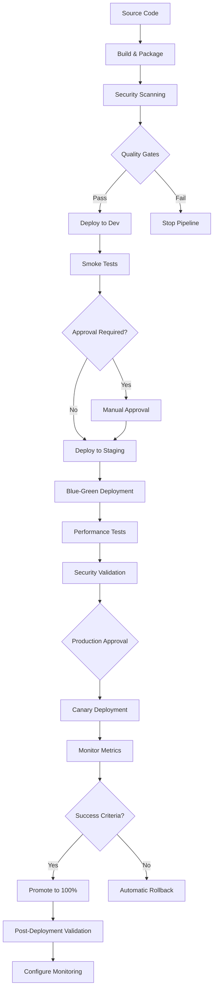

# Azure DevOps Multi-Environment Deployment Pipeline

This repository contains a comprehensive, production-ready Azure DevOps multi-environment deployment pipeline that demonstrates enterprise deployment best practices with proper governance, security controls, and safety mechanisms.

## Overview

The pipeline implements a progressive deployment strategy across three environments:
- **Development** - Rapid iteration and feature development
- **Staging** - Pre-production validation and testing  
- **Production** - Live environment with full monitoring and governance

## Key Features

### 🚀 Progressive Deployment
- **Dev → Staging → Production** flow with automated gates
- **Blue-Green** deployments for zero-downtime releases
- **Canary** deployments with traffic splitting and automatic rollback
- **Manual approval gates** with configurable timeouts and approvers

### 🔒 Security & Compliance
- **Security scanning** with Trivy, SonarCloud, and OWASP ZAP
- **Compliance validation** against Azure policies
- **Secret management** with Azure Key Vault integration
- **Container image signing** and vulnerability scanning
- **SSL/TLS validation** and security headers verification

### 🏗️ Infrastructure as Code
- **Terraform** and **Bicep** template deployment
- **State management** with Azure Storage backend
- **Resource tagging** and naming convention enforcement
- **Cost management** with budget alerts and optimization checks

### 📊 Monitoring & Observability
- **Application Insights** integration with custom dashboards
- **Performance monitoring** with configurable thresholds
- **Automated alerting** for availability, performance, and errors
- **Real user monitoring** and synthetic tests in production

### 🔄 Testing & Quality Gates
- **Smoke tests** with Postman/Newman collections
- **Performance tests** with Artillery load testing
- **Integration tests** with external service mocking
- **Database migration** testing and rollback validation

### 🛡️ Failure Handling & Recovery
- **Automatic rollback** on failed deployments
- **Health check validation** with configurable endpoints
- **Database backup** before production migrations
- **Disaster recovery** testing and documentation

## Architecture



## File Structure

```
azure-devops/multi-env-deployment/
├── azure-pipelines-multi-env.yml      # Main pipeline definition
├── environments/                      # Environment-specific configurations
│   ├── dev.yml                       # Development environment
│   ├── staging.yml                   # Staging environment
│   └── production.yml                # Production environment
├── templates/                        # Reusable pipeline templates
│   ├── deploy-stage.yml              # Main deployment stage template
│   └── deploy-steps.yml              # Deployment steps template
└── README.md                         # This documentation
```

## Environment Configurations

### Development Environment (`environments/dev.yml`)
- **Purpose**: Rapid development and feature testing
- **Resource Sizing**: Minimal (S1 App Service Plan, 1 AKS node)
- **Security**: Relaxed (allows high vulnerabilities, developer access)
- **Monitoring**: Basic (30-day retention)
- **Approvals**: None required
- **Testing**: Smoke tests only
- **Auto-cleanup**: 7-day retention

**Key Features:**
- Remote debugging enabled
- Swagger UI enabled
- All IP addresses allowed
- Auto-shutdown enabled for cost savings

### Staging Environment (`environments/staging.yml`)
- **Purpose**: Pre-production validation and integration testing
- **Resource Sizing**: Production-like (P1v3 App Service Plan, 2 AKS nodes)
- **Security**: Strict (no high/critical vulnerabilities)
- **Monitoring**: Enhanced (90-day retention, distributed tracing)
- **Approvals**: DevOps leads and QA team
- **Testing**: Full test suite including performance tests
- **Backup**: 30-day retention

**Key Features:**
- Blue-green deployment strategy
- Advanced threat protection enabled
- WAF and DDoS protection
- Geo-replication enabled
- Compliance scanning

### Production Environment (`environments/production.yml`)
- **Purpose**: Live production workload
- **Resource Sizing**: High availability (P2v3 App Service Plan, 3+ AKS nodes)
- **Security**: Maximum (Premium Key Vault, HSM, network isolation)
- **Monitoring**: Premium (365-day retention, real user monitoring)
- **Approvals**: Platform team, security team, and product owners
- **Testing**: Full validation with chaos engineering
- **Backup**: 365-day retention with geo-backup

**Key Features:**
- Canary deployment strategy
- Multiple availability zones
- Disaster recovery with automatic failover
- Change management integration
- 24/7 monitoring and alerting
- Business continuity planning

## Prerequisites

### Azure Resources
- **Azure Subscription** with Owner or Contributor permissions
- **Azure DevOps Organization** with project admin access
- **Service Connections** configured for each environment
- **Azure Container Registry** for storing container images
- **Azure Key Vault** for secrets management
- **Log Analytics Workspace** for monitoring and logging

### Required Extensions
Install the following Azure DevOps extensions:
- Azure Resource Manager Tools
- Terraform
- SonarCloud
- OWASP Zed Attack Proxy Scan
- WhiteSource Bolt (for dependency scanning)

### Service Connections
Create Azure Resource Manager service connections for each environment:
- `Azure-Dev-Service-Connection`
- `Azure-Staging-Service-Connection`
- `Azure-Production-Service-Connection`

### Variable Groups
Create the following variable groups in Azure DevOps:

#### Multi-Env-Global-Variables
```yaml
AZURE_TENANT_ID: "your-tenant-id"
APPINSIGHTS_INSTRUMENTATIONKEY: "your-instrumentation-key"
APPLICATIONINSIGHTS_CONNECTION_STRING: "your-connection-string"
SQL_SERVER_ADMIN_PASSWORD: "secure-password" # Mark as secret
BACKUP_STORAGE_KEY: "storage-account-key" # Mark as secret
```

#### Environment-Specific Variables
For each environment, create additional variable groups with environment-specific secrets:
- `Multi-Env-Dev-Secrets`
- `Multi-Env-Staging-Secrets`
- `Multi-Env-Production-Secrets`

## Deployment Strategies

### 1. Blue-Green Deployment (Staging)
Blue-green deployment eliminates downtime by running two identical production environments:

**Process:**
1. Deploy new version to "green" environment (staging slot)
2. Warm up and validate green environment
3. Run smoke tests on green environment
4. Switch traffic from blue to green instantly
5. Keep blue environment as immediate rollback option

**Benefits:**
- Zero downtime deployments
- Instant rollback capability
- Full validation before traffic switch
- Risk mitigation through parallel environments

### 2. Canary Deployment (Production)
Canary deployment gradually shifts traffic to the new version:

**Process:**
1. Deploy new version alongside current version
2. Route small percentage of traffic (10%) to new version
3. Monitor success metrics and error rates
4. Gradually increase traffic (10% → 25% → 50% → 100%)
5. Automatic rollback if success criteria not met

**Benefits:**
- Gradual risk exposure
- Real user feedback on small subset
- Automatic rollback on performance degradation
- Business continuity maintained

### 3. Rolling Deployment (Development)
Standard deployment strategy for development environments:

**Process:**
1. Deploy directly to target environment
2. Replace existing version completely
3. Run health checks and smoke tests
4. No parallel environments needed

**Benefits:**
- Simple and fast
- Resource efficient
- Suitable for non-critical environments

## Security Controls

### 1. Static Application Security Testing (SAST)
- **SonarCloud** integration for code quality and security analysis
- **Quality gates** to prevent vulnerable code deployment
- **Custom rules** for organization-specific security standards

### 2. Dependency Scanning
- **Trivy** for container image vulnerability scanning
- **WhiteSource Bolt** for open source dependency analysis
- **License compliance** checking for legal requirements

### 3. Dynamic Application Security Testing (DAST)
- **OWASP ZAP** baseline and full scans
- **SSL/TLS configuration** validation
- **Security headers** verification
- **Penetration testing** integration

### 4. Infrastructure Security
- **Azure Policy** compliance validation
- **Network security** with WAF and DDoS protection
- **Identity and access management** with managed identities
- **Encryption at rest** and in transit

### 5. Runtime Security
- **Container image signing** with Cosign
- **Pod security policies** in Kubernetes
- **Network policies** for micro-segmentation
- **Runtime threat detection** with Azure Security Center

## Monitoring and Alerting

### Application Insights Integration
- **Custom telemetry** for business metrics
- **Dependency tracking** for external services
- **Performance profiling** and bottleneck identification
- **User behavior analytics** and funnel analysis

### Azure Monitor Alerts
- **Availability alerts** for uptime monitoring
- **Performance alerts** for response time thresholds
- **Error rate alerts** for application failures
- **Resource utilization** alerts for scaling decisions

### Custom Dashboards
- **Executive dashboard** for business stakeholders
- **Operations dashboard** for DevOps teams
- **Security dashboard** for security teams
- **Cost optimization** dashboard for FinOps

### Notification Channels
- **Microsoft Teams** integration for team notifications
- **Slack** integration for development teams
- **Email alerts** for critical issues
- **SMS/voice** for production emergencies

## Testing Strategy

### 1. Unit Tests
- **Code coverage** requirements (85%+)
- **Test result publishing** with trend analysis
- **Quality gates** to prevent regression

### 2. Smoke Tests
- **Health endpoint** validation
- **Critical user journey** testing
- **Service dependency** verification
- **Database connectivity** checks

### 3. Integration Tests
- **End-to-end workflow** validation
- **External service integration** testing
- **Mock services** for isolated testing
- **Data consistency** verification

### 4. Performance Tests
- **Load testing** with Artillery
- **Stress testing** for capacity planning
- **Endurance testing** for stability
- **Baseline comparison** for regression detection

### 5. Security Tests
- **Vulnerability scanning** automation
- **Penetration testing** integration
- **Compliance validation** checks
- **Access control** verification

## Cost Management

### Budget Controls
- **Environment-specific budgets** with alert thresholds
- **Resource tagging** for cost allocation
- **Auto-shutdown** policies for development resources
- **Reserved instance** recommendations

### Cost Optimization
- **Right-sizing** recommendations based on usage
- **Unused resource** identification and cleanup
- **Storage optimization** with lifecycle policies
- **Network cost** optimization strategies

### FinOps Integration
- **Cost center** allocation through tagging
- **Showback/chargeback** reporting
- **Capacity planning** based on growth projections
- **ROI tracking** for cloud investments

## Disaster Recovery

### Backup Strategy
- **Database backups** with point-in-time recovery
- **Configuration backups** for infrastructure state
- **Code repository** mirroring and backup
- **Secrets backup** with secure storage

### Recovery Procedures
- **RTO targets**: 60 minutes for production
- **RPO targets**: 15 minutes for production
- **Automated failover** for critical components
- **DR testing** quarterly validation

### Business Continuity
- **Multi-region deployment** capabilities
- **Traffic manager** for automatic failover
- **Data replication** across regions
- **Communication plans** for stakeholders

## Compliance and Governance

### Regulatory Compliance
- **SOC 2 Type II** controls implementation
- **ISO 27001** security standards alignment
- **GDPR** data protection compliance
- **Industry-specific** regulations (HIPAA, PCI-DSS)

### Change Management
- **Approval workflows** with proper authorization
- **Change advisory board** integration
- **Emergency change** procedures
- **Audit trail** for all deployments

### Documentation
- **Runbooks** for operational procedures
- **Architecture diagrams** and documentation
- **Security procedures** and incident response
- **Training materials** for team members

## Troubleshooting

### Common Issues

#### Pipeline Failures

**Issue: Terraform state lock**
```bash
# Solution: Release the lock manually
az storage blob lease break --blob-name terraform.tfstate --container-name tfstate --account-name <storage-account>
```

**Issue: Service connection authentication**
```bash
# Solution: Refresh service principal credentials
az ad sp credential reset --name <service-principal-name>
```

**Issue: Container registry authentication**
```bash
# Solution: Login to ACR and verify permissions
az acr login --name <registry-name>
az acr repository list --name <registry-name>
```

#### Deployment Issues

**Issue: App Service deployment timeout**
- Check application logs in Azure portal
- Verify health check endpoint responds correctly
- Review resource sizing and scaling settings
- Check for database connection issues

**Issue: AKS deployment failures**
```bash
# Check pod status and logs
kubectl get pods -n <namespace>
kubectl describe pod <pod-name> -n <namespace>
kubectl logs <pod-name> -n <namespace>
```

**Issue: Database migration failures**
- Verify connection strings and credentials
- Check database server firewall rules
- Review migration scripts for syntax errors
- Validate database permissions for migration user

### Performance Issues

**Issue: Slow response times**
1. Check Application Insights performance data
2. Review database query performance
3. Analyze network latency metrics
4. Verify auto-scaling configuration

**Issue: High resource utilization**
1. Review Azure Monitor metrics
2. Check for memory leaks or CPU spikes
3. Analyze traffic patterns and scaling rules
4. Consider vertical or horizontal scaling

### Security Issues

**Issue: Security scan failures**
1. Review vulnerability report details
2. Update dependencies to patched versions
3. Add security exceptions if appropriate
4. Implement security controls or mitigations

**Issue: Compliance violations**
1. Check Azure Policy compliance reports
2. Review resource configurations
3. Update templates to meet requirements
4. Request policy exemptions if justified

## Best Practices

### Pipeline Design
1. **Idempotent deployments** - ensure repeated runs produce same results
2. **Fail fast** - catch issues early in the pipeline
3. **Clear separation** of environments and responsibilities
4. **Comprehensive logging** for troubleshooting and auditing
5. **Version everything** - infrastructure, configuration, and applications

### Security
1. **Principle of least privilege** for all access controls
2. **Secrets management** with Azure Key Vault
3. **Regular security scanning** and vulnerability assessments
4. **Network segmentation** and micro-segmentation
5. **Audit logging** for all administrative actions

### Operations
1. **Infrastructure as Code** for consistency and repeatability
2. **Automated testing** at every stage
3. **Comprehensive monitoring** and alerting
4. **Regular backup testing** and disaster recovery drills
5. **Documentation** kept current and accessible

### Cost Management
1. **Right-size resources** based on actual usage
2. **Use reserved instances** for predictable workloads
3. **Implement auto-scaling** to match demand
4. **Regular cost reviews** and optimization
5. **Tag all resources** for cost allocation

## Support and Maintenance

### Regular Maintenance Tasks
- **Weekly**: Review pipeline execution reports and failure rates
- **Monthly**: Update security scanning tools and policies  
- **Quarterly**: Review and update disaster recovery procedures
- **Annually**: Conduct comprehensive security assessment

### Monitoring and Alerting Review
- Review alert thresholds and notification channels
- Validate escalation procedures and contact information
- Test backup and recovery procedures
- Update documentation and runbooks

### Continuous Improvement
- Collect feedback from development teams
- Analyze deployment metrics and identify bottlenecks
- Implement new Azure DevOps features and capabilities
- Share lessons learned across teams

## Contributing

1. **Fork** the repository and create a feature branch
2. **Test** changes in development environment first
3. **Document** any new features or configuration changes
4. **Submit** pull request with clear description of changes
5. **Review** process includes security and performance validation

## License

This pipeline template is provided under the MIT License. See LICENSE file for details.

## Contact

For questions, issues, or contributions:
- **DevOps Team**: devops-team@company.com
- **Security Team**: security-team@company.com  
- **Platform Team**: platform-team@company.com

---

**Note**: This pipeline template is designed for enterprise environments and should be customized for your specific organizational requirements, security policies, and compliance needs.