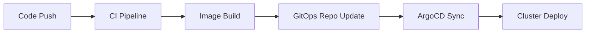

# Enterprise Container and Kubernetes Deployment Pipelines

This repository provides comprehensive, production-ready GitHub Actions workflows for containerized applications with enterprise-grade security, reliability, and compliance features.

## 🚀 Quick Start

1. **Copy workflow files** to your repository's `.github/workflows/` directory
2. **Configure secrets** in your repository settings
3. **Customize configurations** based on your environment
4. **Commit and push** to trigger the pipelines

## 📁 Repository Structure

```
github-actions/container-workflows/
├── docker-build-push.yml          # Docker container build and push pipeline
├── kubernetes-deploy.yml          # Kubernetes deployment pipeline
├── helm-chart-deploy.yml         # Helm chart deployment pipeline
├── docker/
│   ├── Dockerfile                 # Multi-stage production Dockerfile
│   ├── nginx.conf                 # Optimized nginx configuration
│   ├── security-headers.conf      # Security headers configuration
│   └── healthcheck.sh             # Container health check script
├── kubernetes/
│   └── deployment.yaml            # Kubernetes deployment manifests
├── helm/
│   └── values.yaml                # Helm chart values template
└── README.md                      # This documentation
```

## 🔧 Pipeline Features

### Docker Build and Push Pipeline (`docker-build-push.yml`)

**Core Capabilities:**
- Multi-architecture container builds (AMD64, ARM64)
- Multi-registry support (GHCR, ACR, ECR, GCR)
- Comprehensive security scanning with Trivy, Snyk, and Checkov
- Container signing and attestation with Cosign
- SBOM generation with Syft
- Image promotion across environments
- CIS benchmark validation
- Cost analysis and optimization

**Security Features:**
- Vulnerability scanning with configurable thresholds
- Secret detection with Gitleaks
- Container image signing with keyless Cosign
- SBOM attestation for supply chain security
- Compliance scanning with Docker Bench Security

**Triggers:**
- Push to main/develop branches
- Pull requests to main
- Manual workflow dispatch with parameters

### Kubernetes Deployment Pipeline (`kubernetes-deploy.yml`)

**Deployment Strategies:**
- Rolling updates for development
- Canary deployments for staging
- Blue-green deployments for production
- Automated rollback on failure

**GitOps Integration:**
- ArgoCD synchronization
- Flux reconciliation
- GitOps repository updates

**Security Validations:**
- Polaris security policy validation
- Falco rules checking
- Kubesec security analysis
- Network policy enforcement

**Service Mesh Support:**
- Istio configuration
- Linkerd integration
- Traffic management

### Helm Chart Deployment Pipeline (`helm-chart-deploy.yml`)

**Chart Management:**
- Helm lint and testing
- Chart packaging and signing
- Multi-registry publication (ChartMuseum, Harbor, GHCR)
- Version management and promotion

**Testing Framework:**
- Unit tests with helm-unittest
- Integration testing
- Production validation
- Security scanning

**Deployment Features:**
- Environment-specific configurations
- Blue-green deployments for staging
- Canary releases for production
- Automated backup and restore

## 🔒 Security Architecture

### Container Security

**Multi-layered Security:**
```dockerfile
# Security-optimized Dockerfile features:
- Multi-stage builds with minimal attack surface
- Non-root user execution (UID 1001)
- Read-only root filesystem
- Minimal base images with security updates
- Comprehensive health checks
- Security headers configuration
```

**Runtime Security:**
- Security contexts with restricted privileges
- AppArmor and Seccomp profiles
- Capability dropping (ALL capabilities removed)
- Network policies for micro-segmentation

### Supply Chain Security

**Image Signing and Verification:**
```bash
# Cosign keyless signing
cosign sign --yes $IMAGE_URL

# SBOM attestation
cosign attest --yes --predicate sbom.json --type cyclonedx $IMAGE_URL

# Verification
cosign verify --certificate-identity-regexp ".*" $IMAGE_URL
```

**Vulnerability Management:**
- Multi-scanner approach (Trivy, Snyk)
- Configurable severity thresholds
- SARIF integration with GitHub Security tab
- Automated vulnerability reporting

## 🛠 Configuration Guide

### Required Secrets

| Secret | Description | Example |
|--------|-------------|---------|
| `GITHUB_TOKEN` | GitHub Actions token | `${{ secrets.GITHUB_TOKEN }}` |
| `ACR_USERNAME` | Azure Container Registry username | `myacr` |
| `ACR_PASSWORD` | Azure Container Registry password | `***` |
| `AWS_ACCESS_KEY_ID` | AWS access key for ECR | `AKIA...` |
| `AWS_SECRET_ACCESS_KEY` | AWS secret key for ECR | `***` |
| `GCR_JSON_KEY` | Google Cloud service account JSON | `{"type": "service_account"...}` |
| `KUBECONFIG_DEV` | Dev cluster kubeconfig (base64) | `apiVersion: v1...` |
| `KUBECONFIG_STAGING` | Staging cluster kubeconfig (base64) | `apiVersion: v1...` |
| `KUBECONFIG_PROD` | Production cluster kubeconfig (base64) | `apiVersion: v1...` |
| `SNYK_TOKEN` | Snyk API token | `***` |
| `TEAMS_WEBHOOK_URI` | Microsoft Teams webhook | `https://outlook.office.com/...` |

### Repository Variables

| Variable | Description | Default |
|----------|-------------|---------|
| `ACR_REGISTRY` | Azure Container Registry URL | `myacr.azurecr.io` |
| `ECR_REGISTRY` | AWS ECR registry URL | `123456789012.dkr.ecr.us-east-1.amazonaws.com` |
| `GCR_REGISTRY` | Google Container Registry URL | `gcr.io/my-project` |
| `DOMAIN_NAME` | Application domain name | `example.com` |
| `GITOPS_REPO` | GitOps repository | `org/gitops-repo` |
| `ARGOCD_SERVER` | ArgoCD server URL | `argocd.example.com` |
| `SERVICE_MESH_TYPE` | Service mesh type | `istio` or `linkerd` |

### Environment-Specific Configuration

**Development Environment:**
```yaml
# Override in workflow_dispatch inputs
environment: dev
deployment_strategy: rolling
image_tag: latest
rollback_on_failure: true
```

**Staging Environment:**
```yaml
# Automatic configuration for develop branch
environment: staging
deployment_strategy: canary
image_tag: ${{ github.sha }}
rollback_on_failure: true
```

**Production Environment:**
```yaml
# Manual approval required
environment: production
deployment_strategy: blue-green
image_tag: ${{ github.sha }}
rollback_on_failure: true
```

## 📊 Monitoring and Observability

### Metrics Collection

**Prometheus Integration:**
```yaml
# ServiceMonitor configuration
apiVersion: monitoring.coreos.com/v1
kind: ServiceMonitor
metadata:
  name: myapp
spec:
  selector:
    matchLabels:
      app: myapp
  endpoints:
  - port: http-metrics
    interval: 30s
```

**Grafana Dashboards:**
- Application performance metrics
- Container resource utilization
- Deployment success rates
- Security scan results

### Alerting

**Microsoft Teams Integration:**
- Deployment success/failure notifications
- Security scan alerts
- Resource utilization warnings
- Performance degradation alerts

## 🚨 Security Scanning Results

### Container Vulnerability Assessment

| Scanner | Severity Levels | Action |
|---------|----------------|--------|
| **Trivy** | CRITICAL, HIGH, MEDIUM | Fail on CRITICAL |
| **Snyk** | High and above | Fail on HIGH |
| **Checkov** | IaC security issues | Report findings |

### Compliance Validation

**CIS Benchmarks:**
- Docker CIS Benchmark
- Kubernetes CIS Benchmark
- Container runtime compliance

**Security Policies:**
```yaml
# Pod Security Standards
securityContext:
  runAsNonRoot: true
  runAsUser: 1001
  allowPrivilegeEscalation: false
  readOnlyRootFilesystem: true
  capabilities:
    drop: ["ALL"]
```

## 🎯 Deployment Strategies

### Rolling Updates
**Best for:** Development environments
- Zero-downtime deployments
- Gradual pod replacement
- Automatic rollback on health check failures

### Canary Deployments
**Best for:** Staging environments
- Traffic-based validation (10% → 50% → 100%)
- Automated metrics analysis
- Flagger integration for automated promotion

### Blue-Green Deployments
**Best for:** Production environments
- Complete environment switch
- Instant rollback capability
- Zero-downtime deployments with validation

## 💰 Cost Optimization

### Spot Instance Integration

```yaml
# Spot instance tolerations
tolerations:
- key: "spot"
  operator: "Equal"
  value: "true"
  effect: "NoSchedule"
```

**Benefits:**
- Up to 90% cost reduction for non-production workloads
- Automatic rescheduling on interruption
- Pod Disruption Budget protection

### Resource Optimization

**Vertical Pod Autoscaler (VPA):**
- Automated resource recommendations
- Right-sizing based on actual usage
- Cost reduction through optimization

**Horizontal Pod Autoscaler (HPA):**
```yaml
metrics:
- type: Resource
  resource:
    name: cpu
    target:
      type: Utilization
      averageUtilization: 70
```

## 🔄 GitOps Workflow

### ArgoCD Integration



**Configuration:**
```yaml
# ArgoCD Application
apiVersion: argoproj.io/v1alpha1
kind: Application
metadata:
  name: myapp-production
spec:
  source:
    repoURL: https://github.com/org/gitops-repo
    path: apps/production
    targetRevision: HEAD
  destination:
    server: https://kubernetes.default.svc
    namespace: production
  syncPolicy:
    automated:
      prune: true
      selfHeal: true
```

## 🧪 Testing Framework

### Test Types

**Unit Tests:**
- Container build validation
- Dockerfile linting
- Security policy testing

**Integration Tests:**
- Service connectivity
- Database connections
- API endpoint validation

**End-to-End Tests:**
- Full user journey testing
- Cross-service integration
- Performance validation

### Test Automation

```bash
# Helm test execution
helm test myapp --namespace production

# Custom test runner
kubectl run test-runner \
  --image=test-runner:latest \
  --rm -i --restart=Never -- \
  --target-url https://myapp.example.com \
  --test-suite production-readiness
```

## 📈 Performance Optimization

### Container Optimization

**Multi-stage Build Benefits:**
- Reduced image size (up to 90% reduction)
- Improved security posture
- Faster deployment times
- Better layer caching

**Example Optimization:**
```dockerfile
# Before: 1.2GB
FROM node:18

# After: 120MB
FROM node:18-alpine AS build
# ... build stage
FROM nginx:alpine AS production
COPY --from=build /app/dist /usr/share/nginx/html
```

### Kubernetes Optimization

**Resource Requests and Limits:**
```yaml
resources:
  requests:
    cpu: 100m      # Guaranteed CPU
    memory: 128Mi  # Guaranteed memory
  limits:
    cpu: 500m      # Maximum CPU
    memory: 512Mi  # Maximum memory
```

**Networking Optimization:**
- Service mesh integration
- Load balancing algorithms
- Connection pooling
- Circuit breaker patterns

## 🔧 Troubleshooting Guide

### Common Issues

**1. Container Build Failures**
```bash
# Check build logs
docker build --no-cache -t myapp .

# Debug multi-arch builds
docker buildx build --platform linux/amd64,linux/arm64 .
```

**2. Kubernetes Deployment Issues**
```bash
# Check pod status
kubectl get pods -n production

# View deployment logs
kubectl logs deployment/myapp -n production

# Check events
kubectl get events -n production --sort-by='.lastTimestamp'
```

**3. Helm Deployment Problems**
```bash
# Validate chart
helm lint ./helm-chart

# Dry run deployment
helm install myapp ./helm-chart --dry-run --debug

# Check release status
helm status myapp -n production
```

### Debug Commands

**Container Debugging:**
```bash
# Enter running container
kubectl exec -it pod/myapp-xxx -n production -- /bin/sh

# Check container logs
kubectl logs pod/myapp-xxx -n production -c app

# Port forward for local testing
kubectl port-forward service/myapp 8080:80 -n production
```

**Network Debugging:**
```bash
# Test network policies
kubectl run netshoot --rm -i --tty --image nicolaka/netshoot

# Check service endpoints
kubectl get endpoints myapp -n production

# Verify DNS resolution
nslookup myapp.production.svc.cluster.local
```

## 📚 Best Practices

### Security Best Practices

1. **Never use `latest` tags in production**
2. **Always run containers as non-root users**
3. **Implement proper health checks**
4. **Use read-only root filesystems**
5. **Apply principle of least privilege**
6. **Regularly update base images**
7. **Scan images for vulnerabilities**
8. **Sign container images**

### Deployment Best Practices

1. **Use resource limits and requests**
2. **Implement proper pod disruption budgets**
3. **Configure appropriate health checks**
4. **Use secrets management**
5. **Implement network policies**
6. **Monitor application metrics**
7. **Plan for disaster recovery**
8. **Test rollback procedures**

### Performance Best Practices

1. **Optimize container images**
2. **Use multi-stage builds**
3. **Implement proper caching strategies**
4. **Configure appropriate HPA settings**
5. **Use node affinity rules**
6. **Implement circuit breakers**
7. **Monitor resource utilization**
8. **Regular performance testing**

## 🤝 Contributing

1. Fork the repository
2. Create a feature branch
3. Make your changes
4. Test thoroughly
5. Submit a pull request

### Development Workflow

```bash
# Clone repository
git clone https://github.com/your-org/container-workflows

# Create feature branch
git checkout -b feature/new-pipeline

# Make changes and test
# ...

# Commit and push
git commit -m "Add new deployment strategy"
git push origin feature/new-pipeline
```

## 📄 License

This project is licensed under the MIT License - see the [LICENSE](LICENSE) file for details.

## 🆘 Support

For support and questions:

- 📧 Email: devops@yourorganization.com
- 💬 Slack: #devops-support
- 📖 Documentation: https://docs.yourorganization.com/pipelines
- 🐛 Issues: https://github.com/your-org/container-workflows/issues

## 🔗 Additional Resources

- [Docker Best Practices](https://docs.docker.com/develop/dev-best-practices/)
- [Kubernetes Security](https://kubernetes.io/docs/concepts/security/)
- [Helm Best Practices](https://helm.sh/docs/chart_best_practices/)
- [ArgoCD Documentation](https://argo-cd.readthedocs.io/)
- [Istio Service Mesh](https://istio.io/latest/docs/)
- [NIST Container Security](https://csrc.nist.gov/publications/detail/sp/800-190/final)

---

**Last Updated:** $(date +%Y-%m-%d)  
**Version:** 1.0.0  
**Maintained By:** DevOps Team