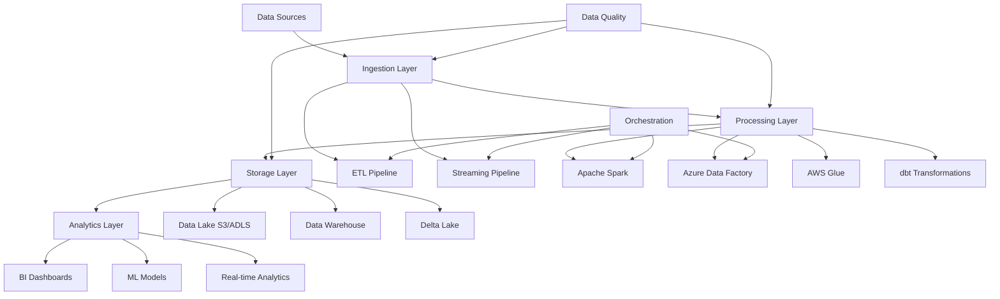

# Enterprise Data Pipeline Workflows

This repository contains production-ready GitHub Actions workflows for comprehensive data pipeline orchestration, demonstrating enterprise-grade data engineering practices with proper governance, security, and scalability.

## 🏗️ Architecture Overview

The data pipeline workflows support end-to-end data processing across multiple clouds and platforms:



## 📋 Pipeline Components

### 1. ETL Pipeline (`etl-pipeline.yml`)
Comprehensive ETL workflow supporting multiple processing engines:

**Features:**
- **Multi-Engine Support**: Spark, Azure Data Factory, AWS Glue
- **Data Quality Gates**: Pre/post-processing validation
- **Dynamic Scaling**: Environment-based resource allocation
- **Cost Optimization**: Automatic resource cleanup
- **Error Recovery**: Comprehensive retry and fallback mechanisms

**Workflow Stages:**
1. **Validation**: Configuration and data source validation
2. **Quality Checks**: Great Expectations data validation
3. **Processing**: Parallel execution across engines
4. **Transformations**: dbt model execution
5. **Lineage Tracking**: Automated metadata extraction
6. **Monitoring**: Performance and cost tracking

### 2. ML Pipeline (`ml-pipeline.yml`)
End-to-end machine learning workflow with MLOps best practices:

**Features:**
- **Multi-Algorithm Training**: XGBoost, LightGBM, Random Forest, Neural Networks
- **Hyperparameter Optimization**: Optuna-based tuning
- **Experiment Tracking**: MLflow and Weights & Biases integration
- **Model Validation**: Cross-validation and performance testing
- **Automated Deployment**: Azure ML and AWS SageMaker
- **Model Monitoring**: Drift detection and performance tracking

**Workflow Stages:**
1. **Data Preparation**: Feature engineering and validation
2. **Model Training**: Parallel algorithm training with HPO
3. **Model Evaluation**: Performance comparison and selection
4. **Deployment**: Multi-cloud model serving
5. **Monitoring**: Real-time performance tracking

### 3. Streaming Pipeline (`streaming-pipeline.yml`)
Real-time data processing with advanced streaming patterns:

**Features:**
- **Multi-Platform**: Apache Kafka, Azure Event Hubs, AWS Kinesis
- **Stream Processing**: Apache Flink and Spark Streaming
- **Schema Evolution**: Confluent Schema Registry integration
- **Fault Tolerance**: Checkpointing and state management
- **Performance Testing**: Load testing and latency monitoring

**Processing Patterns:**
- **Real-time Analytics**: User behavior and engagement metrics
- **Fraud Detection**: ML-based anomaly detection
- **IoT Processing**: Sensor data aggregation and alerting
- **Recommendation Engine**: Real-time personalization

### 4. Data Quality Pipeline (`data-quality-pipeline.yml`)
Comprehensive data quality monitoring and validation:

**Features:**
- **Multi-Layer Validation**: Schema, completeness, accuracy, consistency
- **Great Expectations**: Advanced expectation suites
- **dbt Tests**: Model-level data testing
- **Anomaly Detection**: Statistical and ML-based detection
- **Quality Reporting**: Interactive dashboards and alerts

**Quality Dimensions:**
- **Completeness**: Missing value detection
- **Accuracy**: Business rule validation
- **Consistency**: Cross-source data alignment
- **Validity**: Format and type validation
- **Uniqueness**: Duplicate detection
- **Freshness**: Data recency checks

## 🚀 Quick Start

### Prerequisites

1. **GitHub Secrets Configuration:**
   ```bash
   # Cloud Provider Credentials
   AZURE_CLIENT_ID
   AZURE_CLIENT_SECRET
   AZURE_TENANT_ID
   AZURE_SUBSCRIPTION_ID
   
   AWS_ACCESS_KEY_ID
   AWS_SECRET_ACCESS_KEY
   
   # Data Platform Credentials
   DATABRICKS_HOST
   DATABRICKS_TOKEN
   SNOWFLAKE_ACCOUNT
   SNOWFLAKE_USER
   SNOWFLAKE_PASSWORD
   
   # Messaging & Monitoring
   KAFKA_BOOTSTRAP_SERVERS
   KAFKA_USERNAME
   KAFKA_PASSWORD
   SLACK_WEBHOOK_URL
   ```

2. **Environment Setup:**
   ```yaml
   # config/dev.yaml
   environment: dev
   data_lake_bucket: data-lake-dev
   resource_group: rg-data-dev
   compute_resources:
     spark_workers: 2
     glue_dpu: 10
   ```

3. **Directory Structure:**
   ```
   data-pipelines/
   ├── .github/workflows/
   │   ├── etl-pipeline.yml
   │   ├── ml-pipeline.yml
   │   ├── streaming-pipeline.yml
   │   └── data-quality-pipeline.yml
   ├── spark/
   │   └── spark-job.py
   ├── dbt/
   │   └── models/example.sql
   ├── airflow/
   │   └── dags/example_dag.py
   └── config/
       ├── dev.yaml
       ├── staging.yaml
       └── prod.yaml
   ```

### Running Pipelines

#### 1. Manual Execution
```bash
# Trigger ETL pipeline
gh workflow run etl-pipeline.yml \
  --field environment=dev \
  --field data_date=2024-01-15 \
  --field full_refresh=false

# Trigger ML pipeline
gh workflow run ml-pipeline.yml \
  --field model_type=customer_churn \
  --field environment=staging \
  --field retrain_all=true

# Trigger streaming pipeline
gh workflow run streaming-pipeline.yml \
  --field stream_type=fraud_detection \
  --field environment=prod \
  --field scale_factor=5
```

#### 2. Automated Scheduling
Pipelines run automatically based on configured schedules:
- **ETL Pipeline**: Daily at 2:00 AM UTC
- **ML Pipeline**: Weekly on Mondays at 6:00 AM UTC
- **Data Quality**: Daily at 1:00 AM and 1:00 PM UTC
- **Streaming**: Continuous deployment on code changes

## 🔧 Advanced Configuration

### Environment Variables

| Variable | Description | Default | Required |
|----------|-------------|---------|----------|
| `ENVIRONMENT` | Target environment (dev/staging/prod) | dev | ✅ |
| `DATA_LAKE_BUCKET` | S3/ADLS bucket for data storage | data-lake-{env} | ✅ |
| `ENABLE_COST_OPTIMIZATION` | Enable automatic resource cleanup | true | ❌ |
| `MAX_PARALLEL_JOBS` | Maximum concurrent processing jobs | 5 | ❌ |
| `ALERT_THRESHOLD_ERRORS` | Error count threshold for alerts | 10 | ❌ |
| `DATA_RETENTION_DAYS` | Days to retain processed data | 90 | ❌ |

### Resource Scaling

Pipelines automatically scale resources based on data volume and environment:

```yaml
# Spark cluster scaling
small_dataset: # < 1GB
  workers: 2
  worker_type: "Standard_D4s_v3"
  
medium_dataset: # 1-10GB  
  workers: 4
  worker_type: "Standard_D8s_v3"
  
large_dataset: # > 10GB
  workers: 8
  worker_type: "Standard_D16s_v3"
```

### Cost Optimization

- **Spot Instances**: Use spot/preemptible instances for non-critical workloads
- **Auto-scaling**: Dynamic resource allocation based on workload
- **Resource Cleanup**: Automatic termination of idle resources
- **Compression**: Data compression to reduce storage costs
- **Partitioning**: Intelligent data partitioning for query optimization

## 🛠️ Development Guide

### Adding New Pipeline Components

1. **Create New Workflow:**
   ```yaml
   name: Custom Pipeline
   on:
     push:
       paths: ['custom/**']
     workflow_dispatch:
   
   jobs:
     custom_job:
       runs-on: ubuntu-latest
       steps:
         - name: Process Data
           run: |
             python custom/process.py
   ```

2. **Extend Existing Pipeline:**
   ```yaml
   # Add to etl-pipeline.yml
   custom-transformation:
     runs-on: ubuntu-latest
     needs: [data-quality-checks]
     steps:
       - name: Custom Transform
         run: |
           spark-submit custom/transform.py
   ```

### Testing Pipelines

```bash
# Local testing with act
act -j etl-pipeline --secret-file .env.local

# Validate workflow syntax
gh workflow validate .github/workflows/etl-pipeline.yml

# Test specific job
act -j data-quality-checks --secret-file .env.local
```

### Custom Spark Jobs

Extend the base Spark job template:

```python
from spark.spark_job import ETLJobProcessor, SparkJobConfig

class CustomETLProcessor(ETLJobProcessor):
    def custom_transformation(self, df: DataFrame) -> DataFrame:
        # Your custom logic here
        return df.withColumn("custom_field", lit("value"))

# Usage
if __name__ == "__main__":
    config = SparkJobConfig(parse_arguments())
    spark = create_spark_session(config)
    
    processor = CustomETLProcessor(spark, config)
    processor.run_etl_pipeline()
```

## 📊 Monitoring & Observability

### Key Metrics Tracked

1. **Pipeline Performance:**
   - Execution duration and throughput
   - Resource utilization (CPU, memory, I/O)
   - Cost per pipeline run
   - Data processing volume

2. **Data Quality:**
   - Quality score trends
   - Validation failure rates
   - Data freshness metrics
   - Schema evolution tracking

3. **System Health:**
   - Error rates and types
   - Recovery success rates
   - Resource availability
   - Dependency health

### Alerting Configuration

```yaml
# alerts.yml
alerts:
  pipeline_failure:
    channels: [slack, email, pagerduty]
    severity: critical
    
  data_quality_degradation:
    channels: [slack, email]
    severity: warning
    threshold: quality_score < 95
    
  cost_anomaly:
    channels: [slack]
    severity: info
    threshold: cost > budget * 1.2
```

### Dashboards

Access monitoring dashboards:
- **Pipeline Overview**: Real-time pipeline status and metrics
- **Data Quality**: Quality trends and issue tracking
- **Cost Management**: Resource usage and cost optimization
- **Performance**: Throughput and latency analysis

## 🔐 Security & Compliance

### Data Governance

1. **Data Classification:**
   - PII detection and masking
   - Data sensitivity labeling
   - Access control enforcement
   - Audit trail maintenance

2. **Encryption:**
   - Data at rest encryption (S3/ADLS)
   - Data in transit encryption (TLS 1.3)
   - Key management (Azure Key Vault, AWS KMS)

3. **Access Control:**
   - Role-based access control (RBAC)
   - Service principal authentication
   - Network security groups
   - VPN/Private endpoint access

### Compliance Features

- **GDPR**: Right to erasure, data portability
- **SOC 2**: Access logging, change management
- **HIPAA**: Data anonymization, audit trails
- **PCI DSS**: Payment data protection

## 🚨 Troubleshooting

### Common Issues

1. **Pipeline Failures:**
   ```bash
   # Check logs
   gh run view --log-failed
   
   # Rerun failed jobs
   gh run rerun --failed-only
   ```

2. **Resource Constraints:**
   ```bash
   # Increase resources in workflow
   environment:
     SPARK_EXECUTOR_MEMORY: "8g"
     SPARK_DRIVER_MEMORY: "4g"
   ```

3. **Data Quality Issues:**
   ```bash
   # Review quality report
   curl -H "Authorization: token $GH_TOKEN" \
     https://api.github.com/repos/owner/repo/actions/artifacts
   ```

### Performance Optimization

1. **Spark Tuning:**
   - Increase parallelism for large datasets
   - Tune partition sizes (128MB-1GB per partition)
   - Enable adaptive query execution
   - Use appropriate storage formats (Parquet, Delta)

2. **I/O Optimization:**
   - Partition pruning
   - Columnar file formats
   - Compression (Snappy, LZ4)
   - Predicate pushdown

3. **Memory Management:**
   - Configure executor memory properly
   - Use broadcast joins for small tables
   - Cache frequently accessed datasets
   - Optimize serialization

## 📚 Additional Resources

### Documentation
- [Apache Spark Performance Tuning](https://spark.apache.org/docs/latest/tuning.html)
- [Great Expectations Documentation](https://docs.greatexpectations.io/)
- [dbt Best Practices](https://docs.getdbt.com/guides/best-practices)
- [GitHub Actions Reference](https://docs.github.com/en/actions)

### Training Materials
- [Data Engineering Fundamentals](https://www.coursera.org/specializations/data-engineering)
- [MLOps Practices](https://www.coursera.org/learn/machine-learning-engineering-for-production-mlops)
- [Cloud Data Platforms](https://docs.microsoft.com/en-us/learn/paths/azure-data-engineer/)

### Community
- [Data Engineering Reddit](https://www.reddit.com/r/dataengineering/)
- [Apache Spark User Mailing List](https://spark.apache.org/community.html)
- [dbt Community Slack](https://www.getdbt.com/community/join-the-community/)

## 🤝 Contributing

We welcome contributions! Please see our [Contributing Guidelines](CONTRIBUTING.md) for details.

### Development Workflow

1. Fork the repository
2. Create a feature branch: `git checkout -b feature/amazing-feature`
3. Make your changes and add tests
4. Commit your changes: `git commit -m 'Add amazing feature'`
5. Push to the branch: `git push origin feature/amazing-feature`
6. Open a Pull Request

### Code Standards

- Follow PEP 8 for Python code
- Use type hints where applicable
- Include comprehensive docstrings
- Write unit tests for new functionality
- Update documentation for changes

## 📄 License

This project is licensed under the MIT License - see the [LICENSE](LICENSE) file for details.

## 🙋 Support

For questions and support:

- **Issues**: Create a GitHub issue for bugs and feature requests
- **Discussions**: Use GitHub Discussions for questions and ideas
- **Email**: Contact the data engineering team at data-team@company.com
- **Slack**: Join our #data-engineering channel

---

## 📈 Roadmap

### Upcoming Features

- [ ] **GraphQL API**: Data catalog and lineage API
- [ ] **Real-time Monitoring**: Live pipeline dashboard
- [ ] **Auto-scaling**: Intelligent resource management
- [ ] **Data Mesh**: Domain-oriented data architecture
- [ ] **Feature Store**: Centralized ML feature management
- [ ] **Data Contracts**: Schema evolution management
- [ ] **Kubernetes Support**: Container orchestration
- [ ] **Multi-tenancy**: Isolated pipeline execution

### Version History

- **v2.0.0** (2024-01-15): Major release with streaming pipelines
- **v1.5.0** (2023-12-01): Added ML pipeline and model deployment
- **v1.0.0** (2023-10-15): Initial release with ETL and data quality pipelines

---

*This pipeline template demonstrates enterprise-grade data engineering practices. Customize according to your specific requirements and organizational policies.*