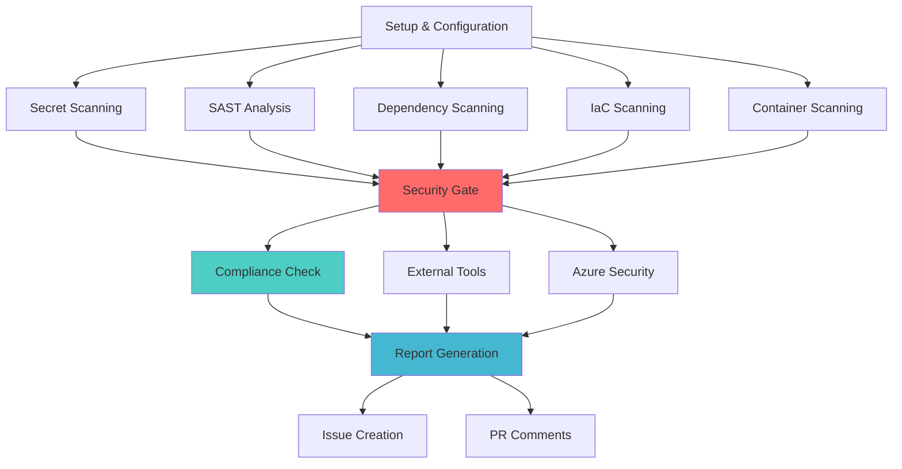

# Enterprise Security Scanning Pipeline

A comprehensive GitHub Actions security scanning pipeline that demonstrates enterprise-grade DevSecOps practices with integrated SAST, DAST, SCA, IaC scanning, and compliance validation.

## Overview

This pipeline provides complete security coverage across the software development lifecycle:

- **Static Application Security Testing (SAST)**: CodeQL, Semgrep, language-specific tools
- **Dynamic Application Security Testing (DAST)**: OWASP ZAP, Nuclei
- **Software Composition Analysis (SCA)**: Trivy, GitHub Dependency Review
- **Infrastructure as Code Scanning**: Checkov, TFSec, custom Azure ARM/Bicep validation
- **Container Security**: Trivy, Grype, image signing with Cosign
- **Secret Detection**: Gitleaks, TruffleHog, GitHub Advanced Security
- **Supply Chain Security**: SBOM generation, attestation, provenance
- **Compliance Validation**: ISO 27001, SOC 2 Type II alignment

## Features

### 🔒 Comprehensive Security Coverage
- Multi-tool approach for reduced false negatives
- Language-specific security analysis with matrix builds
- Container vulnerability scanning and signing
- Infrastructure security validation
- Real-time secret detection

### 🚀 Performance Optimized
- Intelligent caching strategies
- Parallel execution with build matrices
- Configurable scan intensity levels
- Skip options for time-consuming tests

### 🔧 Enterprise Integration
- Azure Security Center/Microsoft Defender integration
- External tool support (SonarQube, Checkmarx, Veracode)
- SARIF report generation and GitHub Security tab integration
- Automated issue creation for security findings

### 📊 Compliance & Reporting
- ISO 27001:2022 Annex A control mapping
- SOC 2 Type II Trust Services Criteria validation
- Consolidated security reporting
- Audit trail and evidence collection

### 🎯 Configurable Security Gates
- Severity-based failure thresholds
- Environment-specific configurations
- Exemption management
- Progressive security hardening

## Quick Start

1. **Copy the pipeline to your repository**:
   ```bash
   mkdir -p .github/workflows
   cp security-scan.yml .github/workflows/
   cp -r .github/security-config .github/
   ```

2. **Configure required secrets in GitHub**:
   - `AZURE_TENANT_ID`
   - `AZURE_CLIENT_ID` 
   - `AZURE_SUBSCRIPTION_ID`
   - `SONARQUBE_URL` (optional)
   - `SONARQUBE_TOKEN` (optional)

3. **Customize security thresholds** in the pipeline environment variables:
   ```yaml
   env:
     FAIL_ON_CRITICAL: true
     FAIL_ON_HIGH: true
     FAIL_ON_MEDIUM: false
   ```

4. **Run the pipeline**:
   - Automatically on push/PR to main branches
   - Manually via workflow dispatch
   - Scheduled weekly scans

## Pipeline Architecture



## Configuration Files

### Core Configuration
- **`.gitleaks.toml`**: Secret detection rules and allowlists
- **`.trivyignore`**: Vulnerability scanning exceptions  
- **`.checkov.yml`**: IaC security scanning configuration
- **`codeql-config.yml`**: CodeQL analysis settings
- **`semgrep.yml`**: SAST scanning rules and settings

### Tool-Specific Configuration
- **`.audit-ci.json`**: npm audit CI configuration
- **`.zap/rules.tsv`**: OWASP ZAP DAST rules
- **Custom policies**: Organization-specific security policies

## Security Tools Integration

### Static Analysis (SAST)
| Tool | Language Support | Strengths |
|------|------------------|-----------|
| **GitHub CodeQL** | Multi-language | Deep semantic analysis, low false positives |
| **Semgrep** | 17+ languages | Fast, customizable rules, CI-optimized |
| **Language-specific** | Per language | Deep domain knowledge |

### Dependency Analysis (SCA) 
| Tool | Ecosystem | Features |
|------|-----------|----------|
| **GitHub Dependency Review** | Multi-ecosystem | Native GitHub integration, policy enforcement |
| **Trivy** | Universal | Fast scanning, multiple formats |
| **npm audit** | Node.js | Native package manager integration |
| **Safety** | Python | Python-specific vulnerability database |

### Infrastructure Scanning
| Tool | Formats | Strengths |
|------|---------|-----------|
| **Checkov** | Terraform, ARM, Bicep, K8s | Comprehensive rule coverage |
| **TFSec** | Terraform | Fast, Terraform-focused |
| **Azure ARM-TTK** | ARM Templates | Microsoft official validation |

### Container Security
| Tool | Capabilities | Output |
|------|-------------|--------|
| **Trivy** | Vulnerabilities, secrets, configs | SARIF, JSON |
| **Grype** | Vulnerability scanning | SARIF, JSON |
| **Cosign** | Image signing | Keyless signatures |
| **Syft** | SBOM generation | CycloneDX, SPDX |

## Scan Levels

### Basic Scan (Pull Requests)
- Secret detection
- SAST analysis
- Critical dependency vulnerabilities
- Basic IaC validation
- **Duration**: ~5-10 minutes

### Standard Scan (Branch Pushes)  
- Full SAST and SCA analysis
- Complete IaC scanning
- Container vulnerability assessment
- Compliance validation
- **Duration**: ~15-25 minutes

### Full Scan (Scheduled/Manual)
- All standard scan features
- DAST scanning with OWASP ZAP
- External tool integration
- Azure Security Center sync
- Comprehensive reporting
- **Duration**: ~30-45 minutes

## Security Gate Logic

The pipeline implements configurable security gates:

```yaml
Security Gate Evaluation:
├── Critical Vulnerabilities: FAIL_ON_CRITICAL (default: true)
├── High Vulnerabilities: FAIL_ON_HIGH (default: true) 
├── Medium Vulnerabilities: FAIL_ON_MEDIUM (default: false)
├── Secret Detection: Always fail on secrets
└── Policy Violations: Configurable per policy
```

### Customizing Gates

Modify environment variables in the pipeline:

```yaml
env:
  FAIL_ON_CRITICAL: true   # Block critical findings
  FAIL_ON_HIGH: true       # Block high findings  
  FAIL_ON_MEDIUM: false    # Allow medium findings
  SECURITY_SCAN_TIMEOUT: 45 # Timeout in minutes
```

## Compliance Mapping

### ISO 27001:2022 Coverage
- **A.8.16** - Secure development lifecycle
- **A.8.24** - Cryptographic controls  
- **A.12.6** - Vulnerability management
- **A.14.2** - Security in development

### SOC 2 Type II Coverage
- **CC6.1** - Logical access controls
- **CC6.6** - Vulnerability management  
- **CC7.1** - System boundaries and data flow
- **CC8.1** - Change management controls

## Integration Examples

### Azure DevOps Integration
```yaml
- name: Upload to Azure DevOps
  run: |
    az boards work-item create \
      --title "Security Finding: ${{ github.repository }}" \
      --type "Bug" \
      --assigned-to "${{ github.actor }}" \
      --area-path "Security"
```

### Slack Notifications
```yaml
- name: Notify Slack
  uses: 8398a7/action-slack@v3
  with:
    status: failure
    fields: repo,message,commit,author
    webhook_url: ${{ secrets.SLACK_WEBHOOK }}
```

### JIRA Integration
```yaml
- name: Create JIRA Issue
  uses: atlassian/gajira-create@v3
  with:
    project: SEC
    issuetype: Bug
    summary: "Security scan failure: ${{ github.repository }}"
```

## Performance Optimization

### Caching Strategy
- **Security tools**: Cache between runs for faster execution
- **Dependencies**: Language-specific package caching
- **Container layers**: Docker buildx caching

### Parallel Execution
- **Matrix builds**: Parallel language-specific scans  
- **Independent jobs**: Concurrent security tool execution
- **Artifact upload**: Asynchronous result collection

### Selective Scanning
```yaml
# Skip scans based on file changes
- name: Check changed files
  run: |
    if ! git diff --name-only HEAD~1 | grep -E "\.(tf|json|bicep)$"; then
      echo "No IaC changes, skipping IaC scan"
      echo "skip-iac=true" >> $GITHUB_OUTPUT
    fi
```

## Troubleshooting

### Common Issues

#### Pipeline Timeout
```yaml
# Increase timeout
env:
  SECURITY_SCAN_TIMEOUT: 60
```

#### False Positives
- Update `.trivyignore` for vulnerability exceptions
- Configure `.gitleaks.toml` allowlists for secrets
- Customize Checkov skip rules in `.checkov.yml`

#### Memory Issues
```yaml
# Adjust resource limits
jobs:
  scan:
    runs-on: ubuntu-latest-4-cores # Use larger runner
```

#### Tool Version Conflicts
```yaml
# Pin specific versions
env:
  TRIVY_VERSION: 'v0.45.0'
  CHECKOV_VERSION: '2.4.9'
```

### Debug Mode
Enable verbose logging:
```yaml
env:
  ACTIONS_STEP_DEBUG: true
  ACTIONS_RUNNER_DEBUG: true
```

## Customization Guide

### Adding New Languages
1. Update the setup job matrix generation
2. Add language-specific tool installation
3. Configure language-specific scanners
4. Update security gate logic

### Custom Policies
1. Create custom Checkov policies in `.checkov/`
2. Add Semgrep rules in `.semgrep/`
3. Configure OPA policies for advanced governance

### External Tool Integration
1. Add secrets for tool authentication
2. Create tool-specific scanning steps
3. Implement SARIF conversion if needed
4. Update security gate aggregation

## Best Practices

### Security Configuration
- Rotate secrets regularly
- Use least-privilege service accounts  
- Enable branch protection with required status checks
- Implement security policy as code

### Performance
- Use appropriate scan levels per environment
- Cache aggressively but invalidate appropriately  
- Parallelize independent operations
- Monitor pipeline execution metrics

### Maintenance
- Update tool versions quarterly
- Review and tune security rules monthly
- Validate compliance mappings annually
- Test disaster recovery procedures

## Support and Documentation

### Additional Resources
- [GitHub Advanced Security Documentation](https://docs.github.com/en/code-security)
- [Azure Security Center Integration](https://docs.microsoft.com/en-us/azure/security-center/)
- [OWASP DevSecOps Guideline](https://owasp.org/www-project-devsecops-guideline/)

### Getting Help
- Review pipeline logs in GitHub Actions tab
- Check security findings in repository Security tab  
- Consult tool-specific documentation for configuration
- Engage security team for policy questions

---

**Security is everyone's responsibility. This pipeline provides the tools, but human judgment and continuous improvement drive security excellence.**