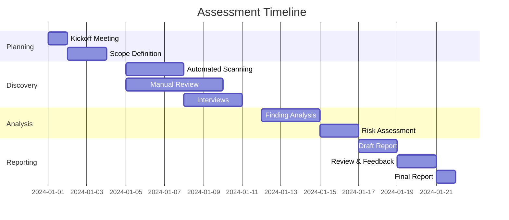

# Azure Security Assessment Report

**CONFIDENTIAL - EXECUTIVE DISTRIBUTION ONLY**

---

## Report Metadata

| Field | Details |
|-------|---------|
| **Organization** | {{company_name}} |
| **Report ID** | {{report_id}} |
| **Classification** | {{confidentiality_level}} |
| **Version** | {{report_version}} |
| **Assessment Period** | {{start_date}} - {{end_date}} |
| **Report Date** | {{report_date}} |
| **Prepared By** | {{prepared_by}} |
| **Reviewed By** | {{reviewed_by}} |
| **Approved By** | {{approved_by}} |
| **Distribution** | {{distribution_list}} |

---

## Table of Contents

1. [Executive Summary](#1-executive-summary)
2. [Document Control](#2-document-control)
3. [Assessment Overview](#3-assessment-overview)
4. [Scope and Methodology](#4-scope-and-methodology)
5. [Architecture and Environment Overview](#5-architecture-and-environment-overview)
6. [Risk Assessment Summary](#6-risk-assessment-summary)
7. [Compliance and Control Coverage](#7-compliance-and-control-coverage)
8. [Security Findings](#8-security-findings)
9. [Vulnerability Assessment Results](#9-vulnerability-assessment-results)
10. [Security Metrics and KPIs](#10-security-metrics-and-kpis)
11. [Remediation Roadmap](#11-remediation-roadmap)
12. [Cost-Benefit Analysis](#12-cost-benefit-analysis)
13. [Strategic Recommendations](#13-strategic-recommendations)
14. [Conclusion and Next Steps](#14-conclusion-and-next-steps)
15. [Appendices](#15-appendices)

---

## 1. Executive Summary

### 1.1 Assessment Purpose and Context
{{Provide 2-3 paragraphs explaining why the assessment was conducted, the business drivers, and strategic importance}}

### 1.2 Overall Security Posture

| Dimension | Rating | Trend | Commentary |
|-----------|--------|-------|------------|
| **Security Maturity** | {{1-5 scale}} | {{↑/↓/→}} | {{Brief assessment}} |
| **Risk Profile** | {{Critical/High/Medium/Low}} | {{↑/↓/→}} | {{Risk context}} |
| **Compliance Status** | {{Percentage}}% | {{↑/↓/→}} | {{Compliance summary}} |
| **Operational Readiness** | {{1-5 scale}} | {{↑/↓/→}} | {{Operational assessment}} |

### 1.3 Key Findings Summary

#### Critical Findings Requiring Immediate Action
1. **{{Finding Title}}**: {{One-sentence description and business impact}}
2. **{{Finding Title}}**: {{One-sentence description and business impact}}
3. **{{Finding Title}}**: {{One-sentence description and business impact}}

#### Strategic Security Gaps
- {{Gap 1: Description and impact}}
- {{Gap 2: Description and impact}}
- {{Gap 3: Description and impact}}

### 1.4 Top Recommendations

| Priority | Recommendation | Business Impact | Investment Required | Timeline |
|----------|---------------|-----------------|-------------------|----------|
| **1** | {{Recommendation}} | {{Impact description}} | ${{Amount}} | {{Days/Weeks}} |
| **2** | {{Recommendation}} | {{Impact description}} | ${{Amount}} | {{Days/Weeks}} |
| **3** | {{Recommendation}} | {{Impact description}} | ${{Amount}} | {{Days/Weeks}} |

### 1.5 Executive Decision Points

- **Immediate Risk Acceptance Required**: {{List any critical risks requiring executive decision}}
- **Budget Allocation Needed**: ${{Total amount}} for priority remediations
- **Resource Commitment**: {{FTE requirements}} for implementation
- **Timeline Constraints**: {{Key dates and deadlines}}

---

## 2. Document Control

### 2.1 Version History

| Version | Date | Author | Reviewer | Approver | Changes |
|---------|------|--------|----------|----------|---------|
| 0.1 | {{Date}} | {{Name}} | - | - | Initial draft |
| 0.2 | {{Date}} | {{Name}} | {{Name}} | - | Incorporated technical review feedback |
| 1.0 | {{Date}} | {{Name}} | {{Name}} | {{Name}} | Final version approved for distribution |

### 2.2 Distribution and Confidentiality

| Recipient | Role | Organization | Date Distributed | Acknowledgment |
|-----------|------|--------------|------------------|----------------|
| {{Name}} | {{Title}} | {{Org}} | {{Date}} | {{Yes/No}} |

### 2.3 Document Classification and Handling

- **Classification Level**: {{Public/Internal/Confidential/Restricted}}
- **Handling Instructions**: {{Specific handling requirements}}
- **Retention Period**: {{Years}} years from report date
- **Destruction Method**: {{Secure deletion/shredding requirements}}

---

## 3. Assessment Overview

### 3.1 Assessment Objectives

| Objective | Success Criteria | Achievement Status |
|-----------|-----------------|-------------------|
| {{Objective 1}} | {{Measurable criteria}} | {{Achieved/Partial/Not Achieved}} |
| {{Objective 2}} | {{Measurable criteria}} | {{Achieved/Partial/Not Achieved}} |
| {{Objective 3}} | {{Measurable criteria}} | {{Achieved/Partial/Not Achieved}} |

### 3.2 Assessment Team

| Role | Name | Organization | Certifications | Responsibilities |
|------|------|--------------|----------------|-----------------|
| **Lead Assessor** | {{Name}} | {{Org}} | {{Certs}} | Overall assessment leadership |
| **Cloud Security Architect** | {{Name}} | {{Org}} | {{Certs}} | Azure security architecture review |
| **Compliance Specialist** | {{Name}} | {{Org}} | {{Certs}} | Regulatory compliance validation |
| **DevOps Security Engineer** | {{Name}} | {{Org}} | {{Certs}} | CI/CD and automation security |
| **Penetration Tester** | {{Name}} | {{Org}} | {{Certs}} | Technical vulnerability assessment |

### 3.3 Stakeholder Engagement

| Stakeholder Group | Representative | Engagement Level | Key Concerns Addressed |
|-------------------|----------------|------------------|----------------------|
| **Executive Leadership** | {{Name, Title}} | {{High/Medium/Low}} | {{Concerns}} |
| **IT Operations** | {{Name, Title}} | {{High/Medium/Low}} | {{Concerns}} |
| **Security Team** | {{Name, Title}} | {{High/Medium/Low}} | {{Concerns}} |
| **Compliance** | {{Name, Title}} | {{High/Medium/Low}} | {{Concerns}} |
| **Development Teams** | {{Name, Title}} | {{High/Medium/Low}} | {{Concerns}} |

---

## 4. Scope and Methodology

### 4.1 Assessment Scope

#### In-Scope Elements

| Category | Specific Items | Coverage Level |
|----------|---------------|---------------|
| **Azure Subscriptions** | {{List subscription IDs}} | {{Full/Partial}} |
| **Resource Groups** | {{Count and critical RGs}} | {{Full/Partial}} |
| **Services** | {{List Azure services}} | {{Full/Partial}} |
| **Applications** | {{List applications}} | {{Full/Partial}} |
| **Data Classifications** | {{Public/Internal/Confidential/Restricted}} | {{Full/Partial}} |
| **Network Segments** | {{VNets, Subnets}} | {{Full/Partial}} |
| **Geographic Regions** | {{Azure regions}} | {{Full/Partial}} |

#### Out-of-Scope Elements

| Element | Reason for Exclusion | Risk Acceptance |
|---------|---------------------|-----------------|
| {{Element}} | {{Justification}} | {{Yes/No - By whom}} |

### 4.2 Assessment Methodology

#### 4.2.1 Framework Alignment

| Framework | Version | Applicability | Coverage |
|-----------|---------|---------------|----------|
| **ISO 27001** | 2022 | Full | {{Percentage}}% |
| **SOC 2 Type II** | 2017 | Partial | {{Percentage}}% |
| **NIST CSF** | 2.0 | Full | {{Percentage}}% |
| **CIS Azure Benchmark** | 1.5.0 | Full | {{Percentage}}% |
| **Microsoft Cloud Security Benchmark** | Latest | Full | {{Percentage}}% |

#### 4.2.2 Assessment Techniques

| Technique | Tools Used | Scope | Findings Generated |
|-----------|------------|-------|-------------------|
| **Automated Scanning** | {{Tools}} | {{Scope}} | {{Count}} findings |
| **Manual Configuration Review** | {{Tools}} | {{Scope}} | {{Count}} findings |
| **Architecture Review** | {{Method}} | {{Scope}} | {{Count}} findings |
| **Code Review** | {{Tools}} | {{Scope}} | {{Count}} findings |
| **Penetration Testing** | {{Tools}} | {{Scope}} | {{Count}} findings |
| **Policy Analysis** | {{Tools}} | {{Scope}} | {{Count}} findings |
| **Interview & Questionnaires** | {{Count}} sessions | {{Participants}} | {{Count}} findings |
| **Documentation Review** | {{Documents}} | {{Scope}} | {{Count}} findings |

### 4.3 Assessment Timeline



---

## 5. Architecture and Environment Overview

### 5.1 Azure Environment Topology

#### 5.1.1 Subscription Hierarchy

```
Root Management Group
├── Production MG
│   ├── Prod-Core-Sub
│   ├── Prod-Apps-Sub
│   └── Prod-Data-Sub
├── Non-Production MG
│   ├── Dev-Sub
│   ├── Test-Sub
│   └── UAT-Sub
└── Platform MG
    ├── Identity-Sub
    ├── Connectivity-Sub
    └── Management-Sub
```

#### 5.1.2 Network Architecture

| Component | Configuration | Security Controls |
|-----------|--------------|------------------|
| **Hub VNet** | {{Address space}} | {{Firewall, NSGs, etc.}} |
| **Spoke VNets** | {{Count and purpose}} | {{Security controls}} |
| **Express Route** | {{Bandwidth, locations}} | {{Encryption, monitoring}} |
| **VPN Gateways** | {{Type, count}} | {{Security configuration}} |
| **Application Gateways** | {{Count, WAF enabled}} | {{Security rules}} |

### 5.2 Identity and Access Architecture

| Component | Implementation | Security Posture |
|-----------|---------------|-----------------|
| **Azure AD Tenant** | {{Tenant details}} | {{MFA, PIM, CA policies}} |
| **RBAC Model** | {{Custom roles count}} | {{Least privilege assessment}} |
| **Service Principals** | {{Count, usage}} | {{Secret management}} |
| **Managed Identities** | {{System/User assigned}} | {{Usage patterns}} |
| **Privileged Access** | {{PIM, PAW usage}} | {{Controls effectiveness}} |

### 5.3 Data Architecture and Classification

| Data Classification | Storage Locations | Encryption | Access Controls | Compliance |
|---------------------|------------------|------------|-----------------|------------|
| **Restricted** | {{Services}} | {{At-rest/In-transit}} | {{Controls}} | {{Standards}} |
| **Confidential** | {{Services}} | {{At-rest/In-transit}} | {{Controls}} | {{Standards}} |
| **Internal** | {{Services}} | {{At-rest/In-transit}} | {{Controls}} | {{Standards}} |
| **Public** | {{Services}} | {{At-rest/In-transit}} | {{Controls}} | {{Standards}} |

### 5.4 Application Portfolio

| Application | Criticality | Architecture Pattern | Security Controls | Risk Level |
|-------------|------------|---------------------|------------------|------------|
| {{App Name}} | {{Critical/High/Medium/Low}} | {{Monolithic/Microservices/Serverless}} | {{List controls}} | {{Risk level}} |

---

## 6. Risk Assessment Summary

### 6.1 Risk Heat Map

```
        Impact →
    ┌─────────────────────────────────────┐
  L │ Low    │ Low    │ Medium │ High   │ V
  i │        │        │        │        │ e
  k │ Low    │ Medium │ High   │Critical│ r
  e │        │        │        │        │ y
  l │ Medium │ High   │Critical│Critical│
  i │        │        │        │        │ H
  h │ High   │Critical│Critical│Critical│ i
  o │        │        │        │        │ g
  o └─────────────────────────────────────┘ h
  d     Low    Medium    High   Critical
  ↓
```

### 6.2 Top Risks by Category

| Risk Category | Count | Critical | High | Medium | Low | Trend |
|---------------|-------|----------|------|--------|-----|-------|
| **Configuration** | {{#}} | {{#}} | {{#}} | {{#}} | {{#}} | {{↑/↓/→}} |
| **Access Control** | {{#}} | {{#}} | {{#}} | {{#}} | {{#}} | {{↑/↓/→}} |
| **Data Protection** | {{#}} | {{#}} | {{#}} | {{#}} | {{#}} | {{↑/↓/→}} |
| **Network Security** | {{#}} | {{#}} | {{#}} | {{#}} | {{#}} | {{↑/↓/→}} |
| **Monitoring** | {{#}} | {{#}} | {{#}} | {{#}} | {{#}} | {{↑/↓/→}} |
| **Compliance** | {{#}} | {{#}} | {{#}} | {{#}} | {{#}} | {{↑/↓/→}} |

### 6.3 Risk Register Summary

| Risk ID | Risk Title | Category | Current Risk | Target Risk | Treatment | Owner | Due Date |
|---------|------------|----------|--------------|-------------|-----------|-------|----------|
| R-001 | {{Title}} | {{Category}} | {{Critical/High/Medium/Low}} | {{Target}} | {{Mitigate/Accept/Transfer/Avoid}} | {{Owner}} | {{Date}} |

### 6.4 Annual Loss Expectancy Analysis

| Threat Scenario | Probability | Impact ($) | ALE ($) | After Controls ($) | ROI |
|-----------------|-------------|------------|---------|-------------------|-----|
| {{Scenario}} | {} |

---

## 7. Compliance and Control Coverage

### 7.1 ISO 27001:2022 Compliance Summary

| Control Domain | Controls | Implemented | Partial | Not Implemented | Maturity |
|----------------|----------|-------------|---------|-----------------|----------|
| **A.5 Organizational Controls** | 37 | {{#}} | {{#}} | {{#}} | {{1-5}} |
| **A.6 People Controls** | 8 | {{#}} | {{#}} | {{#}} | {{1-5}} |
| **A.7 Physical Controls** | 14 | {{#}} | {{#}} | {{#}} | {{1-5}} |
| **A.8 Technological Controls** | 34 | {{#}} | {{#}} | {{#}} | {{1-5}} |
| **Total** | 93 | {{#}} | {{#}} | {{#}} | {{Average}} |

### 7.2 SOC 2 Trust Services Criteria

| TSC Category | Criteria Count | Effective | Partially Effective | Not Effective | Observations |
|--------------|----------------|-----------|-------------------|---------------|--------------|
| **Common Criteria (CC)** | {{#}} | {{#}} | {{#}} | {{#}} | {{#}} |
| **Availability (A)** | {{#}} | {{#}} | {{#}} | {{#}} | {{#}} |
| **Confidentiality (C)** | {{#}} | {{#}} | {{#}} | {{#}} | {{#}} |
| **Processing Integrity (PI)** | {{#}} | {{#}} | {{#}} | {{#}} | {{#}} |
| **Privacy (P)** | {{#}} | {{#}} | {{#}} | {{#}} | {{#}} |

### 7.3 Azure Security Benchmark Compliance

| Control Family | Controls | Compliant | Non-Compliant | N/A | Score |
|----------------|----------|-----------|---------------|-----|--------|
| **Network Security** | {{#}} | {{#}} | {{#}} | {{#}} | {} |
| **Privileged Access** | {{#}} | {{#}} | {{#}} | {{#}} | {} |
| **Asset Management** | {{#}} | {{#}} | {{#}} | {{#}} | {} |
| **Incident Response** | {{#}} | {{#}} | {{#}} | {{#}} | {} |
| **Endpoint Security** | {{#}} | {{#}} | {{#}} | {{#}} | {} |
| **DevOps Security** | {{#}} | {{#}} | {{#}} | {{#}} | {} |

### 7.4 Regulatory Compliance Status

| Regulation | Applicability | Compliance Status | Gaps | Remediation Priority |
|------------|---------------|------------------|------|---------------------|
| **GDPR** | {{Yes/No/Partial}} | {{Compliant/Non-compliant/Partial}} | {{Count}} | {{High/Medium/Low}} |
| **CCPA** | {{Yes/No/Partial}} | {{Compliant/Non-compliant/Partial}} | {{Count}} | {{High/Medium/Low}} |
| **HIPAA** | {{Yes/No/Partial}} | {{Compliant/Non-compliant/Partial}} | {{Count}} | {{High/Medium/Low}} |
| **PCI DSS** | {{Yes/No/Partial}} | {{Compliant/Non-compliant/Partial}} | {{Count}} | {{High/Medium/Low}} |
| **SOX** | {{Yes/No/Partial}} | {{Compliant/Non-compliant/Partial}} | {{Count}} | {{High/Medium/Low}} |

---

## 8. Security Findings

### 8.1 Findings Summary Dashboard

| Finding ID | Title | Severity | Category | Risk Score | Status | Owner | Due Date |
|------------|-------|----------|----------|------------|--------|-------|----------|
| F-001 | {{Title}} | Critical | {{Category}} | 9.5/10 | Open | {{Owner}} | {{Date}} |
| F-002 | {{Title}} | High | {{Category}} | 7.8/10 | In Progress | {{Owner}} | {{Date}} |
| F-003 | {{Title}} | High | {{Category}} | 7.2/10 | Open | {{Owner}} | {{Date}} |
| F-004 | {{Title}} | Medium | {{Category}} | 5.5/10 | Open | {{Owner}} | {{Date}} |
| F-005 | {{Title}} | Medium | {{Category}} | 4.8/10 | In Progress | {{Owner}} | {{Date}} |

### 8.2 Critical Findings Detail

#### Finding F-001: {{Critical Finding Title}}

**Executive Summary**: {{2-3 sentence business impact summary}}

**Technical Details**:
- **Root Cause**: {{Description}}
- **Affected Resources**: {{List}}
- **Attack Vector**: {{Description}}
- **Exploitation Difficulty**: {{Low/Medium/High}}

**Business Impact**:
- **Financial**: ${{Amount}} potential loss
- **Operational**: {{Impact description}}
- **Reputational**: {{Impact description}}
- **Compliance**: {{Violations}}

**Recommendation**:
```bash
# Immediate mitigation steps
{{Commands or configuration}}
```

**Long-term Solution**: {{Strategic fix description}}

### 8.3 Findings by Service

| Azure Service | Critical | High | Medium | Low | Total |
|---------------|----------|------|--------|-----|-------|
| **Storage Accounts** | {{#}} | {{#}} | {{#}} | {{#}} | {{#}} |
| **Virtual Machines** | {{#}} | {{#}} | {{#}} | {{#}} | {{#}} |
| **SQL Databases** | {{#}} | {{#}} | {{#}} | {{#}} | {{#}} |
| **Key Vaults** | {{#}} | {{#}} | {{#}} | {{#}} | {{#}} |
| **App Services** | {{#}} | {{#}} | {{#}} | {{#}} | {{#}} |
| **AKS** | {{#}} | {{#}} | {{#}} | {{#}} | {{#}} |
| **Network** | {{#}} | {{#}} | {{#}} | {{#}} | {{#}} |

---

## 9. Vulnerability Assessment Results

### 9.1 Vulnerability Statistics

| Metric | Value | Benchmark | Status |
|--------|-------|-----------|--------|
| **Total Vulnerabilities** | {{#}} | <100 | {{Pass/Fail}} |
| **Critical Vulnerabilities** | {{#}} | 0 | {{Pass/Fail}} |
| **High Vulnerabilities** | {{#}} | <5 | {{Pass/Fail}} |
| **CVSS Average Score** | {{#.#}} | <4.0 | {{Pass/Fail}} |
| **Mean Time to Patch** | {{Days}} | <30 days | {{Pass/Fail}} |
| **Patch Coverage** | {{%}} | >95% | {{Pass/Fail}} |

### 9.2 Top Vulnerabilities

| CVE ID | CVSS | Service | Description | Remediation | Status |
|--------|------|---------|-------------|-------------|--------|
| {{CVE-YYYY-XXXXX}} | {{Score}} | {{Service}} | {{Description}} | {{Fix}} | {{Open/Closed}} |

### 9.3 Vulnerability Trends

```
CVSS Score Distribution Over Time
10 ┤                                    
 9 ┤    ╭─╮                            
 8 ┤   ╱  ╰─╮                          
 7 ┤  ╱     ╰─╮                        
 6 ┤ ╱        ╰─╮                      
 5 ┤╱           ╰─╮                    
 4 ┤              ╰─╮                  
 3 ┤                ╰─╮                
 2 ┤                  ╰─╮              
 1 ┤                    ╰──────        
 0 └────────────────────────────       
   Jan  Feb  Mar  Apr  May  Jun       
```

---

## 10. Security Metrics and KPIs

### 10.1 Security Posture Metrics

| KPI | Current | Target | Trend | Health |
|-----|---------|--------|-------|--------|
| **Security Score (ASC)** | {{Score}}/100 | >85 | {{↑/↓/→}} | {{🟢/🟡/🔴}} |
| **Policy Compliance** | {{%}} | >95% | {{↑/↓/→}} | {{🟢/🟡/🔴}} |
| **MFA Coverage** | {{%}} | 100% | {{↑/↓/→}} | {{🟢/🟡/🔴}} |
| **Encryption Coverage** | {{%}} | 100% | {{↑/↓/→}} | {{🟢/🟡/🔴}} |
| **Patch Compliance** | {{%}} | >98% | {{↑/↓/→}} | {{🟢/🟡/🔴}} |
| **Security Training Completion** | {{%}} | >90% | {{↑/↓/→}} | {{🟢/🟡/🔴}} |

### 10.2 Operational Security Metrics

| Metric | Last Month | This Month | Target | Status |
|--------|------------|------------|--------|--------|
| **Security Incidents** | {{#}} | {{#}} | <5 | {{Met/Not Met}} |
| **Mean Time to Detect (MTTD)** | {{Hours}} | {{Hours}} | <1 hour | {{Met/Not Met}} |
| **Mean Time to Respond (MTTR)** | {{Hours}} | {{Hours}} | <4 hours | {{Met/Not Met}} |
| **False Positive Rate** | {} | <10% | {{Met/Not Met}} |
| **Security Debt Ratio** | {} | <5% | {{Met/Not Met}} |

### 10.3 Compliance Metrics

| Compliance Area | Score | Findings | Remediated | Outstanding | Deadline |
|-----------------|-------|----------|------------|-------------|----------|
| **Data Privacy** | {} | {{#}} | {{#}} | {{#}} | {{Date}} |
| **Audit Logging** | {} | {{#}} | {{#}} | {{#}} | {{Date}} |

---

## 11. Remediation Roadmap

### 11.1 Remediation Timeline

| Phase | Timeline | Focus Areas | Resources | Budget | Success Criteria |
|-------|----------|-------------|-----------|--------|-----------------|
| **Immediate** | 0-30 days | Critical vulnerabilities, Quick wins | {{FTE}} | ${{Amount}} | All critical findings addressed |
| **Short-term** | 1-3 months | High-risk items, Compliance gaps | {{FTE}} | ${{Amount}} | 80% high findings resolved |
| **Medium-term** | 3-6 months | Process improvements, Automation | {{FTE}} | ${{Amount}} | Security score >85 |
| **Long-term** | 6-12 months | Strategic initiatives, Maturity | {{FTE}} | ${{Amount}} | Level 3 maturity achieved |

### 11.2 Prioritized Action Items

#### Phase 1: Immediate Actions (0-30 days)

| Action | Finding IDs | Owner | Resources | Dependencies | Completion Date |
|--------|-------------|-------|-----------|--------------|-----------------|
| {{Action}} | F-001, F-002 | {{Name}} | {{Resources}} | {{Dependencies}} | {{Date}} |

#### Phase 2: Short-term Improvements (1-3 months)

| Action | Finding IDs | Owner | Resources | Dependencies | Completion Date |
|--------|-------------|-------|-----------|--------------|-----------------|
| {{Action}} | F-003, F-004 | {{Name}} | {{Resources}} | {{Dependencies}} | {{Date}} |

### 11.3 Resource Allocation

| Resource Type | Current | Required | Gap | Acquisition Plan |
|---------------|---------|----------|-----|-----------------|
| **Security Engineers** | {{#}} | {{#}} | {{#}} | {{Plan}} |
| **Cloud Architects** | {{#}} | {{#}} | {{#}} | {{Plan}} |
| **Compliance Analysts** | {{#}} | {{#}} | {{#}} | {{Plan}} |
| **Security Tools** | {{List}} | {{List}} | {{List}} | {{Plan}} |
| **Training Budget** | ${{Amount}} | ${{Amount}} | ${{Amount}} | {{Plan}} |

---

## 12. Cost-Benefit Analysis

### 12.1 Implementation Costs

| Cost Category | Year 1 | Year 2 | Year 3 | Total |
|---------------|--------|--------|--------|-------|
| **Personnel** | ${{Amount}} | ${{Amount}} | ${{Amount}} | ${{Total}} |
| **Technology** | ${{Amount}} | ${{Amount}} | ${{Amount}} | ${{Total}} |
| **Professional Services** | ${{Amount}} | ${{Amount}} | ${{Amount}} | ${{Total}} |
| **Training** | ${{Amount}} | ${{Amount}} | ${{Amount}} | ${{Total}} |
| **Compliance** | ${{Amount}} | ${{Amount}} | ${{Amount}} | ${{Total}} |
| **Total** | ${{Amount}} | ${{Amount}} | ${{Amount}} | ${{Total}} |

### 12.2 Risk Reduction Benefits

| Benefit Category | Year 1 | Year 2 | Year 3 | Total |
|------------------|--------|--------|--------|-------|
| **Breach Cost Avoidance** | ${{Amount}} | ${{Amount}} | ${{Amount}} | ${{Total}} |
| **Compliance Penalty Avoidance** | ${{Amount}} | ${{Amount}} | ${{Amount}} | ${{Total}} |
| **Operational Efficiency** | ${{Amount}} | ${{Amount}} | ${{Amount}} | ${{Total}} |
| **Insurance Premium Reduction** | ${{Amount}} | ${{Amount}} | ${{Amount}} | ${{Total}} |
| **Total Benefits** | ${{Amount}} | ${{Amount}} | ${{Amount}} | ${{Total}} |

### 12.3 ROI Analysis

| Metric | Value |
|--------|-------|
| **Total Investment** | ${{Amount}} |
| **Total Benefits** | ${{Amount}} |
| **Net Present Value (NPV)** | ${{Amount}} |
| **Return on Investment (ROI)** | {} |

---

## 13. Strategic Recommendations

### 13.1 Security Program Enhancements

#### 13.1.1 Governance and Leadership
- **Recommendation**: {{Strategic recommendation}}
  - **Rationale**: {{Business justification}}
  - **Expected Outcome**: {{Measurable result}}
  - **Investment**: ${{Amount}} over {{Timeline}}

#### 13.1.2 Technology and Architecture
- **Recommendation**: {{Strategic recommendation}}
  - **Rationale**: {{Business justification}}
  - **Expected Outcome**: {{Measurable result}}
  - **Investment**: ${{Amount}} over {{Timeline}}

#### 13.1.3 People and Process
- **Recommendation**: {{Strategic recommendation}}
  - **Rationale**: {{Business justification}}
  - **Expected Outcome**: {{Measurable result}}
  - **Investment**: ${{Amount}} over {{Timeline}}

### 13.2 Maturity Roadmap

```
Security Maturity Evolution
Level 5 │                                    ╱──── Optimized
Level 4 │                          ╱────────      Managed
Level 3 │                ╱────────                Defined
Level 2 │      ╱────────                         Repeatable
Level 1 │──────                                   Initial
        └─────────────────────────────────────────
         Current  Q1    Q2    Q3    Q4    Target
```

### 13.3 Innovation and Emerging Technologies

| Technology | Applicability | Security Impact | Implementation Timeline | Investment |
|------------|---------------|-----------------|------------------------|------------|
| **Zero Trust Architecture** | High | Critical | 6-12 months | ${{Amount}} |
| **AI/ML Security** | Medium | High | 12-18 months | ${{Amount}} |
| **DevSecOps Automation** | High | High | 3-6 months | ${{Amount}} |
| **Cloud Native Security** | High | Critical | 6-9 months | ${{Amount}} |

---

## 14. Conclusion and Next Steps

### 14.1 Assessment Conclusion

{{Provide 2-3 paragraphs summarizing the overall assessment results, key achievements, and primary concerns}}

### 14.2 Critical Success Factors

1. **Executive Sponsorship**: {{Requirements for leadership support}}
2. **Resource Commitment**: {{Specific resource needs}}
3. **Cultural Change**: {{Organizational changes required}}
4. **Technology Investment**: {{Key technology requirements}}
5. **Continuous Improvement**: {{Ongoing program requirements}}

### 14.3 Next Steps and Actions

| Priority | Action | Owner | Timeline | Success Metric |
|----------|--------|-------|----------|---------------|
| **1** | {{Action}} | {{Owner}} | {{Timeline}} | {{Metric}} |
| **2** | {{Action}} | {{Owner}} | {{Timeline}} | {{Metric}} |
| **3** | {{Action}} | {{Owner}} | {{Timeline}} | {{Metric}} |
| **4** | {{Action}} | {{Owner}} | {{Timeline}} | {{Metric}} |
| **5** | {{Action}} | {{Owner}} | {{Timeline}} | {{Metric}} |

### 14.4 Follow-up Schedule

| Activity | Date | Participants | Deliverable |
|----------|------|--------------|-------------|
| **Executive Briefing** | {{Date}} | {{Participants}} | Decision on recommendations |
| **Technical Deep Dive** | {{Date}} | {{Participants}} | Implementation plan |
| **30-Day Progress Review** | {{Date}} | {{Participants}} | Status update |
| **Quarterly Assessment** | {{Date}} | {{Participants}} | Progress report |
| **Annual Reassessment** | {{Date}} | {{Participants}} | Full assessment |

---

## 15. Appendices

### Appendix A: Detailed Technical Findings
*Link to Report/Findings-Template.md for complete technical details*

### Appendix B: Evidence and Supporting Documentation
*Reference to Artifacts/Evidence-Log.csv*

### Appendix C: Compliance Mapping Details
- ISO 27001:2022 Control Mapping: `Compliance/ISO27001/Annex-A-Controls.xlsx`
- SOC 2 TSC Mapping: `Compliance/SOC2/TSC-Control-Mapping.xlsx`

### Appendix D: Risk Register
*Complete risk register available at Artifacts/Risk-Register.csv*

### Appendix E: Remediation Plan Details
*Detailed remediation plan at Artifacts/Remediation-Plan.md*

### Appendix F: Technical Architecture Diagrams
*Network diagrams, data flow diagrams, and security architecture*

### Appendix G: Assessment Tools and Scripts
*List of tools, queries, and scripts used during assessment*

### Appendix H: Stakeholder Interview Notes
*Sanitized interview summaries and key insights*

### Appendix I: Glossary and Acronyms
| Term | Definition |
|------|------------|
| {{Term}} | {{Definition}} |

### Appendix J: References and Resources
1. {{Reference 1}}
2. {{Reference 2}}
3. {{Reference 3}}

---

**END OF REPORT**

*This report contains confidential and proprietary information. Distribution is limited to authorized personnel only.*