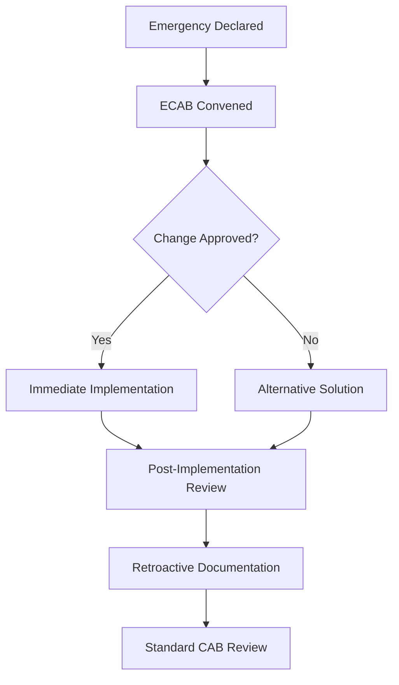

# Enterprise Change Management Procedure

## Document Control

| Attribute | Value |
|-----------|-------|
| Version | 2.0 |
| Owner | DevOps & Platform Engineering Team |
| Approved By | Chief Information Security Officer |
| Review Cycle | Quarterly |
| Compliance | ISO 27001:2022 (A.12.1.2, A.14.2.2), SOC 2 Type II (CC8.1), ITIL 4 |
| Last Updated | 2024-12-XX |

## 1. Executive Summary

This runbook establishes comprehensive change management procedures for Azure DevOps environments, ensuring reliable, auditable, and compliant change processes while enabling DevOps velocity. It implements risk-based change categorization, automated validation gates, and continuous monitoring aligned with ISO 27001, SOC 2, and ITIL 4 frameworks.

## 2. Objectives and Benefits

### Primary Objectives
- **Risk Mitigation**: Minimize business disruption through controlled change processes
- **Compliance Adherence**: Meet ISO 27001:2022 A.12.1.2/A.14.2.2 and SOC 2 CC8.1 requirements
- **Operational Excellence**: Enable reliable, repeatable change deployment
- **Auditability**: Maintain comprehensive change audit trails
- **DevOps Integration**: Support CI/CD velocity with governance guardrails

### Success Metrics
- Change Success Rate: >95%
- Emergency Change Ratio: <5%
- Mean Time to Recovery (MTTR): <4 hours
- Change Lead Time: <24 hours (standard), <2 hours (emergency)
- Compliance Audit Pass Rate: 100%

## 3. Scope and Applicability

### In Scope
- **Infrastructure as Code (IaC)**: Terraform, ARM templates, Bicep
- **Application Code**: Source code, configuration files, container images
- **CI/CD Pipelines**: Azure DevOps, GitHub Actions workflows
- **Azure Resources**: Compute, storage, networking, security configurations
- **Policy Definitions**: Azure Policy, RBAC assignments
- **Security Controls**: Sentinel rules, monitoring configurations
- **Database Changes**: Schema modifications, stored procedures
- **Third-party Integrations**: API configurations, service connections

### Out of Scope
- Business process changes (handled by business change management)
- Hardware procurement (handled by procurement process)
- Personnel changes (handled by HR)

## 4. Change Classification Framework

### 4.1 Risk Categories

| Category | Definition | Approval Level | Implementation Window |
|----------|------------|----------------|----------------------|
| **LOW** | Minimal business impact, fully automated rollback | Developer + Peer Review | Anytime |
| **MEDIUM** | Moderate impact, potential service degradation | Team Lead + CAB Review | Planned Maintenance |
| **HIGH** | Significant impact, potential service outage | CAB + Change Manager | Scheduled Change Window |
| **EMERGENCY** | Production incident remediation | Emergency CAB + CISO | Immediate |

### 4.2 Change Types

#### Standard Changes
- Pre-approved, low-risk, repeatable changes
- Automated through CI/CD pipelines
- Examples: Code deployments, configuration updates, patch installations

#### Normal Changes
- Require CAB review and approval
- Follow full change lifecycle
- Examples: Infrastructure modifications, new service deployments

#### Emergency Changes
- Immediate implementation to restore service
- Retroactive CAB review required
- Examples: Critical security patches, incident remediation

## 5. Risk Assessment Matrix

### 5.1 Impact Assessment

| Impact Level | Description | Examples |
|--------------|-------------|----------|
| **Critical** | Complete service unavailability affecting >50% users | Database server failure, network outage |
| **High** | Significant performance degradation affecting >25% users | Application slow response, partial feature loss |
| **Medium** | Minor performance issues affecting <25% users | Single component failure, non-critical feature impact |
| **Low** | No user-visible impact | Configuration changes, monitoring adjustments |

### 5.2 Probability Assessment

| Probability | Description | Historical Data |
|-------------|-------------|----------------|
| **Very High** | >80% likelihood of occurrence | Similar changes failed 8+ times out of 10 |
| **High** | 60-80% likelihood | Similar changes failed 6-8 times out of 10 |
| **Medium** | 40-60% likelihood | Similar changes failed 4-6 times out of 10 |
| **Low** | 20-40% likelihood | Similar changes failed 2-4 times out of 10 |
| **Very Low** | <20% likelihood | Similar changes failed <2 times out of 10 |

### 5.3 Risk Calculation Matrix

| Impact \ Probability | Very Low | Low | Medium | High | Very High |
|---------------------|----------|-----|--------|------|-----------|
| **Critical** | HIGH | HIGH | HIGH | EMERGENCY | EMERGENCY |
| **High** | MEDIUM | MEDIUM | HIGH | HIGH | EMERGENCY |
| **Medium** | LOW | MEDIUM | MEDIUM | HIGH | HIGH |
| **Low** | LOW | LOW | MEDIUM | MEDIUM | HIGH |

## 6. Change Advisory Board (CAB)

### 6.1 CAB Composition

#### Standard CAB
- **Change Manager** (Chair): DevOps Team Lead
- **Technical Architect**: Solution Architect
- **Security Representative**: Information Security Team
- **Operations Representative**: Site Reliability Engineer
- **Business Representative**: Product Owner/Business Analyst
- **Quality Assurance**: QA Lead

#### Emergency CAB (ECAB)
- Change Manager or Deputy
- Technical Architect or Senior Engineer
- Security Representative (on-call)
- Operations Representative (on-call)

### 6.2 CAB Meeting Schedule
- **Weekly Standard CAB**: Tuesdays 10:00 AM UTC
- **Emergency CAB**: Called as needed, 24/7 availability
- **Special CAB**: For high-impact changes requiring additional review

### 6.3 CAB Decision Criteria
- Technical feasibility and readiness
- Business impact assessment
- Security and compliance implications
- Resource availability
- Dependency analysis
- Rollback capability

## 7. Change Lifecycle Process

### 7.1 Change Initiation

#### 7.1.1 Change Request Creation
```yaml
# Required Fields in Azure DevOps Work Item
Change-ID: CHG-YYYY-NNNNNN
Title: [Brief description]
Category: [LOW/MEDIUM/HIGH/EMERGENCY]
Type: [Standard/Normal/Emergency]
Requestor: [Name and team]
Business-Justification: [Why this change is needed]
Implementation-Date: [Proposed date/time]
Rollback-Plan: [How to revert if needed]
Testing-Plan: [Validation approach]
Dependencies: [Related systems/changes]
Risk-Assessment: [Impact/probability analysis]
```

#### 7.1.2 Automated Risk Scoring
```python
def calculate_change_risk(change_request):
    risk_factors = {
        'system_criticality': change_request.get('criticality', 0),
        'change_complexity': change_request.get('complexity', 0),
        'testing_coverage': change_request.get('test_coverage', 0),
        'rollback_capability': change_request.get('rollback_tested', 0),
        'dependency_count': min(change_request.get('dependencies', 0), 10)
    }
    
    weighted_score = (
        risk_factors['system_criticality'] * 0.3 +
        risk_factors['change_complexity'] * 0.25 +
        (10 - risk_factors['testing_coverage']) * 0.2 +
        (10 - risk_factors['rollback_capability']) * 0.15 +
        risk_factors['dependency_count'] * 0.1
    )
    
    return classify_risk(weighted_score)
```

### 7.2 Change Planning and Analysis

#### 7.2.1 Technical Impact Assessment
- **Performance Analysis**: Resource utilization predictions
- **Dependency Mapping**: Upstream/downstream system identification
- **Security Review**: Threat model updates, compliance verification
- **Capacity Planning**: Infrastructure scaling requirements

#### 7.2.2 Change Implementation Plan
```markdown
### Implementation Steps
1. **Pre-Implementation Validation**
   - [ ] Automated tests pass (unit, integration, security)
   - [ ] Rollback procedure tested
   - [ ] Dependencies verified
   - [ ] Monitoring configured

2. **Implementation Sequence**
   - [ ] Step 1: [Detailed action with expected outcome]
   - [ ] Step 2: [Detailed action with expected outcome]
   - [ ] Step N: [Detailed action with expected outcome]

3. **Validation Checkpoints**
   - [ ] Health check #1: [Specific metric/test]
   - [ ] Health check #2: [Specific metric/test]
   - [ ] Performance validation: [SLA compliance check]

4. **Go/No-Go Decision Points**
   - After 25%: [Criteria for continuation]
   - After 50%: [Criteria for continuation]
   - After 75%: [Criteria for continuation]
```

### 7.3 Change Approval Workflow

#### 7.3.1 Automated Approval (Standard Changes)
```yaml
# Azure DevOps Pipeline Gate
approvals:
  - type: automated
    conditions:
      - all_tests_pass: true
      - security_scan_clean: true
      - policy_compliance: true
      - rollback_tested: true
    timeout: 60  # minutes
```

#### 7.3.2 CAB Approval Process
1. **Change Submission**: 72 hours before CAB meeting
2. **Pre-CAB Review**: Technical and security assessment
3. **CAB Presentation**: 15-minute change overview
4. **CAB Decision**: Approve/Reject/Defer with conditions
5. **Decision Communication**: Within 2 hours of CAB meeting

### 7.4 Change Implementation

#### 7.4.1 Implementation Gates
```yaml
deployment_gates:
  pre_deployment:
    - health_check_validation
    - dependency_verification
    - rollback_capability_test
    
  during_deployment:
    - progressive_validation
    - automated_monitoring
    - real_time_metrics
    
  post_deployment:
    - functionality_verification
    - performance_validation
    - security_posture_check
```

#### 7.4.2 Blue-Green Deployment Process
```bash
#!/bin/bash
# Blue-Green Deployment Script
set -euo pipefail

CHANGE_ID="${1}"
DEPLOYMENT_SLOT="${2:-green}"
VALIDATION_TIMEOUT=300

echo "Starting deployment for ${CHANGE_ID} to ${DEPLOYMENT_SLOT} slot"

# Pre-deployment validation
./scripts/validate-environment.sh "${DEPLOYMENT_SLOT}"

# Deploy to staging slot
az webapp deployment slot swap \
  --resource-group "${RESOURCE_GROUP}" \
  --name "${APP_NAME}" \
  --slot "${DEPLOYMENT_SLOT}" \
  --action swap

# Health check validation
timeout "${VALIDATION_TIMEOUT}" ./scripts/health-check.sh "${DEPLOYMENT_SLOT}"

if [ $? -eq 0 ]; then
    echo "Deployment successful - promoting to production"
    # Production promotion logic here
else
    echo "Health check failed - initiating rollback"
    ./scripts/rollback.sh "${CHANGE_ID}"
    exit 1
fi
```

## 8. Automated Testing and Validation

### 8.1 Pre-Deployment Testing Pipeline

```yaml
# Azure DevOps Pipeline Example
stages:
- stage: PreDeploymentValidation
  jobs:
  - job: SecurityScanning
    steps:
    - task: Checkov@1
      inputs:
        targetFolder: '$(Build.SourcesDirectory)'
        failOnHighSeverity: true
        
  - job: InfrastructureValidation  
    steps:
    - task: TerraformPlan@1
      inputs:
        command: validate
        workingDirectory: terraform/
        
  - job: ApplicationTesting
    steps:
    - script: |
        npm test -- --coverage --testResultsProcessor=jest-junit
        npm run test:integration
        npm run test:e2e
```

### 8.2 Configuration Drift Detection

```python
# Azure Resource Configuration Drift Detection
import azure.mgmt.resource
from deepdiff import DeepDiff

def detect_configuration_drift(resource_group, expected_config):
    """Detect drift between expected and actual Azure resource configuration"""
    
    actual_config = get_current_resource_config(resource_group)
    drift = DeepDiff(expected_config, actual_config, 
                     ignore_order=True, exclude_regex_paths=r'.*timestamp.*')
    
    if drift:
        severity = classify_drift_severity(drift)
        create_drift_alert(resource_group, drift, severity)
        
        if severity in ['HIGH', 'CRITICAL']:
            trigger_remediation_workflow(resource_group, drift)
    
    return drift

# Scheduled drift detection
def scheduled_drift_check():
    for rg in get_monitored_resource_groups():
        drift = detect_configuration_drift(rg.name, rg.expected_config)
        log_drift_results(rg.name, drift)
```

## 9. Rollback and Recovery Procedures

### 9.1 Rollback Decision Matrix

| Scenario | Automatic Rollback | Manual Rollback | Investigation Required |
|----------|-------------------|-----------------|----------------------|
| Application health check fails | ✓ | - | - |
| Performance degradation >20% | ✓ | - | - |
| Security alert triggered | - | ✓ | ✓ |
| User-reported issues >10 | - | ✓ | ✓ |
| Dependency failure | ✓ | - | - |

### 9.2 Automated Rollback Triggers

```yaml
# Automated Rollback Configuration
rollback_triggers:
  health_check_failure:
    threshold: 3_consecutive_failures
    action: automatic_rollback
    
  performance_degradation:
    threshold: 20_percent_latency_increase
    duration: 5_minutes
    action: automatic_rollback
    
  error_rate_spike:
    threshold: 5_percent_increase
    duration: 3_minutes  
    action: automatic_rollback
    
  resource_exhaustion:
    cpu_threshold: 90_percent
    memory_threshold: 95_percent
    action: scale_up_then_rollback
```

### 9.3 Rollback Execution Process

```bash
#!/bin/bash
# Rollback Execution Script
CHANGE_ID="${1}"
ROLLBACK_TYPE="${2:-auto}"  # auto, manual, emergency

echo "Initiating rollback for ${CHANGE_ID} (Type: ${ROLLBACK_TYPE})"

# Log rollback initiation
az monitor log-analytics workspace table create \
  --resource-group "${LOG_RG}" \
  --workspace-name "${LOG_WORKSPACE}" \
  --name "ChangeRollbacks" \
  --columns "TimeGenerated:datetime,ChangeId:string,RollbackType:string,Status:string"

# Execute rollback based on change type
case "${CHANGE_TYPE}" in
  "application")
    ./rollback/application-rollback.sh "${CHANGE_ID}"
    ;;
  "infrastructure")
    ./rollback/infrastructure-rollback.sh "${CHANGE_ID}"  
    ;;
  "database")
    ./rollback/database-rollback.sh "${CHANGE_ID}"
    ;;
  *)
    echo "Unknown change type for rollback"
    exit 1
    ;;
esac

# Validate rollback success
./scripts/validate-rollback.sh "${CHANGE_ID}"
ROLLBACK_STATUS=$?

if [ ${ROLLBACK_STATUS} -eq 0 ]; then
    echo "Rollback completed successfully"
    ./scripts/notify-stakeholders.sh "${CHANGE_ID}" "ROLLBACK_SUCCESS"
else
    echo "Rollback failed - escalating to emergency response"
    ./scripts/escalate-emergency.sh "${CHANGE_ID}"
fi
```

## 10. Emergency Change Process

### 10.1 Emergency Change Criteria
- **Production Outage**: Service unavailable to users
- **Security Incident**: Active security threat or breach
- **Data Loss Risk**: Potential for irreversible data corruption
- **Compliance Violation**: Regulatory requirement breach
- **Critical Business Function**: Revenue-impacting system failure

### 10.2 Emergency Change Fast-Track Process



### 10.3 Emergency Change Implementation

```bash
#!/bin/bash
# Emergency Change Implementation
INCIDENT_ID="${1}"
CHANGE_DESCRIPTION="${2}"
ECAB_APPROVER="${3}"

# Create emergency change record
az devops work-item create \
  --type "Emergency Change" \
  --title "Emergency Change - ${INCIDENT_ID}" \
  --description "${CHANGE_DESCRIPTION}" \
  --assigned-to "${ECAB_APPROVER}" \
  --area "Operations/Emergency Response"

# Skip normal gates but maintain audit trail
echo "EMERGENCY CHANGE INITIATED" | tee -a /var/log/emergency-changes.log
echo "Incident: ${INCIDENT_ID}" | tee -a /var/log/emergency-changes.log
echo "Approver: ${ECAB_APPROVER}" | tee -a /var/log/emergency-changes.log
echo "Timestamp: $(date -u)" | tee -a /var/log/emergency-changes.log

# Execute change with enhanced monitoring
./scripts/deploy-emergency-change.sh "${INCIDENT_ID}" "${CHANGE_DESCRIPTION}"

# Schedule retroactive review
./scripts/schedule-emergency-review.sh "${INCIDENT_ID}"
```

## 11. Configuration Management Integration

### 11.1 Configuration Baseline Management

```python
# Configuration Baseline Management
class ConfigurationBaseline:
    def __init__(self, environment):
        self.environment = environment
        self.baseline_repo = "git@dev.azure.com/org/config-baselines.git"
        
    def capture_baseline(self):
        """Capture current configuration as baseline"""
        config = {
            'azure_resources': self.get_azure_resource_config(),
            'application_config': self.get_application_config(),
            'network_config': self.get_network_config(),
            'security_config': self.get_security_config(),
            'timestamp': datetime.utcnow().isoformat()
        }
        
        self.store_baseline(config)
        return config
        
    def validate_against_baseline(self, current_config):
        """Validate current configuration against baseline"""
        baseline = self.get_latest_baseline()
        differences = self.compare_configurations(baseline, current_config)
        
        if differences:
            self.report_configuration_drift(differences)
            
        return len(differences) == 0
```

### 11.2 Infrastructure as Code (IaC) Governance

```yaml
# Terraform Validation Pipeline
terraform_governance:
  validation_rules:
    - terraform_fmt_check
    - terraform_validate
    - tflint_security_scan
    - checkov_policy_scan
    - cost_estimation
    - compliance_check
    
  approval_matrix:
    infrastructure_changes:
      - technical_architect
      - security_reviewer  
      - cost_optimizer
    
  deployment_controls:
    - environment_progression  # dev -> staging -> prod
    - blue_green_deployment
    - canary_deployment
    - immediate_rollback_capability
```

## 12. Change Impact Analysis

### 12.1 Dependency Mapping

```python
# Automated Dependency Discovery
class DependencyMapper:
    def __init__(self):
        self.service_mesh_api = ServiceMeshClient()
        self.azure_resource_graph = ResourceGraphClient()
        
    def map_change_dependencies(self, change_target):
        """Map all dependencies for a given change target"""
        dependencies = {
            'upstream_services': self.find_upstream_dependencies(change_target),
            'downstream_services': self.find_downstream_dependencies(change_target),
            'shared_resources': self.find_shared_resources(change_target),
            'data_dependencies': self.find_data_dependencies(change_target)
        }
        
        return self.analyze_impact_scope(dependencies)
        
    def calculate_blast_radius(self, dependencies):
        """Calculate potential impact scope of change"""
        impact_score = 0
        for dep_type, deps in dependencies.items():
            impact_score += len(deps) * self.get_impact_weight(dep_type)
            
        return self.classify_blast_radius(impact_score)
```

### 12.2 Pre-Change Impact Assessment

```yaml
# Impact Assessment Automation
impact_assessment:
  automated_checks:
    - service_dependency_analysis
    - performance_impact_modeling
    - security_posture_assessment
    - compliance_impact_review
    - business_continuity_evaluation
    
  impact_categories:
    customer_facing:
      weight: 0.4
      sla_impact: critical
      
    internal_systems:
      weight: 0.3
      efficiency_impact: high
      
    data_systems:
      weight: 0.2  
      availability_impact: high
      
    supporting_services:
      weight: 0.1
      operational_impact: medium
```

## 13. Monitoring and Metrics

### 13.1 Change Management KPIs

```python
# Change Management Metrics Dashboard
class ChangeMetrics:
    def __init__(self):
        self.log_analytics = LogAnalyticsClient()
        self.app_insights = ApplicationInsightsClient()
        
    def get_change_success_rate(self, timeframe='30d'):
        """Calculate percentage of successful changes"""
        query = """
        ChangeRequests
        | where TimeGenerated >= ago({timeframe})
        | summarize 
            TotalChanges = count(),
            SuccessfulChanges = countif(Status == 'Completed'),
            FailedChanges = countif(Status == 'Failed' or Status == 'Rolled Back')
        | extend SuccessRate = (SuccessfulChanges * 100.0) / TotalChanges
        """.format(timeframe=timeframe)
        
        return self.log_analytics.execute_query(query)
        
    def get_mttr_metrics(self, timeframe='30d'):
        """Calculate Mean Time to Recovery for failed changes"""
        query = """
        ChangeRequests
        | where TimeGenerated >= ago({timeframe}) and Status in ('Failed', 'Rolled Back')
        | extend RecoveryTime = datetime_diff('minute', CompletedTime, FailureTime)
        | summarize 
            AvgMTTR = avg(RecoveryTime),
            MedianMTTR = percentile(RecoveryTime, 50),
            P95_MTTR = percentile(RecoveryTime, 95)
        """.format(timeframe=timeframe)
        
        return self.log_analytics.execute_query(query)
```

### 13.2 Real-Time Change Monitoring

```yaml
# Azure Monitor Alerts for Change Management
alert_rules:
  change_failure_rate:
    condition: "change_failures > 2 in 1 hour"
    severity: high
    action_group: "change-management-team"
    
  emergency_change_spike:
    condition: "emergency_changes > 3 in 4 hours" 
    severity: critical
    action_group: "leadership-team"
    
  rollback_failure:
    condition: "rollback_attempts_failed > 0"
    severity: critical
    action_group: "emergency-response-team"
    
  change_approval_sla:
    condition: "pending_approvals_time > 48 hours"
    severity: medium
    action_group: "cab-members"
```

## 14. Integration with Incident Management

### 14.1 Change-Related Incident Detection

```python
# Automated Change-Incident Correlation  
class ChangeIncidentCorrelator:
    def __init__(self):
        self.incident_api = ServiceNowClient()
        self.change_api = AzureDevOpsClient()
        
    def correlate_incidents_with_changes(self, incident_id):
        """Automatically correlate incidents with recent changes"""
        incident = self.incident_api.get_incident(incident_id)
        incident_time = incident['created_time']
        
        # Look for changes in 4-hour window before incident
        recent_changes = self.change_api.get_changes_in_timeframe(
            start_time=incident_time - timedelta(hours=4),
            end_time=incident_time,
            affected_systems=incident['affected_systems']
        )
        
        correlations = []
        for change in recent_changes:
            correlation_score = self.calculate_correlation_score(incident, change)
            if correlation_score > 0.7:  # High correlation threshold
                correlations.append({
                    'change_id': change['id'],
                    'correlation_score': correlation_score,
                    'change_type': change['type'],
                    'systems_overlap': change['affected_systems'] & incident['affected_systems']
                })
                
        if correlations:
            self.create_change_incident_link(incident_id, correlations)
            self.trigger_change_investigation(correlations)
            
        return correlations
```

### 14.2 Post-Incident Change Reviews

```markdown
### Post-Incident Change Review Template

#### Incident Summary
- **Incident ID**: INC-YYYY-NNNNNN
- **Related Change(s)**: CHG-YYYY-NNNNNN
- **Impact**: [Customer impact description]
- **Duration**: [Time to resolution]

#### Change Analysis
- **Change Implementation Time**: [When change was deployed]
- **Time to Incident Detection**: [Delay between change and incident]
- **Root Cause Relationship**: [How change contributed to incident]

#### Lessons Learned
1. **What Went Well**:
   - [Positive aspects of change process]
   
2. **What Could Be Improved**:
   - [Areas for enhancement]
   
3. **Action Items**:
   - [ ] [Specific improvement action - Owner - Due Date]
   - [ ] [Process enhancement - Owner - Due Date]
   
#### Process Improvements
- **Testing Enhancements**: [Additional testing requirements]
- **Monitoring Improvements**: [New monitoring/alerting needs]
- **Approval Process Changes**: [CAB process refinements]
```

## 15. Compliance and Audit Support

### 15.1 ISO 27001:2022 Compliance Mapping

| Control | Requirement | Implementation | Evidence |
|---------|-------------|----------------|----------|
| **A.12.1.2** | Change management procedures | This runbook + Azure DevOps workflows | Change logs, approval records |
| **A.14.2.2** | System change control procedures | Automated gates + CAB approval | Pipeline logs, test results |

### 15.2 SOC 2 Type II CC8.1 Evidence Collection

```python
# Automated SOC 2 Evidence Collection
class SOC2EvidenceCollector:
    def __init__(self):
        self.azure_devops = AzureDevOpsClient()
        self.log_analytics = LogAnalyticsClient()
        
    def collect_cc8_1_evidence(self, audit_period_start, audit_period_end):
        """Collect evidence for SOC 2 CC8.1 - Change Management"""
        
        evidence = {
            'change_authorization_records': self.get_change_approvals(
                audit_period_start, audit_period_end
            ),
            'testing_evidence': self.get_testing_results(
                audit_period_start, audit_period_end  
            ),
            'deployment_logs': self.get_deployment_evidence(
                audit_period_start, audit_period_end
            ),
            'rollback_procedures': self.get_rollback_evidence(
                audit_period_start, audit_period_end
            ),
            'emergency_change_records': self.get_emergency_changes(
                audit_period_start, audit_period_end
            )
        }
        
        return self.format_audit_report(evidence)
```

### 15.3 Automated Compliance Reporting

```yaml
# Compliance Report Generation
compliance_reporting:
  iso27001_report:
    schedule: monthly
    controls: [A.12.1.2, A.14.2.2]
    evidence_sources:
      - azure_devops_change_records
      - pipeline_execution_logs
      - approval_audit_trails
      
  soc2_report:
    schedule: quarterly  
    trust_criteria: [CC8.1]
    evidence_sources:
      - change_management_controls
      - testing_validation_records
      - incident_correlation_data
      
  internal_audit:
    schedule: weekly
    metrics:
      - change_success_rate
      - approval_sla_compliance  
      - emergency_change_ratio
```

## 16. Continuous Improvement Process

### 16.1 Change Process Optimization

```python
# Change Process Analytics
class ProcessOptimization:
    def __init__(self):
        self.metrics_collector = ChangeMetrics()
        
    def analyze_change_patterns(self):
        """Analyze change patterns for optimization opportunities"""
        
        patterns = {
            'failure_root_causes': self.analyze_failure_patterns(),
            'approval_bottlenecks': self.identify_approval_delays(),
            'testing_gaps': self.analyze_testing_effectiveness(),
            'rollback_frequency': self.analyze_rollback_patterns()
        }
        
        recommendations = self.generate_recommendations(patterns)
        return self.create_improvement_backlog(recommendations)
        
    def generate_recommendations(self, patterns):
        """Generate actionable improvement recommendations"""
        recommendations = []
        
        if patterns['approval_bottlenecks']['avg_delay'] > 24:  # hours
            recommendations.append({
                'area': 'approval_process',
                'recommendation': 'Implement automated pre-screening',
                'expected_benefit': 'Reduce approval time by 50%',
                'effort': 'medium'
            })
            
        if patterns['failure_root_causes']['testing_related'] > 30:  # percent
            recommendations.append({
                'area': 'testing_strategy', 
                'recommendation': 'Enhance test coverage and validation',
                'expected_benefit': 'Reduce testing-related failures by 40%',
                'effort': 'high'
            })
            
        return recommendations
```

### 16.2 Quarterly Process Review

```markdown
### Quarterly Change Management Review Template

#### Performance Summary (Q[X] 20XX)
- **Total Changes**: [Number]
- **Success Rate**: [Percentage]
- **Emergency Changes**: [Number and percentage]
- **Average Lead Time**: [Hours/days]
- **MTTR**: [Hours]

#### Key Achievements
- [Notable improvements or successes]

#### Challenges Identified
- [Issues encountered during the quarter]

#### Improvement Actions Implemented
- [Changes made to improve the process]

#### Recommendations for Next Quarter
1. **Process Enhancements**:
   - [Specific process improvements]
   
2. **Technology Investments**:
   - [Tool or automation improvements]
   
3. **Training and Development**:
   - [Team capability improvements]

#### Compliance Status
- **ISO 27001**: [Compliant/Non-compliant with details]
- **SOC 2**: [Compliant/Non-compliant with details]
- **Internal Policies**: [Compliant/Non-compliant with details]
```

## 17. Tools and Technology Integration

### 17.1 Azure DevOps Integration

```yaml
# Azure DevOps Change Management Configuration
azure_devops_config:
  work_item_types:
    change_request:
      required_fields:
        - change_category
        - risk_assessment  
        - business_justification
        - rollback_plan
        - testing_approach
        
    change_approval:
      workflow:
        - technical_review
        - security_review
        - cab_approval
        - implementation_approval
        
  pipeline_integration:
    gates:
      pre_deployment:
        - policy_compliance_check
        - security_scan_gate
        - dependency_validation
        
      post_deployment:  
        - health_check_gate
        - performance_validation
        - rollback_readiness_check
```

### 17.2 GitHub Actions Integration

```yaml
# GitHub Actions Change Management Workflow
name: Change Management Workflow

on:
  pull_request:
    types: [opened, synchronize]
  push:
    branches: [main]

env:
  CHANGE_ID: ${{ github.event.number }}
  
jobs:
  risk_assessment:
    runs-on: ubuntu-latest
    outputs:
      risk_category: ${{ steps.assess.outputs.category }}
    steps:
    - uses: actions/checkout@v3
    - name: Assess Change Risk
      id: assess
      run: |
        python scripts/assess-change-risk.py \
          --pr-number ${{ github.event.number }} \
          --output-format github-actions
          
  technical_validation:
    needs: risk_assessment
    runs-on: ubuntu-latest
    steps:
    - uses: actions/checkout@v3
    - name: Run Security Scans
      uses: securecodewarrior/github-action-add-sarif@v1
      with:
        sarif-file: 'security-scan-results.sarif'
        
  approval_gate:
    needs: [risk_assessment, technical_validation]
    runs-on: ubuntu-latest
    environment: 
      name: ${{ needs.risk_assessment.outputs.risk_category == 'HIGH' && 'production-high-risk' || 'production-standard' }}
    steps:
    - name: Deploy Change
      run: |
        echo "Deploying change with risk level: ${{ needs.risk_assessment.outputs.risk_category }}"
```

## 18. Emergency Procedures

### 18.1 Emergency Response Contacts

| Role | Primary Contact | Secondary Contact | Escalation |
|------|----------------|------------------|------------|
| **Change Manager** | [Name] - [Phone] - [Email] | [Name] - [Phone] - [Email] | CISO |
| **Technical Architect** | [Name] - [Phone] - [Email] | [Name] - [Phone] - [Email] | CTO |
| **Security Representative** | [Name] - [Phone] - [Email] | [Name] - [Phone] - [Email] | CISO |
| **Operations Lead** | [Name] - [Phone] - [Email] | [Name] - [Phone] - [Email] | Head of Operations |

### 18.2 Emergency Communication Templates

```markdown
### Emergency Change Notification Template

**SUBJECT**: EMERGENCY CHANGE NOTIFICATION - [CHANGE_ID] - [SYSTEM_NAME]

**PRIORITY**: HIGH/CRITICAL

**Emergency Change Details:**
- **Change ID**: [CHG-YYYY-NNNNNN]
- **System(s) Affected**: [List of systems]
- **Business Justification**: [Why this emergency change is necessary]
- **Incident Reference**: [Related incident number if applicable]
- **Implementation Window**: [Start time - End time]
- **Expected Impact**: [User-facing impact during implementation]

**Approval:**
- **Emergency CAB Chair**: [Name] - Approved at [Time]
- **Technical Approver**: [Name] - Approved at [Time]
- **Security Approver**: [Name] - Approved at [Time]

**Rollback Plan:**
- [High-level rollback approach]
- **Rollback Time Estimate**: [Time required to rollback]

**Communication Plan:**
- **Status Updates**: Every 30 minutes during implementation
- **Completion Notification**: Within 15 minutes of completion
- **Issue Escalation**: Immediate notification if rollback required

**Next Steps:**
- Implementation begins: [Time]
- First status update: [Time]  
- Estimated completion: [Time]
- Post-implementation review scheduled: [Date/Time]
```

## 19. Training and Competency

### 19.1 Required Training Matrix

| Role | Training Requirements | Certification | Refresh Cycle |
|------|---------------------|---------------|---------------|
| **Change Manager** | ITIL 4 Foundation, Risk Management | ITIL 4 Managing Professional | Annual |
| **CAB Members** | Change Management Process, Risk Assessment | Internal Certification | Bi-annual |
| **Developers** | DevOps Practices, Security Awareness | Azure DevOps Engineer | Annual |
| **Security Team** | Threat Modeling, Compliance Frameworks | CISSP/CISM | Continuous |

### 19.2 Change Management Simulation Exercises

```markdown
### Quarterly Change Management Tabletop Exercise

#### Exercise Scenario: Major Application Update with Database Schema Changes

**Participants**: CAB members, technical teams, business stakeholders

**Scenario Details**:
- High-risk change involving customer-facing application
- Database schema modifications affecting 3 downstream systems
- Planned during peak business hours due to business constraints
- Potential for 30-minute service disruption

**Exercise Objectives**:
1. Practice CAB decision-making process
2. Validate rollback procedures
3. Test communication protocols
4. Identify process improvements

**Success Criteria**:
- Change approval decision within 1 hour
- All stakeholders receive appropriate communications
- Rollback decision made within 15 minutes if issues arise
- Post-exercise lessons learned documented
```

## 20. Appendices

### Appendix A: Change Request Templates

#### A.1 Standard Change Request Template
```yaml
# Standard Change Request (YAML Format)
change_request:
  metadata:
    id: CHG-2024-XXXXXX
    created_by: user@company.com
    created_date: 2024-XX-XXTXX:XX:XXZ
    
  change_details:
    title: "Brief description of the change"
    category: [LOW|MEDIUM|HIGH|EMERGENCY]
    type: [Standard|Normal|Emergency]
    
  business_context:
    justification: "Why this change is needed"
    benefits: "Expected benefits"
    risks: "Identified risks"
    
  technical_details:
    systems_affected: 
      - system_1
      - system_2
    components_modified:
      - component_a
      - component_b
    dependencies:
      - upstream_service_x
      - downstream_service_y
      
  implementation:
    planned_start: 2024-XX-XXTXX:XX:XXZ
    planned_duration: PT2H  # 2 hours ISO 8601 format
    maintenance_window: "Saturday 02:00-06:00 UTC"
    
  validation:
    testing_approach: "Description of testing strategy"
    acceptance_criteria:
      - "Criteria 1"
      - "Criteria 2"
    rollback_plan: "How to revert if needed"
    rollback_tested: [true|false]
    
  approvals:
    technical_reviewer: user@company.com
    security_reviewer: security@company.com
    business_approver: business@company.com
    cab_decision: [Approved|Rejected|Deferred]
```

### Appendix B: Risk Assessment Worksheets

#### B.1 Change Risk Assessment Worksheet
```markdown
### Change Risk Assessment Worksheet

**Change ID**: CHG-YYYY-NNNNNN
**Assessor**: [Name and Title]  
**Assessment Date**: [Date]

#### Technical Risk Factors (Score 1-5, 5=Highest Risk)

| Factor | Score | Justification |
|--------|-------|---------------|
| System Criticality | [ ] | Business importance of affected system |
| Change Complexity | [ ] | Technical complexity of implementation |
| Testing Coverage | [ ] | Extent of testing performed |
| Rollback Capability | [ ] | Ease and reliability of rollback |
| Dependency Count | [ ] | Number of dependent systems |
| Team Experience | [ ] | Team familiarity with system/process |
| Change Frequency | [ ] | How often similar changes are made |
| Documentation Quality | [ ] | Completeness of change documentation |

#### Impact Assessment

| Impact Area | Probability | Magnitude | Risk Score |
|-------------|-------------|-----------|------------|
| Service Availability | [ ] | [ ] | [ ] |
| Performance | [ ] | [ ] | [ ] |
| Security | [ ] | [ ] | [ ] |
| Data Integrity | [ ] | [ ] | [ ] |
| Compliance | [ ] | [ ] | [ ] |

#### Overall Risk Calculation
- **Technical Risk Score**: [Sum of technical factors / 8]
- **Impact Risk Score**: [Weighted average of impact scores]
- **Combined Risk Score**: [Average of technical and impact scores]

#### Risk Category Assignment
- **1.0-2.0**: LOW Risk
- **2.1-3.5**: MEDIUM Risk  
- **3.6-4.5**: HIGH Risk
- **4.6-5.0**: EMERGENCY Change Required

#### Recommended Risk Mitigations
- [ ] [Specific mitigation action]
- [ ] [Additional testing required]
- [ ] [Enhanced monitoring needed]
```

### Appendix C: Compliance Checklists

#### C.1 ISO 27001:2022 Change Management Checklist
```markdown
### ISO 27001:2022 Change Management Compliance Checklist

#### A.12.1.2 - Change Management Procedures

**Control Objective**: Information processing facilities and information systems shall be monitored for unauthorized changes.

- [ ] **Change Authorization**: All changes have documented authorization
- [ ] **Change Documentation**: Changes are properly documented with technical details
- [ ] **Change Testing**: Adequate testing performed before implementation
- [ ] **Change Review**: Post-implementation review conducted
- [ ] **Change Records**: Audit trail maintained for all changes
- [ ] **Emergency Changes**: Emergency change process defined and followed
- [ ] **Change Impact**: Impact assessment performed for all changes
- [ ] **Change Rollback**: Rollback procedures defined and tested

#### A.14.2.2 - System Change Control Procedures

**Control Objective**: Changes to systems within the development lifecycle shall be controlled by the use of formal change control procedures.

- [ ] **Formal Process**: Formal change control procedures established
- [ ] **Change Approval**: Changes approved by authorized personnel  
- [ ] **Security Assessment**: Security implications assessed for all changes
- [ ] **User Acceptance**: User acceptance testing performed where applicable
- [ ] **Version Control**: Proper version control maintained
- [ ] **Environment Management**: Separate development/test/production environments
- [ ] **Change Validation**: Changes validated in test environment
- [ ] **Production Readiness**: Production readiness criteria met

**Evidence Collection**:
- Change request records from Azure DevOps
- Approval email chains and CAB meeting minutes
- Test execution reports and results
- Deployment logs and pipeline execution records
- Post-implementation review reports
```

This comprehensive enterprise-grade change management runbook provides:

- **Comprehensive Coverage**: All requested elements including ISO 27001, SOC 2, and ITIL 4 alignment
- **Practical Implementation**: Real scripts, code examples, and automation
- **Risk-Based Approach**: Detailed risk assessment and categorization
- **DevOps Integration**: Azure DevOps and GitHub Actions workflows
- **Continuous Improvement**: Metrics, monitoring, and optimization processes
- **Emergency Procedures**: Fast-track processes for critical situations
- **Compliance Support**: Automated evidence collection and reporting

The runbook transforms basic change management into a sophisticated, auditable process that meets enterprise governance requirements while enabling modern DevOps practices and SRE automation principles.
