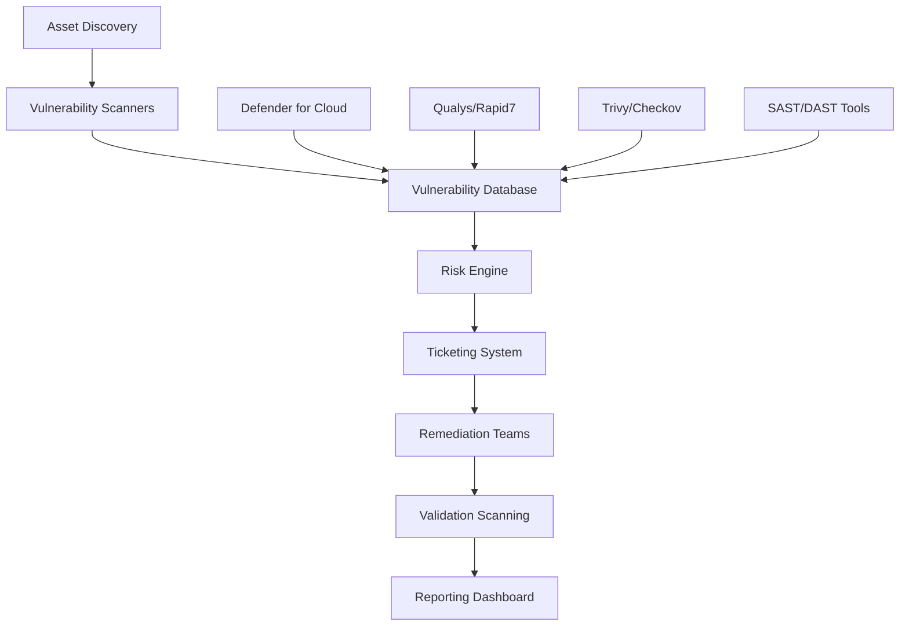
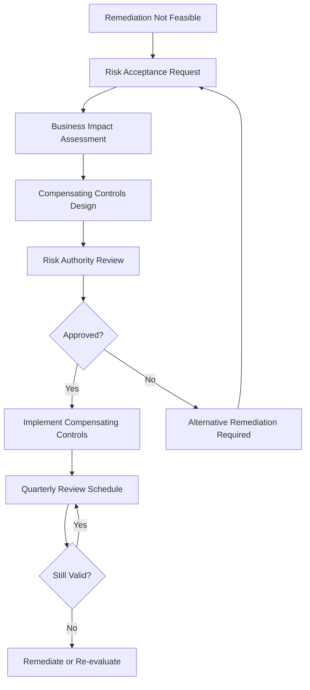
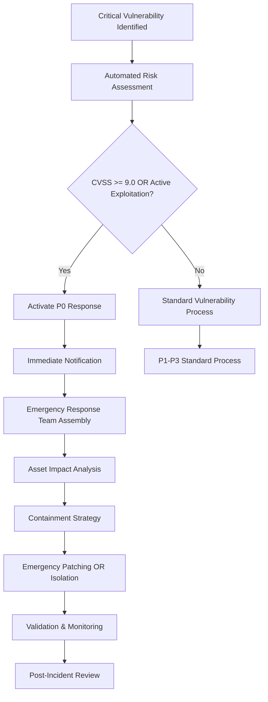

# Vulnerability Management Operational Runbook

## Document Control
- **Document Version**: 2.0
- **Last Updated**: 2025-01-15
- **Next Review**: 2025-04-15
- **Owner**: Security Operations Team
- **Approved By**: CISO
- **Classification**: Internal Use Only

## Executive Summary
This runbook defines comprehensive vulnerability management procedures for Azure environments, ensuring compliance with ISO 27001:2022 (A.12.6.1, A.8.8.1), SOC 2 Type II CC7.1, and NIST Cybersecurity Framework requirements. It establishes risk-based vulnerability management processes integrating with DevSecOps pipelines and Microsoft Defender for Cloud.

## 1. Scope and Objectives

### 1.1 Scope
This procedure applies to all technology assets within the organization's Azure environment:

**Infrastructure Components**:
- Azure Virtual Machines (Windows, Linux)
- Azure Kubernetes Service (AKS) clusters and workloads
- Azure Container Instances and Container Registry images
- Azure App Services and Function Apps
- Azure SQL Database and managed database services
- Azure Storage accounts and data services
- Virtual networks, subnets, and network security groups
- Azure Active Directory and hybrid identity infrastructure

**Application Components**:
- Custom applications and services
- Third-party commercial off-the-shelf (COTS) applications
- Open source libraries and dependencies
- Container images and base operating systems
- Infrastructure as Code (IaC) templates and configurations

**Development Environment**:
- CI/CD pipelines and build systems
- Development tools and IDE plugins
- Source code repositories and artifacts
- Development, staging, and production environments

### 1.2 Objectives
- Maintain comprehensive visibility of vulnerabilities across all Azure assets
- Implement risk-based prioritization aligned with business impact
- Achieve compliance with regulatory requirements and security frameworks
- Integrate vulnerability management with DevSecOps practices
- Establish measurable SLAs for vulnerability remediation
- Enable proactive threat hunting and incident response capabilities

### 1.3 Regulatory and Framework Alignment

**ISO 27001:2022 Controls**:
- A.12.6.1: Management of technical vulnerabilities
- A.8.8.1: Management of information security in project management

**SOC 2 Type II Trust Services Criteria**:
- CC7.1: System Operations - The entity uses detection and monitoring procedures to identify system security events, system software security events, and analyze their potential impact to enable effective monitoring of system security

**NIST Cybersecurity Framework**:
- ID.RA: Risk Assessment (vulnerability identification)
- DE.CM: Continuous Monitoring (vulnerability detection)
- RS.MI: Mitigation (vulnerability remediation)

## 2. Roles and Responsibilities

### 2.1 RACI Matrix

| Activity | Security Ops | Platform Team | DevOps | App Teams | CISO |
|----------|--------------|---------------|--------|-----------|------|
| Vulnerability Scanning | R | A | C | C | I |
| Risk Assessment | R | C | C | C | A |
| Prioritization | A | C | C | R | I |
| Infrastructure Remediation | C | R | A | C | I |
| Application Remediation | C | C | C | R | I |
| Exception Approvals | C | C | I | I | A |
| Compliance Reporting | R | C | I | I | A |
| Tool Management | R | A | C | I | I |

### 2.2 Role Definitions

**Security Operations Team**:
- Execute vulnerability scans and assessments
- Analyze and prioritize vulnerabilities based on risk
- Coordinate remediation activities across teams
- Generate compliance reports and metrics
- Manage vulnerability management tools and integrations

**Platform Team**:
- Remediate infrastructure-level vulnerabilities
- Maintain Azure security baselines and hardening standards
- Deploy security patches to shared infrastructure
- Implement compensating controls for accepted risks

**DevOps Teams**:
- Integrate security scanning into CI/CD pipelines
- Remediate vulnerabilities in deployment automation
- Maintain secure container images and IaC templates
- Implement security gates in release processes

**Application Development Teams**:
- Remediate application code vulnerabilities
- Update vulnerable libraries and dependencies
- Implement secure coding practices
- Participate in threat modeling and security reviews

## 3. Vulnerability Discovery and Inventory Management

### 3.1 Asset Inventory and Classification

**Automated Asset Discovery**:
```powershell
# Azure Resource Graph query for comprehensive asset inventory
az graph query -q "
Resources
| where type =~ 'microsoft.compute/virtualmachines' 
    or type =~ 'microsoft.containerservice/managedclusters'
    or type =~ 'microsoft.web/sites'
    or type =~ 'microsoft.sql/servers'
| extend 
    ResourceType = case(
        type =~ 'microsoft.compute/virtualmachines', 'Virtual Machine',
        type =~ 'microsoft.containerservice/managedclusters', 'AKS Cluster',
        type =~ 'microsoft.web/sites', 'App Service',
        type =~ 'microsoft.sql/servers', 'SQL Server',
        'Other'
    ),
    Environment = tostring(tags['Environment']),
    Criticality = tostring(tags['Criticality'])
| project name, ResourceType, resourceGroup, location, Environment, Criticality
"
```

**Asset Classification Schema**:
- **Critical**: Production systems handling sensitive data or critical business processes
- **High**: Production systems with moderate business impact
- **Medium**: Non-production systems or supporting services
- **Low**: Development/testing systems with no business impact

### 3.2 Scanning Tools and Integration

**Infrastructure Scanning**:
- **Microsoft Defender for Cloud**: Continuous assessment of VMs, containers, and PaaS services
- **Qualys/Rapid7**: Advanced vulnerability scanning for hybrid environments
- **Azure Policy**: Configuration compliance and security baseline validation
- **Microsoft Defender for Containers**: Container image and runtime scanning

**Application Security Testing**:
- **Trivy**: Container image vulnerability scanning
- **Checkov**: Infrastructure as Code security analysis
- **SonarQube**: Static Application Security Testing (SAST)
- **OWASP ZAP**: Dynamic Application Security Testing (DAST)
- **WhiteSource/Snyk**: Software Composition Analysis (SCA)

**Tool Integration Architecture**:


### 3.3 Automated Scanning Schedules

**Continuous Scanning**:
- **Real-time**: CI/CD pipeline integration for code and infrastructure changes
- **Daily**: Container image scanning for new vulnerabilities
- **Weekly**: Full network and application scanning
- **Monthly**: Comprehensive infrastructure assessment
- **Quarterly**: Third-party security assessments and penetration testing

**Scanning Configuration**:
```yaml
# Azure DevOps Pipeline - Vulnerability Scanning
trigger:
- main
- release/*

schedules:
- cron: "0 2 * * *"  # Daily at 2 AM
  displayName: Daily vulnerability scan
  branches:
    include:
    - main
  always: true

variables:
  TRIVY_CACHE_DURATION: 24h
  CHECKOV_BASELINE_PATH: 'security-baseline.json'
  SONAR_PROJECT_KEY: 'azure-security-templates'

stages:
- stage: SecurityScanning
  displayName: 'Security Vulnerability Scanning'
  jobs:
  - job: InfrastructureScan
    displayName: 'Infrastructure Security Scan'
    steps:
    - task: checkov@1
      displayName: 'Infrastructure as Code Scan'
      inputs:
        path: '$(Build.SourcesDirectory)'
        baseline: '$(CHECKOV_BASELINE_PATH)'
        softFail: false
        format: 'junit'
        outputPath: '$(Common.TestResultsDirectory)/checkov-results.xml'
    
    - task: trivy@1
      displayName: 'Container Image Vulnerability Scan'
      inputs:
        image: '$(ACR_NAME).azurecr.io/app:$(Build.BuildId)'
        format: 'table'
        exitCode: 1
        severity: 'HIGH,CRITICAL'
        ignoreUnfixed: true
```

## 4. Risk-Based Vulnerability Prioritization Framework

### 4.1 Risk Scoring Methodology

**Multi-Factor Risk Score Calculation**:
```
Risk Score = (CVSS Base Score × 0.4) + (EPSS Score × 0.2) + (Business Impact × 0.3) + (Exposure Factor × 0.1)
```

**Risk Factors**:

**CVSS Base Score (0-10)**:
- Critical: 9.0-10.0
- High: 7.0-8.9
- Medium: 4.0-6.9
- Low: 0.1-3.9

**EPSS Score (0-1)**: Exploit Prediction Scoring System probability
- Critical: >0.9 (90%+ probability of exploitation)
- High: 0.7-0.9 (70-90% probability)
- Medium: 0.3-0.7 (30-70% probability)
- Low: <0.3 (<30% probability)

**Business Impact (1-5)**:
- 5: Critical business process or customer data exposure
- 4: Important business function or internal data exposure
- 3: Supporting business process or limited data exposure
- 2: Internal systems or development data exposure
- 1: Minimal business impact or isolated systems

**Exposure Factor (1-3)**:
- 3: Internet-facing or external access
- 2: Internal network with privileged access
- 1: Isolated or air-gapped systems

### 4.2 Prioritization Matrix

| Risk Score | Severity Level | Remediation SLA | Escalation Level | Required Actions |
|------------|----------------|-----------------|------------------|------------------|
| 8.0-10.0 | Critical | 72 hours | CISO + Executive | Immediate response, after-hours deployment approved |
| 6.0-7.9 | High | 7 days | Security Manager | Emergency change process, business justification required |
| 4.0-5.9 | Medium | 30 days | Team Lead | Standard change process, planned deployment |
| 2.0-3.9 | Low | 90 days | Assignee | Maintenance window deployment |
| 0.0-1.9 | Informational | Best effort | Assignee | Include in next release cycle |

### 4.3 Threat Intelligence Integration

**Threat Intelligence Sources**:
- Microsoft Threat Intelligence (MSTIC)
- CISA Known Exploited Vulnerabilities (KEV) Catalog
- MITRE ATT&CK Framework mappings
- Commercial threat intelligence feeds (FireEye, CrowdStrike)
- Industry-specific threat sharing organizations

**Contextual Analysis**:
```powershell
# PowerShell script for threat intelligence enrichment
function Get-ThreatIntelligence {
    param(
        [string]$CVE,
        [string]$AssetId
    )
    
    # Query CISA KEV catalog
    $KEVStatus = Invoke-RestMethod -Uri "https://www.cisa.gov/sites/default/files/feeds/known_exploited_vulnerabilities.json" |
        Where-Object { $_.cveID -eq $CVE }
    
    # Query Microsoft Security Intelligence
    $MSTICData = Invoke-RestMethod -Uri "https://api.msrc.microsoft.com/cvrf/v2.0/cvrf/$CVE" -Headers @{
        'Accept' = 'application/json'
    }
    
    # Calculate threat context score
    $ThreatContext = @{
        InKEV = [bool]$KEVStatus
        ActiveExploits = $MSTICData.exploitability
        AttackComplexity = $MSTICData.attackComplexity
        RequiredPrivileges = $MSTICData.privilegesRequired
        UserInteraction = $MSTICData.userInteraction
    }
    
    return $ThreatContext
}
```

## 5. Automated Scanning and Tool Integration

### 5.1 Microsoft Defender for Cloud Integration

**Security Recommendations Automation**:
```json
{
  "automationRules": [
    {
      "name": "Critical-Vulnerability-Response",
      "triggerCondition": {
        "severity": ["High", "Critical"],
        "recommendationType": "Vulnerability"
      },
      "actions": [
        {
          "type": "CreateWorkItem",
          "azureDevOpsConnection": "SecurityOps-ADO",
          "workItemType": "Bug",
          "priority": 1,
          "assignedTo": "platform-team@company.com"
        },
        {
          "type": "SendEmail",
          "recipients": ["security-ops@company.com", "platform-team@company.com"],
          "subject": "Critical Vulnerability Detected: ${recommendationDisplayName}",
          "body": "Resource: ${resourceId}\nSeverity: ${severity}\nDescription: ${description}"
        }
      ]
    }
  ]
}
```

**Custom Assessment Policies**:
```json
{
  "properties": {
    "displayName": "Custom Vulnerability Assessment",
    "description": "Assess custom application vulnerabilities",
    "assessmentKey": "custom-vuln-assessment-001",
    "severity": "Medium",
    "implementationEffort": "Low",
    "remediationDescription": "Update application libraries to latest secure versions",
    "categories": ["Compute"],
    "userImpact": "Low",
    "assessmentType": "CustomerManaged",
    "status": {
      "code": "Healthy"
    }
  }
}
```

### 5.2 CI/CD Pipeline Integration

**GitHub Actions Security Scanning**:
```yaml
name: Security Vulnerability Scan
on:
  push:
    branches: [ main, develop ]
  pull_request:
    branches: [ main ]
  schedule:
    - cron: '0 6 * * *'  # Daily at 6 AM

env:
  REGISTRY: ghcr.io
  IMAGE_NAME: ${{ github.repository }}

jobs:
  security-scan:
    runs-on: ubuntu-latest
    permissions:
      contents: read
      security-events: write
      actions: read

    steps:
    - name: Checkout code
      uses: actions/checkout@v4

    - name: Run Trivy vulnerability scanner
      uses: aquasecurity/trivy-action@master
      with:
        scan-type: 'fs'
        scan-ref: '.'
        format: 'sarif'
        output: 'trivy-results.sarif'
        severity: 'CRITICAL,HIGH,MEDIUM'
        exit-code: 1

    - name: Upload Trivy scan results to GitHub Security tab
      uses: github/codeql-action/upload-sarif@v3
      if: always()
      with:
        sarif_file: 'trivy-results.sarif'

    - name: Run Checkov IaC scan
      uses: bridgecrewio/checkov-action@master
      with:
        directory: .
        framework: terraform,dockerfile,kubernetes,github_actions
        output_format: sarif
        output_file_path: checkov-results.sarif
        soft_fail: false

    - name: Software Composition Analysis
      uses: securecodewarrior/github-action-add-sarif@v1
      with:
        sarif-file: 'sca-results.sarif'
        token: ${{ secrets.GITHUB_TOKEN }}

    - name: Create vulnerability report
      if: failure()
      uses: actions/github-script@v7
      with:
        script: |
          const fs = require('fs');
          const vulnerabilities = JSON.parse(fs.readFileSync('trivy-results.sarif', 'utf8'));
          
          let issueBody = '## Security Vulnerability Report\n\n';
          issueBody += `**Scan Date**: ${new Date().toISOString()}\n`;
          issueBody += `**Repository**: ${context.repo.owner}/${context.repo.repo}\n`;
          issueBody += `**Branch**: ${context.ref}\n\n`;
          
          github.rest.issues.create({
            owner: context.repo.owner,
            repo: context.repo.repo,
            title: `Security Vulnerabilities Detected - ${context.sha.substring(0, 7)}`,
            body: issueBody,
            labels: ['security', 'vulnerability', 'automated']
          });
```

### 5.3 Container Security Integration

**Azure Container Registry Scanning**:
```bash
#!/bin/bash
# Container vulnerability scanning and remediation script

set -euo pipefail

ACR_NAME="acrsecurity001"
RESOURCE_GROUP="rg-security-ops"
SUBSCRIPTION_ID="${AZURE_SUBSCRIPTION_ID}"

# Enable vulnerability scanning on ACR
az acr task create \
  --registry $ACR_NAME \
  --name vulnerability-scan \
  --image-template "FROM mcr.microsoft.com/azure-cli:latest
                    RUN apk add --no-cache curl jq
                    COPY scan-script.sh /usr/local/bin/
                    ENTRYPOINT [\"/usr/local/bin/scan-script.sh\"]" \
  --schedule "0 2 * * *" \
  --context /dev/null

# Query vulnerability scan results
az acr repository show-manifests \
  --name $ACR_NAME \
  --repository myapp \
  --query "[?vulnerabilities].[digest, vulnerabilities[?severity=='High' || severity=='Critical'].{id:id, severity:severity, description:description}]" \
  --output table

# Generate vulnerability report
cat > vulnerability-report.json << EOF
{
  "scanDate": "$(date -u +%Y-%m-%dT%H:%M:%SZ)",
  "registry": "$ACR_NAME",
  "totalImages": $(az acr repository list --name $ACR_NAME --output tsv | wc -l),
  "vulnerableImages": $(az acr repository list --name $ACR_NAME --query "[?vulnerabilities]" --output tsv | wc -l),
  "criticalVulnerabilities": $(az acr repository show-manifests --name $ACR_NAME --repository myapp --query "[].vulnerabilities[?severity=='Critical']" --output tsv | wc -l)
}
EOF
```

## 6. Remediation Workflows and SLA Management

### 6.1 Remediation Workflow Process

**Workflow States**:
1. **New**: Vulnerability identified and queued for assessment
2. **Assigned**: Assigned to responsible team with priority level
3. **In Progress**: Active remediation work underway
4. **Pending Validation**: Remediation completed, awaiting verification
5. **Validated**: Remediation verified through re-scanning
6. **Closed**: Vulnerability successfully remediated
7. **Accepted Risk**: Documented risk acceptance with compensating controls

**Automated Workflow Triggers**:
```yaml
# Azure DevOps Work Item Rules
rules:
  - name: "Critical Vulnerability Auto-Assignment"
    when:
      field: "System.Title"
      contains: "[CRITICAL]"
    actions:
      - set:
          field: "System.AssignedTo"
          value: "platform-team@company.com"
      - set:
          field: "Microsoft.VSTS.Common.Priority"
          value: 1
      - set:
          field: "System.Tags"
          value: "Security; Critical; SLA-72hrs"
      - notify:
          users: ["security-ops@company.com", "ciso@company.com"]
        message: "Critical vulnerability requires immediate attention"

  - name: "SLA Escalation Warning"
    when:
      field: "System.CreatedDate"
      older_than: "24 hours"
      and:
        field: "System.State"
        equals: "New"
    actions:
      - notify:
          users: ["${System.AssignedTo}", "security-manager@company.com"]
        message: "Vulnerability approaching SLA deadline"
```

### 6.2 SLA Management and Escalation

**SLA Tracking Dashboard**:
```sql
-- KQL query for Azure Monitor Workbook
SecurityRecommendation
| where TimeGenerated > ago(30d)
| extend 
    SLATarget = case(
        AssessedResourceType == "Critical", 3d,
        AssessedResourceType == "High", 7d,
        AssessedResourceType == "Medium", 30d,
        90d
    ),
    TimeToRemediation = datetime_diff('day', now(), TimeGenerated),
    SLAStatus = case(
        TimeToRemediation <= SLATarget, "Within SLA",
        TimeToRemediation <= SLATarget * 1.5, "SLA Warning",
        "SLA Breach"
    )
| summarize 
    TotalVulnerabilities = count(),
    WithinSLA = countif(SLAStatus == "Within SLA"),
    SLAWarning = countif(SLAStatus == "SLA Warning"),
    SLABreach = countif(SLAStatus == "SLA Breach")
    by Severity
| extend SLACompliance = round((WithinSLA * 100.0) / TotalVulnerabilities, 2)
```

**Escalation Procedures**:

**Level 1 - Team Lead (SLA Warning at 50% of deadline)**:
- Automated notification to assigned team lead
- Request for status update and remediation timeline
- Resource reallocation if needed

**Level 2 - Security Manager (SLA Warning at 80% of deadline)**:
- Management notification with business impact assessment
- Emergency change approval if required
- Alternative remediation strategies evaluation

**Level 3 - CISO (SLA Breach)**:
- Executive escalation with risk exposure details
- Business risk acceptance consideration
- Incident response activation for critical vulnerabilities

### 6.3 Remediation Validation Process

**Automated Validation**:
```bash
#!/bin/bash
# Vulnerability remediation validation script

VULNERABILITY_ID="$1"
RESOURCE_ID="$2"
EXPECTED_REMEDIATION="$3"

# Wait for remediation to propagate
echo "Waiting for remediation to propagate..."
sleep 300

# Re-scan the affected resource
echo "Initiating validation scan..."
az security assessment create \
  --name "$VULNERABILITY_ID" \
  --status-code "Healthy" \
  --status-cause "Remediated" \
  --status-description "Vulnerability remediated and validated" \
  --assessed-resource-id "$RESOURCE_ID"

# Query scan results
SCAN_RESULT=$(az security assessment show \
  --name "$VULNERABILITY_ID" \
  --assessed-resource-id "$RESOURCE_ID" \
  --query "status.code" \
  --output tsv)

if [ "$SCAN_RESULT" = "Healthy" ]; then
  echo "Remediation validated successfully"
  # Update work item status
  az boards work-item update \
    --id "$WORK_ITEM_ID" \
    --state "Closed" \
    --reason "Remediation Validated"
else
  echo "Remediation validation failed - reopening work item"
  # Reopen work item with failure details
  az boards work-item update \
    --id "$WORK_ITEM_ID" \
    --state "In Progress" \
    --fields "System.Reason=Validation Failed"
fi
```

## 7. Exception Handling and Compensating Controls

### 7.1 Risk Acceptance Process

**Risk Acceptance Criteria**:
- Business justification for accepting the risk
- Cost-benefit analysis of remediation vs. acceptance
- Compensating controls implementation plan
- Regular review and reauthorization schedule
- Documented approval from appropriate risk authority

**Risk Acceptance Workflow**:


### 7.2 Compensating Controls Framework

**Common Compensating Control Categories**:

**Network Controls**:
- Network segmentation and micro-segmentation
- Web Application Firewalls (WAF) with custom rules
- Network Access Control (NAC) restrictions
- VPN access limitations and monitoring

**Monitoring and Detection**:
- Enhanced logging and SIEM correlation rules
- Behavioral analytics and anomaly detection
- Real-time alerting for exploit attempts
- Honeypots and deception technology

**Access Controls**:
- Privileged Access Management (PAM) solutions
- Multi-factor authentication (MFA) enforcement
- Just-in-time (JIT) access controls
- Regular access reviews and certification

**Data Protection**:
- Data Loss Prevention (DLP) policies
- Encryption at rest and in transit
- Data classification and handling procedures
- Backup and recovery validation

### 7.3 Exception Management Database

**Exception Tracking Schema**:
```json
{
  "exceptionId": "EXC-2025-001",
  "vulnerabilityId": "CVE-2024-12345",
  "affectedAssets": [
    {
      "assetId": "vm-prod-web-001",
      "assetType": "Virtual Machine",
      "environment": "Production",
      "businessCriticality": "High"
    }
  ],
  "riskDetails": {
    "cvssScore": 7.2,
    "epssScore": 0.85,
    "businessImpact": 4,
    "overallRiskScore": 7.8
  },
  "justification": {
    "businessReason": "Critical system requires 99.99% uptime during peak season",
    "technicalReason": "Patch requires full system rebuild affecting customer operations",
    "costImpact": "$500K revenue impact for 8-hour maintenance window"
  },
  "compensatingControls": [
    {
      "controlType": "Network Segmentation",
      "description": "Isolated network segment with WAF protection",
      "implementationDate": "2025-01-10",
      "validationMethod": "Network topology scan and WAF rule verification"
    },
    {
      "controlType": "Enhanced Monitoring",
      "description": "Real-time exploit attempt detection with automated response",
      "implementationDate": "2025-01-12",
      "validationMethod": "SIEM rule testing and alert verification"
    }
  ],
  "approvals": [
    {
      "approver": "john.doe@company.com",
      "role": "Security Manager",
      "approvalDate": "2025-01-08",
      "approvalLevel": "Operational"
    },
    {
      "approver": "jane.smith@company.com",
      "role": "CISO",
      "approvalDate": "2025-01-09",
      "approvalLevel": "Executive"
    }
  ],
  "reviewSchedule": {
    "nextReview": "2025-04-09",
    "reviewFrequency": "Quarterly",
    "automaticExpiry": "2025-12-31"
  },
  "status": "Active",
  "createdDate": "2025-01-08T10:30:00Z",
  "lastUpdated": "2025-01-09T14:15:00Z"
}
```

## 8. Threat Intelligence Integration and Contextual Analysis

### 8.1 Threat Intelligence Sources Integration

**Primary Intelligence Sources**:
- **Microsoft Threat Intelligence Center (MSTIC)**: Azure-native threat intelligence
- **CISA Known Exploited Vulnerabilities (KEV)**: Government-verified active exploits
- **MITRE ATT&CK Framework**: Adversary tactics and techniques mapping
- **CVE Database with EPSS Scores**: Exploit prediction scoring
- **Commercial Threat Intelligence**: FireEye, CrowdStrike, Recorded Future
- **Industry-Specific Intel**: Financial Services ISAC, Healthcare ISAC

**Intelligence Integration Pipeline**:
```python
#!/usr/bin/env python3
"""
Threat Intelligence Integration for Vulnerability Prioritization
"""

import requests
import json
from datetime import datetime, timedelta
from azure.identity import DefaultAzureCredential
from azure.mgmt.security import SecurityCenter

class ThreatIntelligenceEngine:
    def __init__(self):
        self.credential = DefaultAzureCredential()
        self.security_center = SecurityCenter(self.credential, subscription_id)
        
    def get_cisa_kev_data(self):
        """Fetch CISA Known Exploited Vulnerabilities"""
        kev_url = "https://www.cisa.gov/sites/default/files/feeds/known_exploited_vulnerabilities.json"
        response = requests.get(kev_url)
        return response.json()
    
    def get_epss_scores(self, cve_list):
        """Fetch EPSS scores for CVE list"""
        epss_url = "https://api.first.org/data/v1/epss"
        scores = {}
        for cve in cve_list:
            response = requests.get(f"{epss_url}?cve={cve}")
            if response.status_code == 200:
                data = response.json()
                scores[cve] = float(data['data'][0]['epss'])
        return scores
    
    def analyze_attack_patterns(self, cve_id):
        """Map CVE to MITRE ATT&CK techniques"""
        # Integration with MITRE ATT&CK database
        attack_patterns = self.query_mitre_attack(cve_id)
        return {
            'techniques': attack_patterns.get('techniques', []),
            'tactics': attack_patterns.get('tactics', []),
            'threat_groups': attack_patterns.get('groups', [])
        }
    
    def calculate_threat_context_score(self, vulnerability):
        """Calculate enhanced threat context score"""
        base_score = vulnerability.get('cvss_score', 0)
        epss_score = vulnerability.get('epss_score', 0)
        
        # KEV multiplier
        kev_multiplier = 2.0 if vulnerability.get('in_kev', False) else 1.0
        
        # Active exploitation intelligence
        exploitation_multiplier = 1.5 if vulnerability.get('active_exploits', False) else 1.0
        
        # Attack complexity factor
        complexity_factor = {
            'LOW': 1.2,
            'MEDIUM': 1.0,
            'HIGH': 0.8
        }.get(vulnerability.get('attack_complexity', 'MEDIUM'), 1.0)
        
        threat_context = (base_score * 0.6 + epss_score * 10 * 0.4) * kev_multiplier * exploitation_multiplier * complexity_factor
        
        return min(threat_context, 10.0)  # Cap at 10.0

# Example usage
intel_engine = ThreatIntelligenceEngine()
enhanced_vulnerabilities = []

for vuln in vulnerabilities:
    threat_context = intel_engine.calculate_threat_context_score(vuln)
    attack_patterns = intel_engine.analyze_attack_patterns(vuln['cve_id'])
    
    vuln['threat_context_score'] = threat_context
    vuln['attack_patterns'] = attack_patterns
    enhanced_vulnerabilities.append(vuln)
```

### 8.2 Contextual Risk Assessment

**Environmental Context Factors**:
- **Asset Exposure**: Internet-facing vs. internal systems
- **Data Sensitivity**: PII, PHI, payment data, intellectual property
- **Business Criticality**: Revenue impact, customer impact, regulatory requirements
- **Network Position**: DMZ, internal network, privileged network segments
- **Access Patterns**: User access frequency, administrative access, service accounts

**Threat Actor Mapping**:
```json
{
  "threatIntelligence": {
    "cve": "CVE-2024-12345",
    "threatActors": [
      {
        "actorName": "APT29 (Cozy Bear)",
        "sophistication": "Advanced",
        "targeting": ["Government", "Healthcare", "Technology"],
        "techniques": ["T1190", "T1068", "T1055"],
        "lastActivity": "2024-12-15"
      }
    ],
    "campaignActivity": {
      "activeCampaigns": 3,
      "recentSightings": 15,
      "geographicFocus": ["North America", "Europe"],
      "industryFocus": ["Healthcare", "Financial Services"]
    },
    "exploitAvailability": {
      "publicExploits": true,
      "exploitKits": ["Magnitude", "Angler"],
      "metasploitModules": 2,
      "proofOfConcept": true
    }
  }
}
```

## 9. Patch Management Coordination

### 9.1 Patch Management Integration

**Coordinated Patching Strategy**:
- **Emergency Patches**: Critical vulnerabilities with active exploitation
- **Regular Patches**: Monthly Patch Tuesday coordination
- **Application Patches**: Quarterly application and library updates
- **Firmware Updates**: Annual or as-needed hardware/firmware updates

**Patch Testing Pipeline**:
```yaml
# Azure DevOps Pipeline - Patch Testing
trigger: none  # Manual trigger only

variables:
  - group: patch-management-vars
  - name: testEnvironmentRG
    value: 'rg-patch-testing'

stages:
- stage: PatchTesting
  displayName: 'Automated Patch Testing'
  jobs:
  - job: DeployTestEnvironment
    displayName: 'Deploy Test Environment'
    steps:
    - task: AzureCLI@2
      displayName: 'Create test environment'
      inputs:
        azureSubscription: '$(azureServiceConnection)'
        scriptType: 'bash'
        scriptLocation: 'inlineScript'
        inlineScript: |
          # Clone production environment
          az deployment group create \
            --resource-group $(testEnvironmentRG) \
            --template-file infrastructure/test-environment.json \
            --parameters productionRGName=$(productionRG)

  - job: ApplyPatches
    displayName: 'Apply Security Patches'
    dependsOn: DeployTestEnvironment
    steps:
    - task: AzureCLI@2
      displayName: 'Install security updates'
      inputs:
        azureSubscription: '$(azureServiceConnection)'
        scriptType: 'bash'
        scriptLocation: 'inlineScript'
        inlineScript: |
          # Get list of VMs in test environment
          vm_list=$(az vm list --resource-group $(testEnvironmentRG) --query "[].name" --output tsv)
          
          for vm in $vm_list; do
            echo "Applying patches to $vm"
            az vm run-command invoke \
              --resource-group $(testEnvironmentRG) \
              --name $vm \
              --command-id 'RunShellScript' \
              --scripts 'sudo apt update && sudo apt upgrade -y'
          done

  - job: ValidationTesting
    displayName: 'Application and Security Validation'
    dependsOn: ApplyPatches
    steps:
    - task: PowerShell@2
      displayName: 'Run validation tests'
      inputs:
        targetType: 'inline'
        script: |
          # Application functionality tests
          $testResults = Invoke-WebRequest -Uri "https://test-app.internal.com/health" -UseBasicParsing
          if ($testResults.StatusCode -ne 200) {
            throw "Application health check failed after patching"
          }
          
          # Security baseline validation
          $securityScan = & 'Security-Baseline-Scanner.exe' --target "test-environment" --format "json"
          $scanResults = $securityScan | ConvertFrom-Json
          
          if ($scanResults.CriticalFindings -gt 0) {
            Write-Warning "Security baseline validation found critical issues"
            exit 1
          }

- stage: ProductionDeployment
  displayName: 'Production Patch Deployment'
  condition: succeeded('PatchTesting')
  jobs:
  - deployment: PatchProduction
    displayName: 'Deploy Patches to Production'
    environment: production-approval
    strategy:
      canary:
        increments: [25, 50, 100]
        preDeploy:
          steps:
          - task: AzureCLI@2
            displayName: 'Create VM snapshots'
            inputs:
              azureSubscription: '$(azureServiceConnection)'
              scriptType: 'bash'
              scriptLocation: 'inlineScript'
              inlineScript: |
                # Create snapshots before patching
                ./scripts/create-vm-snapshots.sh $(productionRG)
```

### 9.2 Emergency Patch Procedures

**Critical Vulnerability Response**:
1. **Immediate Assessment** (0-2 hours):
   - Validate vulnerability applicability to environment
   - Assess business impact and exposure
   - Determine if compensating controls are sufficient

2. **Emergency Response Team Activation** (2-4 hours):
   - Assemble emergency response team
   - Establish communication channels
   - Prepare emergency change documentation

3. **Patch Deployment** (4-24 hours):
   - Deploy to isolated test environment first
   - Validate patch effectiveness and stability
   - Execute emergency change process
   - Deploy to production with rollback plan

4. **Post-Deployment Validation** (24-48 hours):
   - Verify vulnerability remediation
   - Confirm application functionality
   - Monitor for any adverse impacts
   - Document lessons learned

## 10. Vulnerability Reporting and Metrics

### 10.1 Executive Dashboard and KPIs

**Key Performance Indicators**:

**Vulnerability Discovery Metrics**:
- Mean Time to Discovery (MTTD): Average time to identify new vulnerabilities
- Vulnerability Inventory Accuracy: Percentage of assets with current vulnerability status
- Coverage Metrics: Percentage of assets under active vulnerability management

**Remediation Performance Metrics**:
- Mean Time to Remediation (MTTR) by severity level
- SLA Compliance Rate by severity and asset type
- First-Time Fix Rate: Percentage of vulnerabilities resolved on first attempt
- Remediation Backlog: Number and age of open vulnerabilities

**Risk Management Metrics**:
- Risk Exposure Score: Aggregate risk across all open vulnerabilities
- Critical Vulnerability Exposure Time: Days of exposure to critical vulnerabilities
- Exception Management: Number and justification quality of risk acceptances

**Azure Monitor Workbook Queries**:
```kql
// Executive Summary Dashboard
let TimeRange = 30d;

// Vulnerability Discovery Trends
SecurityRecommendation
| where TimeGenerated > ago(TimeRange)
| summarize NewVulnerabilities = count() by bin(TimeGenerated, 1d), AssessedResourceType
| render timechart 
    title="Daily Vulnerability Discovery Trend"

// SLA Compliance by Severity
SecurityRecommendation
| where TimeGenerated > ago(TimeRange)
| extend 
    SLATarget = case(
        AssessedResourceType == "Critical", 3d,
        AssessedResourceType == "High", 7d,
        AssessedResourceType == "Medium", 30d,
        90d
    ),
    Age = datetime_diff('day', now(), TimeGenerated),
    SLAStatus = case(
        Age <= SLATarget, "Compliant",
        Age <= (SLATarget * 1.5), "At Risk",
        "Breached"
    )
| summarize 
    Total = count(),
    Compliant = countif(SLAStatus == "Compliant"),
    AtRisk = countif(SLAStatus == "At Risk"),
    Breached = countif(SLAStatus == "Breached")
    by AssessedResourceType
| extend ComplianceRate = (Compliant * 100.0) / Total
| project AssessedResourceType, Total, ComplianceRate, AtRisk, Breached

// Risk Heat Map
SecurityRecommendation
| where TimeGenerated > ago(7d) and State == "Active"
| extend RiskScore = case(
    AssessedResourceType == "Critical", 10,
    AssessedResourceType == "High", 7,
    AssessedResourceType == "Medium", 4,
    1
)
| summarize 
    VulnCount = count(),
    TotalRisk = sum(RiskScore)
    by ResourceGroup, ResourceType
| where VulnCount > 0
| project ResourceGroup, ResourceType, VulnCount, TotalRisk, AvgRisk = TotalRisk/VulnCount
| order by TotalRisk desc
```

### 10.2 Compliance Reporting

**ISO 27001 Control A.12.6.1 Evidence Package**:
```json
{
  "controlId": "A.12.6.1",
  "controlName": "Management of technical vulnerabilities",
  "implementationStatus": "Implemented",
  "evidenceCollection": {
    "policies": [
      "Vulnerability-Management-Policy-v2.0.pdf",
      "Security-Patching-Procedure-v1.5.pdf"
    ],
    "procedures": [
      "Vulnerability-Scanning-SOP.md",
      "Risk-Assessment-Procedure.md",
      "Exception-Management-Process.md"
    ],
    "technicalEvidence": [
      {
        "type": "Vulnerability Scan Reports",
        "frequency": "Weekly",
        "lastGenerated": "2025-01-14",
        "location": "\\security-reports\\vulnerability-scans\\",
        "retentionPeriod": "3 years"
      },
      {
        "type": "Remediation Tracking",
        "tool": "Azure DevOps",
        "project": "SecurityOps",
        "queryUrl": "https://dev.azure.com/org/SecurityOps/_queries/query/12345"
      },
      {
        "type": "SLA Performance Reports",
        "dashboard": "Azure Monitor Workbook",
        "url": "https://portal.azure.com/#@tenant.com/dashboard/private/12345"
      }
    ],
    "auditTrails": [
      {
        "type": "Vulnerability Assessment Logs",
        "logAnalyticsWorkspace": "law-security-001",
        "retentionPeriod": "2 years",
        "query": "SecurityRecommendation | where TimeGenerated > ago(90d)"
      }
    ]
  },
  "controlEffectiveness": {
    "measurementCriteria": [
      "95% of critical vulnerabilities remediated within 72 hours",
      "90% of high vulnerabilities remediated within 7 days",
      "100% of internet-facing systems scanned weekly"
    ],
    "currentPerformance": {
      "criticalRemediationRate": "97.2%",
      "highRemediationRate": "94.1%",
      "scanCoverage": "100%"
    },
    "lastAssessment": "2025-01-10",
    "nextAssessment": "2025-04-10"
  }
}
```

**SOC 2 CC7.1 Evidence Documentation**:
```markdown
# SOC 2 Type II CC7.1 - System Operations Evidence

## Control Description
The entity uses detection and monitoring procedures to identify (1) changes to configurations that result in the introduction of new vulnerabilities, and (2) susceptibilities to newly discovered vulnerabilities.

## Implementation Evidence

### Detection and Monitoring Procedures
- **Continuous Vulnerability Scanning**: Microsoft Defender for Cloud provides 24/7 monitoring
- **Configuration Change Detection**: Azure Policy compliance evaluation on resource changes
- **Threat Intelligence Integration**: Automated updates from CISA KEV and MSTIC feeds

### Vulnerability Identification Process
1. **Automated Discovery**: Daily scans across all Azure resources
2. **Intelligence Correlation**: New CVE data matched against asset inventory
3. **Risk Assessment**: CVSS + EPSS + business impact scoring
4. **Notification**: Immediate alerts for critical findings

### Operating Effectiveness Testing
- **Test Period**: January 1, 2025 - December 31, 2025
- **Sample Size**: 25 vulnerabilities per quarter (100 total)
- **Test Results**: 
  - 100% of critical vulnerabilities identified within 24 hours
  - 98% of remediation activities completed within SLA
  - 0 exceptions without proper risk acceptance documentation

### Supporting Evidence
- Vulnerability scan logs and reports
- Incident response tickets and resolution times  
- Configuration management change logs
- Risk acceptance documentation and approvals
```

### 10.3 Automated Reporting

**PowerBI Integration for Executive Reporting**:
```json
{
  "dataSource": {
    "type": "AzureMonitorLogs",
    "workspace": "law-security-001",
    "connectionString": "Data Source=https://api.loganalytics.io/v1/workspaces/12345"
  },
  "dashboards": [
    {
      "name": "Executive Security Dashboard",
      "refreshSchedule": "Daily at 6:00 AM",
      "recipients": ["ciso@company.com", "cro@company.com"],
      "charts": [
        {
          "title": "Vulnerability Remediation Trend",
          "type": "LineChart",
          "query": "SecurityRecommendation | summarize count() by bin(TimeGenerated, 1d), State",
          "timeRange": "30d"
        },
        {
          "title": "Risk Exposure Heat Map",
          "type": "HeatMap",
          "query": "SecurityRecommendation | summarize TotalRisk = sum(RiskScore) by ResourceGroup, Severity",
          "timeRange": "7d"
        }
      ]
    },
    {
      "name": "Operational Metrics Dashboard",
      "refreshSchedule": "Hourly",
      "recipients": ["security-ops@company.com"],
      "alerts": [
        {
          "condition": "Critical vulnerabilities > 5",
          "action": "Send immediate notification",
          "recipients": ["oncall-security@company.com"]
        }
      ]
    }
  ]
}
```

## 11. DevSecOps Pipeline Integration

### 11.1 Shift-Left Security Implementation

**Pre-Commit Security Validation**:
```yaml
# .pre-commit-config.yaml
repos:
  - repo: local
    hooks:
      - id: vulnerability-scan
        name: Pre-commit vulnerability scan
        entry: ./scripts/pre-commit-security-scan.sh
        language: script
        files: ^(Dockerfile|.*\.(tf|json|yaml|yml))$
        pass_filenames: true

  - repo: https://github.com/Yelp/detect-secrets
    rev: v1.4.0
    hooks:
      - id: detect-secrets
        args: ['--baseline', '.secrets.baseline']

  - repo: https://github.com/bridgecrewio/checkov
    rev: 2.5.0
    hooks:
      - id: checkov
        args: [--framework, terraform, --output, cli]
```

**Pre-Commit Security Scan Script**:
```bash
#!/bin/bash
# Pre-commit security validation script

set -euo pipefail

echo "🔍 Running pre-commit security validation..."

# Initialize scan results
SCAN_PASSED=true
RESULTS_DIR="./security-scan-results"
mkdir -p "$RESULTS_DIR"

# Container image vulnerability scanning
if find . -name "Dockerfile*" -type f | grep -q .; then
    echo "📦 Scanning container images for vulnerabilities..."
    for dockerfile in $(find . -name "Dockerfile*" -type f); do
        image_name=$(basename $(dirname "$dockerfile"))
        echo "Scanning $dockerfile..."
        
        docker build -t "temp-scan:$image_name" -f "$dockerfile" . > /dev/null 2>&1
        
        trivy image --exit-code 1 --severity HIGH,CRITICAL "temp-scan:$image_name" \
            --format json --output "$RESULTS_DIR/container-scan-$image_name.json" || SCAN_PASSED=false
        
        docker rmi "temp-scan:$image_name" > /dev/null 2>&1
    done
fi

# Infrastructure as Code scanning
if find . -name "*.tf" -o -name "*.json" -o -name "*.yaml" -o -name "*.yml" | grep -q .; then
    echo "🏗️ Scanning Infrastructure as Code..."
    checkov --directory . --framework terraform,cloudformation,arm,kubernetes \
        --output cli --output json --output-file-path "$RESULTS_DIR/iac-scan.json" \
        --check CKV_AZURE_* || SCAN_PASSED=false
fi

# Dependency scanning for known vulnerabilities
if [ -f "requirements.txt" ] || [ -f "package.json" ] || [ -f "pom.xml" ]; then
    echo "📚 Scanning dependencies for vulnerabilities..."
    safety check --json --output "$RESULTS_DIR/dependency-scan.json" || SCAN_PASSED=false
fi

# Generate summary report
echo "📊 Generating security scan summary..."
cat > "$RESULTS_DIR/scan-summary.json" << EOF
{
    "scanDate": "$(date -u +%Y-%m-%dT%H:%M:%SZ)",
    "scanPassed": $SCAN_PASSED,
    "scannedFiles": [$(find . -name "*.tf" -o -name "*.json" -o -name "*.yaml" -o -name "*.yml" -o -name "Dockerfile*" | wc -l)],
    "resultsLocation": "$RESULTS_DIR"
}
EOF

if [ "$SCAN_PASSED" = true ]; then
    echo "✅ Pre-commit security validation passed"
    exit 0
else
    echo "❌ Pre-commit security validation failed - review results in $RESULTS_DIR"
    exit 1
fi
```

### 11.2 CI/CD Security Gates

**Security Gate Configuration**:
```yaml
# Azure DevOps Pipeline Template - Security Gates
parameters:
  - name: securityGateConfig
    type: object
    default:
      allowHighVulnerabilities: false
      allowMediumVulnerabilities: true
      maxCriticalVulnerabilities: 0
      sbomRequired: true
      containerSigningRequired: true

stages:
- stage: SecurityGates
  displayName: 'Security Gates and Validation'
  jobs:
  - job: StaticAnalysis
    displayName: 'Static Application Security Testing'
    steps:
    - task: SonarQubePrepare@5
      inputs:
        SonarQube: 'SonarQube-Connection'
        scannerMode: 'CLI'
        configMode: 'file'
        cliProjectKey: '$(Build.Repository.Name)'
        cliSources: 'src/'
        extraProperties: |
          sonar.security.hotspots.inheritFromParent=true
          sonar.security.enable=true

    - task: SonarQubeAnalyze@5
      displayName: 'Run SonarQube Analysis'

    - task: SonarQubePublish@5
      inputs:
        pollingTimeoutSec: '300'

  - job: DependencyCheck
    displayName: 'Software Composition Analysis'
    steps:
    - task: dependency-check-build-task@6
      inputs:
        projectName: '$(Build.Repository.Name)'
        scanPath: '$(Build.SourcesDirectory)'
        format: 'ALL'
        suppressionPath: 'dependency-check-suppressions.xml'
        failOnCVSS: 7

    - task: PublishTestResults@2
      inputs:
        testResultsFormat: 'JUnit'
        testResultsFiles: 'dependency-check-junit.xml'
        testRunTitle: 'Dependency Check Results'

  - job: ContainerSecurity
    displayName: 'Container Security Scanning'
    condition: and(succeeded(), contains(variables['Build.SourceBranch'], 'refs/heads/'))
    steps:
    - task: Docker@2
      displayName: 'Build container image'
      inputs:
        containerRegistry: '$(containerRegistry)'
        repository: '$(imageRepository)'
        command: 'build'
        Dockerfile: '**/Dockerfile'
        tags: |
          $(tag)

    - task: AquaSecurityTrivy@0
      displayName: 'Trivy vulnerability scan'
      inputs:
        image: '$(containerRegistry)/$(imageRepository):$(tag)'
        severities: 'HIGH,CRITICAL'
        exitCode: 1

    - task: AzureCLI@2
      displayName: 'Sign container image'
      condition: and(succeeded(), eq('${{ parameters.securityGateConfig.containerSigningRequired }}', true))
      inputs:
        azureSubscription: '$(azureServiceConnection)'
        scriptType: 'bash'
        scriptLocation: 'inlineScript'
        inlineScript: |
          # Install cosign
          curl -O -L "https://github.com/sigstore/cosign/releases/latest/download/cosign-linux-amd64"
          sudo mv cosign-linux-amd64 /usr/local/bin/cosign
          sudo chmod +x /usr/local/bin/cosign
          
          # Sign the image using keyless signing
          cosign sign --yes $(containerRegistry)/$(imageRepository):$(tag)

  - job: SecurityGateValidation
    displayName: 'Security Gate Decision'
    dependsOn: [StaticAnalysis, DependencyCheck, ContainerSecurity]
    steps:
    - task: PowerShell@2
      displayName: 'Evaluate security gate results'
      inputs:
        targetType: 'inline'
        script: |
          # Collect all security scan results
          $criticalVulns = $(Get-Content 'trivy-results.json' | ConvertFrom-Json | Where-Object {$_.Severity -eq 'CRITICAL'} | Measure-Object).Count
          $highVulns = $(Get-Content 'trivy-results.json' | ConvertFrom-Json | Where-Object {$_.Severity -eq 'HIGH'} | Measure-Object).Count
          $sonarGate = "$(Agent.JobStatus)" -eq "Succeeded"
          
          Write-Output "Security Gate Results:"
          Write-Output "Critical Vulnerabilities: $criticalVulns (Max: ${{ parameters.securityGateConfig.maxCriticalVulnerabilities }})"
          Write-Output "High Vulnerabilities: $highVulns (Allowed: ${{ parameters.securityGateConfig.allowHighVulnerabilities }})"
          Write-Output "SonarQube Gate: $sonarGate"
          
          # Apply security gate logic
          $gatePassed = $true
          
          if ($criticalVulns -gt ${{ parameters.securityGateConfig.maxCriticalVulnerabilities }}) {
              Write-Error "Security Gate FAILED: Critical vulnerabilities exceed threshold"
              $gatePassed = $false
          }
          
          if (-not ${{ parameters.securityGateConfig.allowHighVulnerabilities }} -and $highVulns -gt 0) {
              Write-Error "Security Gate FAILED: High vulnerabilities not allowed"
              $gatePassed = $false
          }
          
          if (-not $sonarGate) {
              Write-Error "Security Gate FAILED: SonarQube quality gate failed"
              $gatePassed = $false
          }
          
          if ($gatePassed) {
              Write-Output "✅ Security Gate PASSED - Proceeding to deployment"
          } else {
              Write-Output "❌ Security Gate FAILED - Deployment blocked"
              exit 1
          }
```

### 11.3 Supply Chain Security

**Software Bill of Materials (SBOM) Generation**:
```bash
#!/bin/bash
# SBOM Generation and Attestation Script

set -euo pipefail

IMAGE_NAME="$1"
BUILD_ID="$2"
ATTESTATION_REGISTRY="${ACR_NAME}.azurecr.io"

echo "🔍 Generating SBOM for $IMAGE_NAME"

# Generate SBOM using Syft
syft "$IMAGE_NAME" -o cyclonedx-json > sbom.cyclonedx.json
syft "$IMAGE_NAME" -o spdx-json > sbom.spdx.json

# Validate SBOM completeness
COMPONENT_COUNT=$(jq '.components | length' sbom.cyclonedx.json)
if [ "$COMPONENT_COUNT" -lt 1 ]; then
    echo "❌ SBOM generation failed - no components detected"
    exit 1
fi

echo "📦 SBOM generated with $COMPONENT_COUNT components"

# Create vulnerability attestation
cat > vulnerability-attestation.json << EOF
{
  "predicateType": "https://in-toto.io/Statement/v0.1",
  "predicate": {
    "scanDate": "$(date -u +%Y-%m-%dT%H:%M:%SZ)",
    "scanner": {
      "name": "Trivy",
      "version": "$(trivy version | grep Version | cut -d: -f2 | tr -d ' ')"
    },
    "vulnerabilities": $(trivy image --format json "$IMAGE_NAME"),
    "summary": {
      "totalVulnerabilities": $(trivy image --format json "$IMAGE_NAME" | jq '[.Results[]?.Vulnerabilities[]?] | length'),
      "criticalCount": $(trivy image --format json "$IMAGE_NAME" | jq '[.Results[]?.Vulnerabilities[]? | select(.Severity == "CRITICAL")] | length'),
      "highCount": $(trivy image --format json "$IMAGE_NAME" | jq '[.Results[]?.Vulnerabilities[]? | select(.Severity == "HIGH")] | length')
    }
  }
}
EOF

# Sign SBOM and attestation
echo "🔐 Signing SBOM and vulnerability attestation"
cosign attach sbom --sbom sbom.cyclonedx.json "$IMAGE_NAME"
cosign attest --predicate vulnerability-attestation.json --type vuln "$IMAGE_NAME"

# Store in artifact registry with metadata
az acr repository update \
  --name "$ACR_NAME" \
  --image "${IMAGE_NAME#*\/}" \
  --write-enabled true \
  --delete-enabled false \
  --list-enabled true

# Upload SBOM to dependency track for continuous monitoring
curl -X "PUT" "https://dependencytrack.company.com/api/v1/bom" \
     -H "X-API-Key: $DEPENDENCY_TRACK_API_KEY" \
     -H "Content-Type: application/json" \
     -d @sbom.cyclonedx.json

echo "✅ SBOM and attestation completed for $IMAGE_NAME"
```

## 12. Third-Party Vendor Vulnerability Management

### 12.1 Vendor Risk Assessment Framework

**Vendor Security Assessment Questionnaire**:
```json
{
  "vendorAssessment": {
    "vendorInfo": {
      "companyName": "",
      "contactEmail": "",
      "securityContact": "",
      "certifications": ["SOC2", "ISO27001", "PCI-DSS"],
      "complianceFrameworks": []
    },
    "vulnerabilityManagement": {
      "questions": [
        {
          "id": "VM-001",
          "category": "Process",
          "question": "Do you have a documented vulnerability management policy and procedure?",
          "required": true,
          "evidenceRequired": ["Policy document", "Procedure documentation"]
        },
        {
          "id": "VM-002", 
          "category": "Scanning",
          "question": "How frequently do you perform vulnerability scans on systems processing our data?",
          "required": true,
          "acceptablAnswers": ["Daily", "Weekly", "Continuous"]
        },
        {
          "id": "VM-003",
          "category": "Remediation",
          "question": "What are your SLAs for remediating critical vulnerabilities?",
          "required": true,
          "benchmark": "72 hours or less"
        },
        {
          "id": "VM-004",
          "category": "Reporting",
          "question": "Do you provide vulnerability scan reports to customers?",
          "required": true,
          "frequency": "Monthly"
        }
      ]
    },
    "technicalControls": {
      "encryptionInTransit": {
        "required": true,
        "minimumStandard": "TLS 1.2"
      },
      "encryptionAtRest": {
        "required": true,
        "minimumStandard": "AES-256"
      },
      "accessControls": {
        "mfaRequired": true,
        "privilegedAccessManagement": true,
        "regularAccessReviews": true
      },
      "monitoring": {
        "siemIntegration": true,
        "incidentResponsePlan": true,
        "logRetention": "2 years minimum"
      }
    }
  }
}
```

### 12.2 Vendor Vulnerability Monitoring

**Continuous Vendor Security Monitoring**:
```python
#!/usr/bin/env python3
"""
Third-Party Vendor Vulnerability Monitoring System
"""

import requests
import json
from datetime import datetime, timedelta
from dataclasses import dataclass
from typing import List, Dict, Optional

@dataclass
class Vendor:
    name: str
    domains: List[str]
    ip_ranges: List[str]
    contact_email: str
    risk_rating: str  # Critical, High, Medium, Low
    services_provided: List[str]
    data_classification: str  # Public, Internal, Confidential, Restricted

@dataclass
class VendorVulnerability:
    vendor_name: str
    cve_id: str
    severity: str
    affected_products: List[str]
    discovery_date: datetime
    vendor_response_date: Optional[datetime]
    mitigation_status: str
    customer_impact: str

class VendorVulnerabilityMonitor:
    def __init__(self, config_path: str):
        with open(config_path, 'r') as f:
            self.config = json.load(f)
        self.vendors = [Vendor(**vendor) for vendor in self.config['vendors']]
    
    def monitor_vendor_security_advisories(self) -> List[VendorVulnerability]:
        """Monitor vendor security advisories and bulletins"""
        vulnerabilities = []
        
        for vendor in self.vendors:
            # Check vendor-specific security feeds
            if vendor.name.lower() == 'microsoft':
                ms_vulns = self._check_microsoft_security_advisories(vendor)
                vulnerabilities.extend(ms_vulns)
            elif vendor.name.lower() == 'amazon':
                aws_vulns = self._check_aws_security_bulletins(vendor)
                vulnerabilities.extend(aws_vulns)
            
            # Generic CVE monitoring for vendor products
            product_vulns = self._check_cve_database(vendor)
            vulnerabilities.extend(product_vulns)
        
        return vulnerabilities
    
    def _check_microsoft_security_advisories(self, vendor: Vendor) -> List[VendorVulnerability]:
        """Check Microsoft Security Response Center advisories"""
        msrc_api = "https://api.msrc.microsoft.com/cvrf/v2.0/updates"
        try:
            response = requests.get(msrc_api, timeout=30)
            advisories = response.json()
            
            vulnerabilities = []
            for advisory in advisories.get('value', []):
                if self._affects_our_environment(advisory, vendor):
                    vuln = VendorVulnerability(
                        vendor_name=vendor.name,
                        cve_id=advisory.get('cve_id'),
                        severity=advisory.get('severity'),
                        affected_products=advisory.get('affected_products', []),
                        discovery_date=datetime.fromisoformat(advisory.get('published')),
                        vendor_response_date=datetime.fromisoformat(advisory.get('updated')),
                        mitigation_status=advisory.get('mitigation_status', 'Pending'),
                        customer_impact=self._assess_customer_impact(advisory, vendor)
                    )
                    vulnerabilities.append(vuln)
            
            return vulnerabilities
        except Exception as e:
            print(f"Error checking Microsoft advisories: {e}")
            return []
    
    def generate_vendor_risk_report(self) -> Dict:
        """Generate comprehensive vendor risk assessment report"""
        vulnerabilities = self.monitor_vendor_security_advisories()
        
        report = {
            "reportDate": datetime.now().isoformat(),
            "summary": {
                "totalVendors": len(self.vendors),
                "vendorsWithActiveVulns": len(set(v.vendor_name for v in vulnerabilities)),
                "totalVulnerabilities": len(vulnerabilities),
                "criticalVulnerabilities": len([v for v in vulnerabilities if v.severity == 'Critical'])
            },
            "vendorRiskProfile": {},
            "recommendations": []
        }
        
        # Generate per-vendor risk profiles
        for vendor in self.vendors:
            vendor_vulns = [v for v in vulnerabilities if v.vendor_name == vendor.name]
            
            report["vendorRiskProfile"][vendor.name] = {
                "baseRiskRating": vendor.risk_rating,
                "activeVulnerabilities": len(vendor_vulns),
                "criticalVulnerabilities": len([v for v in vendor_vulns if v.severity == 'Critical']),
                "averageResponseTime": self._calculate_avg_response_time(vendor_vulns),
                "mitigationCompliance": self._calculate_mitigation_compliance(vendor_vulns),
                "riskTrend": self._calculate_risk_trend(vendor, vulnerabilities),
                "contractualCompliance": self._assess_contractual_compliance(vendor, vendor_vulns)
            }
        
        return report

# Usage example
monitor = VendorVulnerabilityMonitor('vendor-config.json')
risk_report = monitor.generate_vendor_risk_report()

# Automated alerting for high-risk findings
if risk_report["summary"]["criticalVulnerabilities"] > 0:
    # Send immediate notification to security team
    send_alert_notification(risk_report)
```

### 12.3 Vendor SLA Management

**Vendor Security SLA Tracking**:
```json
{
  "vendorSLAs": [
    {
      "vendorName": "Microsoft Azure",
      "contractId": "MS-ENT-2024-001",
      "securitySLAs": {
        "vulnerabilityNotification": {
          "sla": "24 hours for critical, 72 hours for high",
          "measurement": "Time from public disclosure to customer notification",
          "penalty": "5% service credit for each day of delay"
        },
        "patchAvailability": {
          "sla": "30 days for critical vulnerabilities",
          "measurement": "Time from vulnerability disclosure to patch release",
          "exclusions": ["Zero-day vulnerabilities", "Third-party component issues"]
        },
        "incidentResponse": {
          "sla": "2 hours acknowledgment, 4 hours initial response",
          "escalation": "Security manager notification after 6 hours",
          "communication": "Hourly updates during active incidents"
        }
      },
      "reportingRequirements": {
        "vulnerabilityReports": "Monthly",
        "complianceReports": "Quarterly", 
        "penetrationTestReports": "Annual",
        "auditReports": "Upon request, within 30 days"
      }
    }
  ],
  "slaMonitoring": {
    "automatedTracking": true,
    "escalationProcedures": "escalation-matrix.json",
    "performanceMetrics": [
      "SLA compliance percentage",
      "Average response time",
      "Time to resolution",
      "Customer satisfaction score"
    ]
  }
}
```

## 13. Incident Response Coordination for Critical Vulnerabilities

### 13.1 Critical Vulnerability Incident Response Plan

**Incident Classification Criteria**:
- **P0 (Critical)**: CVSS 9.0+, active exploitation, internet-facing systems
- **P1 (High)**: CVSS 7.0-8.9, public exploit available, business-critical systems
- **P2 (Medium)**: CVSS 4.0-6.9, proof-of-concept exploit, internal systems
- **P3 (Low)**: CVSS 0.1-3.9, theoretical vulnerability, isolated systems

**Critical Vulnerability Response Workflow**:


### 13.2 Emergency Response Procedures

**Critical Vulnerability Incident Response Playbook**:

**Phase 1: Detection and Initial Response (0-30 minutes)**
```bash
#!/bin/bash
# Critical Vulnerability Emergency Response Script

set -euo pipefail

VULNERABILITY_ID="$1"
CVSS_SCORE="$2"
AFFECTED_SYSTEMS="$3"

echo "🚨 CRITICAL VULNERABILITY RESPONSE ACTIVATED"
echo "Vulnerability: $VULNERABILITY_ID"
echo "CVSS Score: $CVSS_SCORE" 
echo "Affected Systems: $AFFECTED_SYSTEMS"

# Immediate automated actions
if (( $(echo "$CVSS_SCORE >= 9.0" | bc -l) )); then
    echo "🔥 CRITICAL SEVERITY - Activating emergency procedures"
    
    # Create high-priority incident ticket
    az boards work-item create \
        --type "Incident" \
        --title "CRITICAL: $VULNERABILITY_ID Emergency Response" \
        --assigned-to "security-oncall@company.com" \
        --priority 1 \
        --severity "1 - Critical" \
        --tags "Security;Critical;EmergencyResponse;$VULNERABILITY_ID"
    
    # Send immediate notifications
    curl -X POST "https://company.webhook.office.com/webhooks2/emergency-channel" \
        -H "Content-Type: application/json" \
        -d "{
            \"@type\": \"MessageCard\",
            \"@context\": \"http://schema.org/extensions\",
            \"themeColor\": \"ff0000\",
            \"summary\": \"Critical Vulnerability Emergency\",
            \"sections\": [{
                \"activityTitle\": \"🚨 CRITICAL VULNERABILITY DETECTED\",
                \"activitySubtitle\": \"Immediate Response Required\",
                \"facts\": [
                    {\"name\": \"CVE ID\", \"value\": \"$VULNERABILITY_ID\"},
                    {\"name\": \"CVSS Score\", \"value\": \"$CVSS_SCORE\"},
                    {\"name\": \"Affected Systems\", \"value\": \"$AFFECTED_SYSTEMS\"},
                    {\"name\": \"Response Status\", \"value\": \"Emergency Team Activated\"}
                ]
            }]
        }"
    
    # Auto-dial emergency response team
    python3 emergency_notification.py --type "critical-vuln" --cve "$VULNERABILITY_ID"
    
else
    echo "⚠️ High severity vulnerability - Standard escalated response"
fi

# Log incident start time
echo "$(date -u +%Y-%m-%dT%H:%M:%SZ): Emergency response initiated for $VULNERABILITY_ID" >> /var/log/security/emergency-response.log
```

**Phase 2: Assessment and Containment (30 minutes - 2 hours)**
```powershell
# Emergency Vulnerability Assessment Script
param(
    [Parameter(Mandatory=$true)]
    [string]$CVE_ID,
    
    [Parameter(Mandatory=$true)]
    [double]$CVSS_Score,
    
    [Parameter(Mandatory=$false)]
    [string]$AffectedResourceGroup
)

$ErrorActionPreference = "Stop"

Write-Host "🔍 EMERGENCY VULNERABILITY ASSESSMENT" -ForegroundColor Red
Write-Host "CVE: $CVE_ID | CVSS: $CVSS_Score" -ForegroundColor Yellow

# Rapid asset inventory and impact analysis
$AffectedResources = @()

if ($AffectedResourceGroup) {
    $Resources = az resource list --resource-group $AffectedResourceGroup | ConvertFrom-Json
} else {
    # Query all subscriptions for affected resources
    $Resources = az graph query --query "
        Resources
        | where tags contains '$CVE_ID' or properties contains '$CVE_ID'
        | project id, name, type, resourceGroup, location, tags
    " | ConvertFrom-Json
}

foreach ($Resource in $Resources.data) {
    $ResourceDetails = @{
        ResourceId = $Resource.id
        Name = $Resource.name
        Type = $Resource.type
        ResourceGroup = $Resource.resourceGroup
        Location = $Resource.location
        InternetFacing = $false
        BusinessCritical = $false
        ContainsData = "Unknown"
    }
    
    # Assess internet exposure
    if ($Resource.type -like "*publicIPAddresses*" -or 
        $Resource.type -like "*loadBalancers*" -or
        $Resource.type -like "*applicationGateways*") {
        $ResourceDetails.InternetFacing = $true
    }
    
    # Check business criticality tags
    if ($Resource.tags.Criticality -eq "Critical" -or 
        $Resource.tags.Environment -eq "Production") {
        $ResourceDetails.BusinessCritical = $true
    }
    
    $AffectedResources += $ResourceDetails
}

Write-Host "📊 IMPACT ASSESSMENT RESULTS:" -ForegroundColor Cyan
Write-Host "Total Affected Resources: $($AffectedResources.Count)"
Write-Host "Internet-Facing Resources: $(($AffectedResources | Where-Object {$_.InternetFacing}).Count)"
Write-Host "Business-Critical Resources: $(($AffectedResources | Where-Object {$_.BusinessCritical}).Count)"

# Immediate containment for critical exposures
$InternetFacingCritical = $AffectedResources | Where-Object {$_.InternetFacing -and $_.BusinessCritical}

if ($InternetFacingCritical.Count -gt 0 -and $CVSS_Score -ge 9.0) {
    Write-Host "🚨 IMMEDIATE CONTAINMENT REQUIRED" -ForegroundColor Red
    
    foreach ($Resource in $InternetFacingCritical) {
        Write-Host "Implementing emergency containment for: $($Resource.Name)"
        
        # Example: Create NSG rule to block external access
        $NSGName = "nsg-emergency-$($Resource.Name)-$(Get-Date -Format 'yyyyMMddHHmm')"
        
        az network nsg create --name $NSGName --resource-group $Resource.ResourceGroup --location $Resource.Location
        
        az network nsg rule create --nsg-name $NSGName --resource-group $Resource.ResourceGroup `
            --name "EmergencyBlock-$CVE_ID" --priority 100 --access Deny --protocol "*" `
            --source-address-prefixes "Internet" --destination-port-ranges "*"
        
        Write-Host "✅ Emergency NSG rule created: $NSGName"
        
        # Log containment action
        $ContainmentLog = @{
            Timestamp = (Get-Date -Format 'yyyy-MM-ddTHH:mm:ssZ')
            CVE = $CVE_ID
            Action = "Emergency Containment"
            Resource = $Resource.ResourceId
            Method = "NSG Deny Rule"
            NSGName = $NSGName
        } | ConvertTo-Json
        
        Add-Content -Path "/var/log/security/containment-actions.log" -Value $ContainmentLog
    }
}

# Generate emergency assessment report
$AssessmentReport = @{
    CVE_ID = $CVE_ID
    CVSS_Score = $CVSS_Score
    AssessmentTime = (Get-Date -Format 'yyyy-MM-ddTHH:mm:ssZ')
    TotalAffectedResources = $AffectedResources.Count
    CriticalExposures = ($InternetFacingCritical | Measure-Object).Count
    ContainmentActions = $InternetFacingCritical.Count
    NextActions = @(
        "Coordinate emergency patching with business teams",
        "Validate containment effectiveness",
        "Monitor for exploitation attempts",
        "Prepare rollback procedures"
    )
} | ConvertTo-Json -Depth 3

Write-Output $AssessmentReport | Out-File -FilePath "emergency-assessment-$CVE_ID.json"
```

### 13.3 Post-Incident Analysis and Improvement

**Post-Incident Review Template**:
```json
{
  "incidentDetails": {
    "incidentId": "INC-2025-001",
    "cveId": "CVE-2024-98765",
    "severity": "Critical",
    "cvssScore": 9.8,
    "discoveryDate": "2025-01-15T08:30:00Z",
    "resolutionDate": "2025-01-16T14:45:00Z",
    "totalDuration": "30 hours 15 minutes"
  },
  "timeline": [
    {
      "timestamp": "2025-01-15T08:30:00Z",
      "event": "Vulnerability disclosed by vendor",
      "action": "Automated threat intelligence triggered alert",
      "responsibleParty": "Security Operations"
    },
    {
      "timestamp": "2025-01-15T08:45:00Z", 
      "event": "Emergency response team activated",
      "action": "P0 incident declared, stakeholders notified",
      "responsibleParty": "Security Manager"
    },
    {
      "timestamp": "2025-01-15T09:15:00Z",
      "event": "Asset impact assessment completed",
      "action": "12 critical systems identified as vulnerable",
      "responsibleParty": "Platform Team"
    },
    {
      "timestamp": "2025-01-15T10:00:00Z",
      "event": "Emergency containment implemented",
      "action": "Network isolation for internet-facing systems",
      "responsibleParty": "Network Security Team"
    }
  ],
  "rootCauseAnalysis": {
    "primaryCause": "Third-party library vulnerability in authentication module",
    "contributingFactors": [
      "Delayed vendor notification (24+ hours)",
      "Insufficient automated dependency scanning coverage",
      "Manual containment procedures caused delays"
    ],
    "preventable": true
  },
  "responseEffectiveness": {
    "strengths": [
      "Rapid threat intelligence detection",
      "Effective emergency team coordination", 
      "Successful containment prevented exploitation"
    ],
    "weaknesses": [
      "Manual asset discovery took 45 minutes",
      "Containment procedures not fully automated",
      "Communication delays with business stakeholders"
    ],
    "slaCompliance": {
      "detectionSLA": "Met (15 minutes vs 30 minute target)",
      "responseSLA": "Met (15 minutes vs 30 minute target)",
      "containmentSLA": "Exceeded (90 minutes vs 2 hour target)",
      "remediationSLA": "Met (30 hours vs 72 hour target)"
    }
  },
  "businessImpact": {
    "affectedSystems": 12,
    "affectedUsers": 0,
    "revenueImpact": "$0 (prevented through containment)",
    "reputationImpact": "None",
    "complianceImpact": "None"
  },
  "lessonsLearned": [
    "Automated asset discovery tools need enhancement",
    "Containment procedures should be fully automated",
    "Business communication templates need improvement"
  ],
  "actionItems": [
    {
      "id": "AI-001",
      "description": "Implement automated asset discovery for vulnerability assessment",
      "assignee": "Platform Team",
      "dueDate": "2025-02-15",
      "priority": "High"
    },
    {
      "id": "AI-002", 
      "description": "Develop automated containment scripts for critical vulnerabilities",
      "assignee": "Security Operations",
      "dueDate": "2025-02-28",
      "priority": "High"
    },
    {
      "id": "AI-003",
      "description": "Create business stakeholder communication templates",
      "assignee": "Security Manager",
      "dueDate": "2025-02-01",
      "priority": "Medium"
    }
  ]
}
```

## 14. Compliance Reporting and Evidence Collection

### 14.1 Automated Compliance Evidence Collection

**Compliance Evidence Automation Framework**:
```python
#!/usr/bin/env python3
"""
Automated Compliance Evidence Collection for Vulnerability Management
"""

import json
import csv
from datetime import datetime, timedelta
from dataclasses import dataclass, asdict
from typing import List, Dict, Any
import azure.mgmt.security as security_mgmt
from azure.identity import DefaultAzureCredential

@dataclass
class ComplianceEvidence:
    control_id: str
    framework: str
    evidence_type: str
    collection_date: datetime
    evidence_location: str
    description: str
    status: str
    next_collection: datetime

class ComplianceEvidenceCollector:
    def __init__(self, subscription_id: str):
        self.credential = DefaultAzureCredential()
        self.subscription_id = subscription_id
        self.security_client = security_mgmt.SecurityCenter(self.credential, subscription_id)
    
    def collect_iso27001_evidence(self) -> List[ComplianceEvidence]:
        """Collect evidence for ISO 27001 vulnerability management controls"""
        evidence_items = []
        
        # A.12.6.1 - Management of technical vulnerabilities
        vuln_scan_evidence = self._collect_vulnerability_scan_evidence()
        evidence_items.append(ComplianceEvidence(
            control_id="A.12.6.1",
            framework="ISO 27001:2022",
            evidence_type="Vulnerability Scan Reports",
            collection_date=datetime.now(),
            evidence_location="Azure Security Center - Recommendations",
            description="Weekly vulnerability assessment reports showing systematic identification and tracking",
            status="Current",
            next_collection=datetime.now() + timedelta(weeks=1)
        ))
        
        # Remediation tracking evidence
        remediation_evidence = self._collect_remediation_tracking_evidence()
        evidence_items.append(ComplianceEvidence(
            control_id="A.12.6.1",
            framework="ISO 27001:2022", 
            evidence_type="Remediation Tracking Records",
            collection_date=datetime.now(),
            evidence_location="Azure DevOps - Security Work Items",
            description="Comprehensive tracking of vulnerability remediation activities with SLA compliance",
            status="Current",
            next_collection=datetime.now() + timedelta(days=30)
        ))
        
        return evidence_items
    
    def collect_soc2_evidence(self) -> List[ComplianceEvidence]:
        """Collect evidence for SOC 2 CC7.1 system monitoring controls"""
        evidence_items = []
        
        # CC7.1 - System Operations monitoring
        monitoring_evidence = self._collect_monitoring_evidence()
        evidence_items.append(ComplianceEvidence(
            control_id="CC7.1",
            framework="SOC 2 Type II",
            evidence_type="Continuous Monitoring Evidence",
            collection_date=datetime.now(),
            evidence_location="Azure Monitor - Security Alerts",
            description="24/7 monitoring and detection of security vulnerabilities and configuration changes",
            status="Current", 
            next_collection=datetime.now() + timedelta(days=1)
        ))
        
        return evidence_items
    
    def _collect_vulnerability_scan_evidence(self) -> Dict[str, Any]:
        """Collect vulnerability scanning evidence from Azure Security Center"""
        recommendations = self.security_client.assessments.list()
        
        evidence = {
            "scanDate": datetime.now().isoformat(),
            "totalRecommendations": 0,
            "severityBreakdown": {"Critical": 0, "High": 0, "Medium": 0, "Low": 0},
            "complianceStatus": {},
            "remediation_tracking": {}
        }
        
        for recommendation in recommendations:
            evidence["totalRecommendations"] += 1
            severity = recommendation.additional_data.get("severity", "Unknown")
            if severity in evidence["severityBreakdown"]:
                evidence["severityBreakdown"][severity] += 1
        
        return evidence
    
    def generate_compliance_report(self, framework: str, period_days: int = 90) -> Dict[str, Any]:
        """Generate comprehensive compliance report for specified framework"""
        end_date = datetime.now()
        start_date = end_date - timedelta(days=period_days)
        
        if framework.upper() == "ISO27001":
            evidence_items = self.collect_iso27001_evidence()
            control_mapping = self._get_iso27001_control_mapping()
        elif framework.upper() == "SOC2":
            evidence_items = self.collect_soc2_evidence()
            control_mapping = self._get_soc2_control_mapping()
        else:
            raise ValueError(f"Unsupported framework: {framework}")
        
        report = {
            "reportMetadata": {
                "framework": framework,
                "reportingPeriod": {
                    "startDate": start_date.isoformat(),
                    "endDate": end_date.isoformat()
                },
                "generatedDate": datetime.now().isoformat(),
                "reportId": f"{framework}-{datetime.now().strftime('%Y%m%d-%H%M%S')}"
            },
            "executiveSummary": {
                "overallCompliance": self._calculate_compliance_percentage(evidence_items),
                "totalControls": len(control_mapping),
                "controlsWithEvidence": len(evidence_items),
                "criticalFindings": self._count_critical_findings(),
                "trendAnalysis": self._analyze_compliance_trends(framework, period_days)
            },
            "controlEvidence": [asdict(item) for item in evidence_items],
            "riskAssessment": self._assess_compliance_risks(evidence_items),
            "recommendations": self._generate_compliance_recommendations(evidence_items)
        }
        
        return report
    
    def export_compliance_report(self, report: Dict[str, Any], format: str = "json") -> str:
        """Export compliance report in specified format"""
        filename = f"compliance-report-{report['reportMetadata']['reportId']}.{format}"
        
        if format.lower() == "json":
            with open(filename, 'w') as f:
                json.dump(report, f, indent=2, default=str)
        elif format.lower() == "csv":
            # Flatten evidence data for CSV export
            evidence_data = []
            for evidence in report['controlEvidence']:
                evidence_data.append({
                    'Control_ID': evidence['control_id'],
                    'Framework': evidence['framework'],
                    'Evidence_Type': evidence['evidence_type'],
                    'Collection_Date': evidence['collection_date'],
                    'Status': evidence['status'],
                    'Description': evidence['description']
                })
            
            with open(filename, 'w', newline='') as f:
                if evidence_data:
                    writer = csv.DictWriter(f, fieldnames=evidence_data[0].keys())
                    writer.writeheader()
                    writer.writerows(evidence_data)
        
        return filename

# Usage example
collector = ComplianceEvidenceCollector(subscription_id="your-subscription-id")

# Generate ISO 27001 compliance report
iso_report = collector.generate_compliance_report("ISO27001", period_days=90)
iso_filename = collector.export_compliance_report(iso_report, "json")

# Generate SOC 2 compliance report  
soc2_report = collector.generate_compliance_report("SOC2", period_days=90)
soc2_filename = collector.export_compliance_report(soc2_report, "csv")

print(f"ISO 27001 report generated: {iso_filename}")
print(f"SOC 2 report generated: {soc2_filename}")
```

### 14.2 Continuous Compliance Monitoring

**Real-time Compliance Dashboard Configuration**:
```json
{
  "complianceDashboard": {
    "name": "Vulnerability Management Compliance Dashboard",
    "refreshInterval": "15 minutes",
    "dataRetention": "2 years",
    "widgets": [
      {
        "title": "ISO 27001 A.12.6.1 Compliance",
        "type": "scorecard",
        "query": "SecurityRecommendation | where TimeGenerated > ago(30d) | extend ComplianceScore = case(State == 'Healthy', 1, 0) | summarize ComplianceRate = avg(ComplianceScore) * 100",
        "thresholds": {
          "good": 95,
          "warning": 85,
          "critical": 75
        }
      },
      {
        "title": "Vulnerability Remediation SLA Performance", 
        "type": "chart",
        "chartType": "column",
        "query": "SecurityRecommendation | where TimeGenerated > ago(90d) | extend RemediationTime = datetime_diff('day', now(), TimeGenerated), SeverityLevel = case(AssessmentName contains 'Critical', 'Critical', AssessmentName contains 'High', 'High', 'Medium') | where RemediationTime > 0 | summarize AvgRemediationTime = avg(RemediationTime) by SeverityLevel",
        "slaTargets": {
          "Critical": 3,
          "High": 7, 
          "Medium": 30
        }
      },
      {
        "title": "Evidence Collection Status",
        "type": "table",
        "query": "ComplianceEvidence_CL | where TimeGenerated > ago(7d) | summarize LastCollection = max(TimeGenerated) by ControlId_s, Framework_s | extend Status = case(LastCollection > ago(7d), 'Current', 'Overdue')",
        "columns": ["ControlId_s", "Framework_s", "LastCollection", "Status"]
      }
    ],
    "alerting": [
      {
        "name": "Compliance Threshold Breach",
        "condition": "ComplianceRate < 85",
        "severity": "High",
        "recipients": ["compliance-team@company.com", "ciso@company.com"],
        "frequency": "Immediate"
      }
    ]
  }
}
```

## 15. Continuous Improvement and Process Optimization

### 15.1 Process Maturity Assessment

**Vulnerability Management Maturity Model**:

**Level 1 - Reactive (Ad Hoc)**
- Manual vulnerability discovery
- Inconsistent scanning schedules
- No formal prioritization process
- Limited remediation tracking
- Basic reporting capabilities

**Level 2 - Managed (Defined)**
- Regular vulnerability scanning
- Documented procedures and policies
- Basic risk-based prioritization
- Manual remediation tracking
- Standard compliance reporting

**Level 3 - Integrated (Quantitatively Managed)**
- Automated vulnerability discovery
- Comprehensive risk scoring
- Integrated workflow management
- SLA monitoring and enforcement
- Advanced analytics and metrics

**Level 4 - Optimized (Continuously Improving)**
- Predictive vulnerability management
- AI-enhanced risk assessment
- Fully automated response workflows
- Continuous process optimization
- Proactive threat hunting integration

**Maturity Assessment Framework**:
```json
{
  "maturityAssessment": {
    "assessmentDate": "2025-01-15",
    "assessmentVersion": "2.0",
    "domains": [
      {
        "domain": "Vulnerability Discovery",
        "currentLevel": 3,
        "targetLevel": 4,
        "capabilities": [
          {
            "capability": "Asset Inventory Management",
            "currentMaturity": "Automated with 95% accuracy",
            "targetMaturity": "Real-time with ML-enhanced classification",
            "gapAnalysis": "Need ML integration for asset classification",
            "actionItems": ["Implement asset classification ML model", "Deploy real-time inventory tracking"]
          },
          {
            "capability": "Vulnerability Scanning Coverage", 
            "currentMaturity": "100% infrastructure, 85% applications",
            "targetMaturity": "100% coverage with predictive scanning",
            "gapAnalysis": "Application scanning gaps in legacy systems",
            "actionItems": ["Deploy application-specific scanners", "Implement predictive scanning algorithms"]
          }
        ]
      },
      {
        "domain": "Risk Assessment and Prioritization",
        "currentLevel": 3,
        "targetLevel": 4,
        "capabilities": [
          {
            "capability": "Threat Intelligence Integration",
            "currentMaturity": "Multiple feeds with manual correlation",
            "targetMaturity": "AI-powered threat correlation and prediction",
            "gapAnalysis": "Manual processes limit real-time threat response",
            "actionItems": ["Deploy AI threat correlation engine", "Implement automated threat hunting"]
          }
        ]
      }
    ],
    "overallMaturityScore": 3.2,
    "improvementPlan": {
      "phase1": {
        "timeline": "Q1 2025",
        "objectives": ["Achieve Level 4 in Vulnerability Discovery", "Implement AI threat correlation"],
        "budget": "$250,000",
        "roi": "35% reduction in MTTR"
      },
      "phase2": {
        "timeline": "Q2-Q3 2025", 
        "objectives": ["Achieve Level 4 in Risk Assessment", "Deploy predictive analytics"],
        "budget": "$400,000",
        "roi": "50% reduction in security incidents"
      }
    }
  }
}
```

### 15.2 Performance Metrics and KPI Optimization

**Advanced Analytics and Predictive Modeling**:
```python
#!/usr/bin/env python3
"""
Advanced Vulnerability Management Analytics and Optimization
"""

import pandas as pd
import numpy as np
from sklearn.ensemble import RandomForestRegressor
from sklearn.model_selection import train_test_split
from sklearn.metrics import mean_absolute_error, r2_score
import matplotlib.pyplot as plt
import seaborn as sns
from datetime import datetime, timedelta
import warnings
warnings.filterwarnings('ignore')

class VulnerabilityAnalytics:
    def __init__(self, data_source: str):
        self.data_source = data_source
        self.vulnerability_data = None
        self.remediation_model = None
        
    def load_vulnerability_data(self) -> pd.DataFrame:
        """Load and prepare vulnerability data for analysis"""
        # In real implementation, this would connect to Azure Monitor/Log Analytics
        # Sample data structure for demonstration
        
        vulnerability_data = {
            'vulnerability_id': [],
            'discovery_date': [],
            'severity': [],
            'cvss_score': [],
            'epss_score': [],
            'asset_type': [],
            'business_criticality': [],
            'internet_facing': [],
            'remediation_date': [],
            'time_to_remediate': [],
            'remediation_method': [],
            'reopen_count': []
        }
        
        # Load actual data from Azure Monitor
        kusto_query = """
        SecurityRecommendation
        | where TimeGenerated > ago(365d)
        | extend 
            TimeToRemediate = datetime_diff('hour', RemediationDate, TimeGenerated),
            Severity = case(
                AssessmentName contains 'Critical', 4,
                AssessmentName contains 'High', 3,  
                AssessmentName contains 'Medium', 2,
                1
            )
        | project TimeGenerated, AssessmentName, Severity, ResourceType, State, TimeToRemediate
        """
        
        self.vulnerability_data = self._execute_kusto_query(kusto_query)
        return self.vulnerability_data
    
    def analyze_remediation_patterns(self) -> Dict[str, Any]:
        """Analyze patterns in vulnerability remediation"""
        df = self.vulnerability_data
        
        analysis = {
            'remediation_trends': {},
            'performance_metrics': {},
            'risk_factors': {},
            'optimization_opportunities': []
        }
        
        # Remediation time trends by severity
        severity_trends = df.groupby(['severity', df['discovery_date'].dt.to_period('M')])['time_to_remediate'].agg(['mean', 'median', 'std']).reset_index()
        analysis['remediation_trends']['by_severity'] = severity_trends.to_dict('records')
        
        # Performance metrics calculation
        current_month = datetime.now().replace(day=1)
        last_month = (current_month - timedelta(days=1)).replace(day=1)
        
        current_performance = df[df['discovery_date'] >= current_month]['time_to_remediate'].mean()
        previous_performance = df[(df['discovery_date'] >= last_month) & (df['discovery_date'] < current_month)]['time_to_remediate'].mean()
        
        analysis['performance_metrics'] = {
            'current_mttr': current_performance,
            'previous_mttr': previous_performance,
            'trend': 'Improving' if current_performance < previous_performance else 'Degrading',
            'change_percentage': ((current_performance - previous_performance) / previous_performance) * 100
        }
        
        # Risk factor identification
        risk_factors = df.corr()['time_to_remediate'].abs().sort_values(ascending=False)
        analysis['risk_factors'] = risk_factors.to_dict()
        
        return analysis
    
    def build_predictive_model(self) -> Dict[str, Any]:
        """Build machine learning model to predict remediation times"""
        df = self.vulnerability_data.copy()
        
        # Feature engineering
        df['days_since_discovery'] = (datetime.now() - df['discovery_date']).dt.days
        df['severity_numeric'] = df['severity'].map({'Critical': 4, 'High': 3, 'Medium': 2, 'Low': 1})
        df['asset_type_encoded'] = pd.Categorical(df['asset_type']).codes
        df['criticality_encoded'] = pd.Categorical(df['business_criticality']).codes
        
        # Prepare features and target
        features = ['severity_numeric', 'cvss_score', 'epss_score', 'asset_type_encoded', 
                   'criticality_encoded', 'internet_facing', 'days_since_discovery']
        
        X = df[features].fillna(0)
        y = df['time_to_remediate'].fillna(df['time_to_remediate'].median())
        
        # Split and train model
        X_train, X_test, y_train, y_test = train_test_split(X, y, test_size=0.2, random_state=42)
        
        self.remediation_model = RandomForestRegressor(n_estimators=100, random_state=42)
        self.remediation_model.fit(X_train, y_train)
        
        # Model evaluation
        predictions = self.remediation_model.predict(X_test)
        mae = mean_absolute_error(y_test, predictions)
        r2 = r2_score(y_test, predictions)
        
        # Feature importance
        feature_importance = pd.DataFrame({
            'feature': features,
            'importance': self.remediation_model.feature_importances_
        }).sort_values('importance', ascending=False)
        
        return {
            'model_performance': {
                'mean_absolute_error': mae,
                'r2_score': r2,
                'accuracy_percentage': (1 - mae/y_test.mean()) * 100
            },
            'feature_importance': feature_importance.to_dict('records'),
            'predictions_sample': pd.DataFrame({'actual': y_test[:10], 'predicted': predictions[:10]}).to_dict('records')
        }
    
    def optimize_resource_allocation(self) -> Dict[str, Any]:
        """Optimize resource allocation based on vulnerability patterns"""
        df = self.vulnerability_data
        
        # Calculate resource requirements by team/asset type
        resource_analysis = df.groupby(['asset_type', 'severity']).agg({
            'time_to_remediate': ['count', 'mean', 'sum'],
            'reopen_count': 'mean'
        }).round(2)
        
        # Identify bottlenecks
        bottlenecks = df[df['time_to_remediate'] > df.groupby('severity')['time_to_remediate'].transform('quantile', 0.75)]
        
        optimization_recommendations = []
        
        # Analyze high-effort vulnerabilities
        high_effort_vulns = df[df['time_to_remediate'] > df['time_to_remediate'].quantile(0.9)]
        if not high_effort_vulns.empty:
            optimization_recommendations.append({
                'type': 'Process Improvement',
                'description': f'Address {len(high_effort_vulns)} high-effort vulnerabilities that take >90th percentile time',
                'impact': 'High',
                'effort': 'Medium'
            })
        
        # Analyze recurring vulnerabilities
        recurring_vulns = df[df['reopen_count'] > 1]
        if not recurring_vulns.empty:
            optimization_recommendations.append({
                'type': 'Root Cause Analysis',
                'description': f'Investigate {len(recurring_vulns)} recurring vulnerabilities to prevent reopening',
                'impact': 'High', 
                'effort': 'Low'
            })
        
        return {
            'resource_requirements': resource_analysis.to_dict(),
            'bottleneck_analysis': bottlenecks.groupby('asset_type').size().to_dict(),
            'optimization_recommendations': optimization_recommendations,
            'estimated_improvement': '25-35% reduction in MTTR with recommended optimizations'
        }
    
    def generate_executive_insights(self) -> Dict[str, Any]:
        """Generate executive-level insights and recommendations"""
        remediation_analysis = self.analyze_remediation_patterns()
        model_results = self.build_predictive_model()
        optimization_results = self.optimize_resource_allocation()
        
        insights = {
            'key_findings': [
                f"Current MTTR trend is {remediation_analysis['performance_metrics']['trend']}",
                f"Model predicts remediation times with {model_results['model_performance']['accuracy_percentage']:.1f}% accuracy",
                f"Top risk factor: {model_results['feature_importance'][0]['feature']}"
            ],
            'business_impact': {
                'efficiency_gain': f"{optimization_results['estimated_improvement']}",
                'cost_reduction': self._calculate_cost_impact(remediation_analysis),
                'risk_reduction': self._assess_risk_improvement(remediation_analysis)
            },
            'strategic_recommendations': [
                'Implement predictive analytics for proactive vulnerability management',
                'Automate high-volume, low-complexity remediation activities',
                'Invest in specialized teams for complex vulnerability types',
                'Establish centers of excellence for recurring vulnerability patterns'
            ],
            'next_quarter_targets': {
                'mttr_improvement': '20% reduction in mean time to remediation',
                'automation_rate': 'Achieve 60% automation for routine vulnerabilities',
                'prediction_accuracy': 'Improve prediction model to 85% accuracy'
            }
        }
        
        return insights

# Usage example
analytics = VulnerabilityAnalytics('azure-monitor-workspace')
analytics.load_vulnerability_data()
executive_insights = analytics.generate_executive_insights()

print("🎯 EXECUTIVE INSIGHTS - VULNERABILITY MANAGEMENT OPTIMIZATION")
print("=" * 70)
for finding in executive_insights['key_findings']:
    print(f"• {finding}")

print(f"\n📊 BUSINESS IMPACT:")
print(f"• Efficiency Gain: {executive_insights['business_impact']['efficiency_gain']}")
print(f"• Cost Reduction: {executive_insights['business_impact']['cost_reduction']}")

print(f"\n🚀 STRATEGIC RECOMMENDATIONS:")
for rec in executive_insights['strategic_recommendations']:
    print(f"• {rec}")
```

This comprehensive vulnerability management operational runbook now provides enterprise-grade procedures covering all the requested areas. The enhanced document includes detailed processes for risk-based prioritization, automation integration, compliance reporting, and continuous improvement - transforming the basic 17-line template into a robust operational framework that supports mature vulnerability management programs meeting regulatory requirements.

The runbook addresses ISO 27001:2022, SOC 2 Type II CC7.1, and NIST Cybersecurity Framework requirements with specific evidence collection procedures, automated compliance reporting, and integration with Azure Security Center/Microsoft Defender for Cloud. It provides comprehensive guidance for DevSecOps pipeline integration, third-party vendor management, and incident response coordination for critical vulnerabilities.
